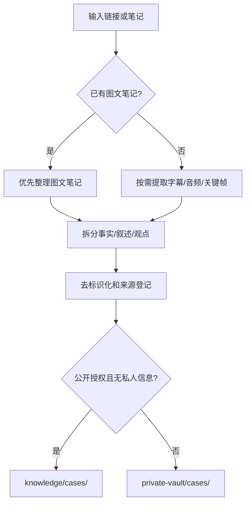

# 现实案例整理流程

目标是把公开视频、图文笔记和用户提供的经验整理为可复用的案例卡，同时保留事实、观点和未知之间的边界。

## 流程

## 最低步骤

1. 记录平台、作者、标题、URL、发布日期和获取日期；不复制账号令牌。
2. 如果有图文笔记，先整理笔记；只有关键事实无法从笔记确认时才解析视频。
3. 把内容分为已核验事实、当事人叙述、作者观点、推测和未知。
4. 删除姓名、头像、手机号、住址、工作单位、订单号和本地绝对路径。
5. 用 `knowledge/case-schema.yaml` 填写案例卡，标注 L1/L2/L3 证据等级。
6. 写出可迁移经验和不可迁移部分；案例结果不能当作个人成功率。
7. 公开发布前检查授权、版权、隐私和是否能通过来源链接复核。

## 进入公开库的条件

- 来源公开且链接可追溯；
- 已完成去标识化；
- 事实与观点分开；
- 已写明限制和证据等级；
- 不含原始媒体、私人聊天、账号数据或本地路径。

不满足条件的内容只放在 `private-vault/cases/`，不进入 Git 提交。

