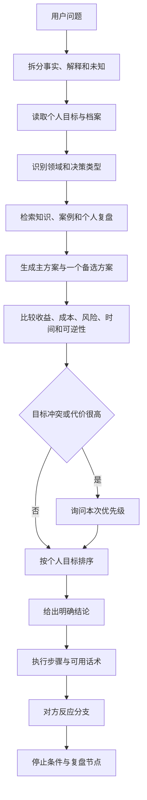
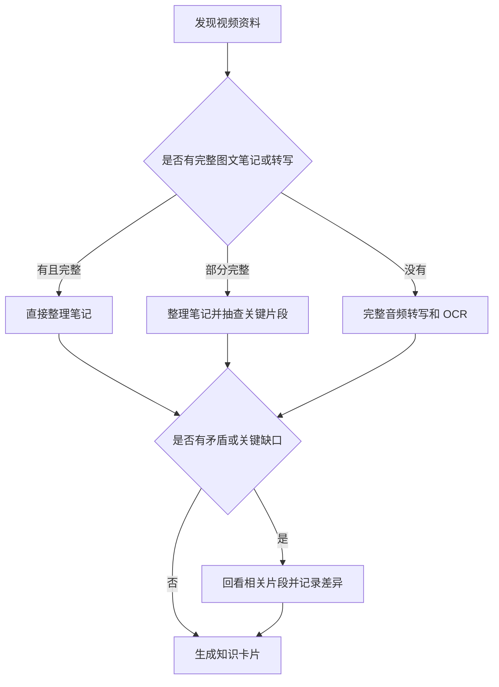

# Relationship Adviser 跨平台关系决策 Skill 设计

**状态：** 设计已获确认，等待实现计划
**日期：** 2026-09-29
**目标版本：** 0.1.0

## 1. 项目目标

Relationship Adviser 是一个面向个人使用的跨平台关系决策 skill，覆盖恋爱、约会、沟通、婚姻、家庭、性与亲密、财务、分手和特殊情境。

它的默认优化方向是用户的个人目标与收益。当用户目标不明确、彼此冲突、信息不足或决策代价较高时，系统先询问本次优先级。建议必须可执行，包含明确结论、步骤、话术、对方可能反应、对应回答、停止条件和复盘节点。

系统由一个平台无关主包、一个本地私人资料库和多个轻量平台适配器组成。核心规则只维护一份，适配器不复制分析逻辑。

## 2. 设计原则

1. **个人目标优先。** 默认按照用户明确或推断出的目标排序；目标冲突时先询问。
2. **行动优先。** 先给推荐动作，再解释理由；不以“看情况”作为结论。
3. **证据分层。** 研究、专业书籍、博主经验和个人案例必须分开标注。
4. **事实与推断分离。** 输出明确区分事实、推断、建议和未知。
5. **保持可逆。** 先推荐低成本、可撤回、能获得新信息的行动。
6. **本地优先。** 个人档案、真实案例、敏感经历和原始资料默认只保存在本地。
7. **视觉服务于理解。** Markdown 是基础；表格、Mermaid 和插图按需增强，任何图片都有文字替代。
8. **持续校准。** 新案例可以修正策略，但不会自动推翻已有规则或自动覆盖个人档案。

## 3. 系统边界

### 3.1 首版包含

- 平台无关核心分析协议；
- 个人档案字段和本地记忆规则；
- 知识库、决策库和案例库的数据模型；
- 书籍、论文、视频和个人案例的证据标注方式；
- 视频文字化、时间戳和按需解析流程；
- Markdown、表格、Mermaid 和插图降级规则；
- Codex、Claude Code、WorkBuddy 的适配器接口约定；
- 跨平台一致性验证方案。

### 3.2 首版不包含

- 自动爬取或批量下载平台内容；
- 自动上传个人资料到云端；
- 语音输入或语音回答；
- 直接复制受版权保护的完整书籍或视频；
- 把 MBTI、依恋类型或单个博主观点当作诊断或确定性结论。

## 4. 目录与数据边界

公开主包可以发布到 GitHub：

```text
relationship-adviser/
├─ core/
│  ├─ mission.md
│  ├─ domains.md
│  ├─ intake.md
│  ├─ reasoning.md
│  ├─ evidence.md
│  ├─ communication.md
│  └─ output.md
├─ knowledge-schema/
│  ├─ source.schema.yaml
│  ├─ video-card.schema.yaml
│  ├─ case.schema.yaml
│  └─ decision.schema.yaml
├─ visuals/
│  ├─ diagram-rules.md
│  └─ illustration-rules.md
├─ adapters/
│  ├─ codex/
│  ├─ claude-code/
│  └─ workbuddy/
├─ examples/
└─ README.md
```

私人资料库与公开主包分离：

```text
private-vault/
├─ profile/
├─ cases/
├─ decisions/
├─ knowledge-notes/
├─ video-notes/
└─ source-index/
```

私人资料默认不提交到 GitHub。原始视频继续保留在用户的 MediaCrawler 目录，资料库保存本地路径、哈希、转写、时间戳、摘要和索引。

## 5. 一次分析的数据流



统一思考骨架：

1. 定义用户要达成的结果；
2. 区分已知事实、用户解释和未知信息；
3. 识别对方可能的目标、约束和底线；
4. 找出真正的决策变量；
5. 生成主方案和一个备选方案；
6. 比较收益、成本、时间、风险和可逆性；
7. 给出明确推荐；
8. 展开详细步骤、话术和反应分支；
9. 设置停止条件和复盘时间。

## 6. 输出协议

涉及选择或行动时，固定输出以下部分：

```text
结论
判断依据
详细执行步骤
可直接使用的话术或动作
对方可能反应
对应回答和下一步
流程图或表格（需要时）
停止条件
一个备选方案
信心与信息缺口
```

结论必须直接说明推荐做什么、暂不做什么。执行步骤按时间或事件顺序排列。对方反应分支必须包含可直接使用的回应，不只描述心理状态。涉及谈判时必须设置预算、底线、暂停条件和复盘节点。

输出中的信息标签：

- **事实：** 可从用户提供内容或来源直接确认；
- **推断：** 基于行为或研究作出的暂时判断；
- **建议：** 为达到用户目标推荐的行动；
- **未知：** 当前无法确认且可能改变结论的变量。

## 7. 领域模块

首批领域主题：

- 恋爱开始与推进；
- 吸引、投入和关系节奏；
- 冲突、冷战、信任与修复；
- 见家长、彩礼和婚前协商；
- 婚姻分工、财务、生育和双方家庭；
- 性、欲望差异、边界和亲密沟通；
- 分手、复合和关系退出；
- 个人成长、社交能力和长期生活规划；
- 关系心理学：吸引、选择、承诺、依赖、权力和修复；
- 人格与情绪：Big Five、依恋、焦虑、回避和情绪调节；
- 认识与约会：第一次见面、体验设计、邀约、关系确认和线上约会；
- 沟通策略：聊天分析、场景校准、倾听、共情、赞美、冲突、道歉和拒绝；
- 社交策略与 PUA：机制拆解、风险识别、防御和低风险替代方案；
- 社会与人文：婚姻变迁、人口、城市化、平台约会、性别分工和照护劳动；
- 恋爱哲学：欲望、友爱、自由、承诺、共同体、自我与他者、爱与占有；
- 分手与特殊情境：失恋、背叛、复合、信任重建、多元关系和反刻板印象。

MBTI 只用于沟通偏好和自我反思，不用于给人定性或预测伴侣适配。PUA 内容只用于识别、拆解、防御和低风险替代，不作为操控、欺骗或施压的默认行动方案。

## 8. 知识库与决策库

知识库回答“什么可能是真的”，决策库回答“在什么条件下采取了什么行动，结果怎样”，个人档案回答“用户的目标、偏好、资源和限制”。三者必须分开。

证据层级：

| 层级 | 资料 | 用途 |
|---|---|---|
| L1 | 系统综述、实证研究、官方统计、法律法规 | 判断事实、概率和边界 |
| L2 | 专业书籍、课程、领域专家材料 | 建立概念和分析框架 |
| L3 | 博主视频、咨询案例、谈判经验 | 提供话术、场景和行动技巧 |
| L4 | 用户个人经历和复盘 | 校准是否适合用户 |

知识卡片至少包含：标题、类型、来源、主张、上下文、证据层级、可信度、适用条件、反例、可应用问题和原文定位。

```yaml
title: ""
type: book|paper|video|case|personal
source: "作者、平台、链接或本地路径"
claim: "这条资料主张什么"
context: "在哪些条件下适用"
evidence_level: L1|L2|L3|L4
confidence: low|medium|high
counterpoints: []
application: []
```

P2 资料进入可复用策略库前，必须记录至少一个限制条件或反例，并尽可能通过真实案例验证。

## 9. 视频资料处理

视频不是只做摘要，而是提取成可检索、可引用、可复用的文本资料。处理方式根据现有材料完整度选择最小必要步骤：



处理规则：

- 完整图文笔记或字幕：以文字资料为主，不解析整段视频；
- 只有截图：只提取截图文字和已知上下文，不推测截图外内容；
- 笔记不完整：先整理笔记，只检查会改变结论的关键片段；
- 没有笔记或字幕：才进行完整音频转写和 OCR；
- 笔记与视频矛盾：同时保留两者，标注差异并回看相关时间段；
- 每条记录注明 `notes_only`、`notes_plus_images`、`notes_plus_spotcheck` 或 `full_video`。

每个视频保存三层内容：

1. 原始转写：完整文字、说话人和时间戳；
2. 结构化整理：问题、观点、理由、话术、反应和行动；
3. 决策摘要：可复用策略、适用条件、失败信号和反例。

视频卡片：

```yaml
title: ""
source:
  platform: ""
  url: ""
  local_path: ""
  author: ""
  captured_at: ""
topic: ""
evidence_level: L3
extraction_mode: notes_only|notes_plus_images|notes_plus_spotcheck|full_video
transcript: []
claims: []
playbook:
  goal: ""
  steps: []
  scripts: []
  expected_reactions: []
  responses: []
  stop_conditions: []
limits: []
status: raw|整理中|已审核|已验证
```

当前提供的“见丈母娘谈彩礼”截图先按 `notes_plus_images` 整理，提取彩礼沟通中的尊重表达、延后报价、双方协商、预期询问、反应分支和停止条件；只有需要确认完整上下文时才回看原视频。

## 10. 个人档案与长期记忆

个人档案保存影响决策质量的稳定信息，不作为完整日记：

```yaml
identity:
  age_stage: ""
  location_context: ""
  relationship_status: ""
goals:
  default_priority: personal_objective
  current_goals: []
  marriage_view: ""
  children_view: ""
  financial_priorities: ""
preferences:
  communication_style: ""
  preferred_risk_level: ""
  decision_style: ""
constraints:
  time: ""
  money: ""
  family_constraints: ""
  non_negotiables: []
patterns:
  recurring_problems: []
  past_decision_lessons: []
memory_rules:
  save_by_default: false
  require_explicit_save_for_sensitive_events: true
```

稳定偏好在用户确认后长期保存；具体恋爱、性经历和家庭冲突默认只用于当前对话。只有用户明确要求“记住”时才写入长期档案或决策库。新旧信息冲突时先标记待确认，不自动覆盖。

## 11. 跨平台适配

核心包提供统一元数据和能力名：

```yaml
name: relationship-adviser
version: 0.1.0
core_entry: core/mission.md
profile_path: profile/profile.yaml
output_protocol: core/output.md
visual_policy: visuals/diagram-rules.md
```

统一能力名：

```text
read_profile
search_knowledge
save_case
render_mermaid
generate_illustration
```

适配器只负责：

1. 告诉平台从哪里加载主包；
2. 把平台工具映射到统一能力名；
3. 平台不支持某项能力时触发降级。

具体 Codex、Claude Code 和 WorkBuddy 的入口格式在实现阶段分别核验，核心规则不依赖平台专有语法。

## 12. 图文输出

视觉输出四级降级：

1. Markdown；
2. Markdown 表格；
3. Mermaid；
4. PNG/SVG 插图。

只有角色较多、时间节点较多、反应分支超过两条、需要比较三个以上方案或抽象概念难以理解时才触发视觉输出。图片必须附带文字版替代。

GitHub 视觉项目按许可证、本地运行能力、输出格式、模型依赖、维护活跃度、结构清晰度和纯文本降级能力筛选。

## 13. 资料收集计划

首批 P0 方向：

- Gottman 体系和 Sue Johnson 的长期关系研究；
- `Nonviolent Communication`、`Difficult Conversations`、`Fight Right`；
- `Getting to Yes`、困难谈判和边界设定；
- Emily Nagoski 的性欲、性沟通和身体自主材料；
- 成人依恋、Big Five 及研究限制；
- 婚前关系教育、家务分工、共同财务、育儿和双方父母；
- 中国现行婚姻家庭法律、家暴和跟踪规定、彩礼与婚俗研究。

P1 方向：通俗依恋读物、Bowen 家庭系统、代际边界、失恋与信任重建、社会变迁、平台约会和照护劳动。

P2 方向：PUA 和社交技巧视频、彩礼和见家长案例、冲突和分手案例、用户个人经历。

书籍和论文按“书目确认 → 版本核验 → 核心观点 → 对应实证研究 → 适用条件与反例 → 知识卡片 → 案例验证”处理。网络检索恢复后再补充具体链接、版本、DOI、许可证和项目活跃度。

## 14. 质量控制

### 分析质量

- 先给明确结论；
- 区分事实、推断和未知；
- 有具体步骤、时间点和话术；
- 有反应分支、停止条件和复盘节点；
- 按用户目标排序；
- 不把单个案例当成普遍规律；
- 标出信心和信息缺口。

### 知识质量

- 有出处、版本或时间戳；
- 标明证据层级；
- 记录适用条件和反例；
- 区分研究、专家观点、博主经验和个人案例；
- 法律、医学和平台规则在使用前重新核验。

### 跨平台质量

使用相同案例在三个目标平台运行，比较结论、结构、个人档案读取、视觉降级和工具失败后的恢复能力。

## 15. 分阶段实施

### 阶段 1：核心包

创建平台无关核心规则、领域目录、输出协议、schema 和脱敏示例。

### 阶段 2：本地私人资料库

创建 `private-vault`、个人档案模板、知识卡片、视频卡片和决策复盘模板；加入当前彩礼案例。

### 阶段 3：平台适配与验证

创建 Codex、Claude Code、WorkBuddy 入口，用固定案例做一致性验证。

### 阶段 4：资料扩充

核验并加入书籍、论文、中国情境资料、视频转写和实战案例；接入 MediaCrawler 的索引和按需解析流程。

### 阶段 5：可选能力

评估插图工具、批量资料处理、语音输入和语音回答。

## 16. 验收标准

首版完成必须满足：

1. 同一套核心规则可被三个目标平台加载；
2. 用户提出一个关系问题时能输出明确、可执行的建议；
3. 输出包含详细步骤、话术、对方反应、对应回答和停止条件；
4. 个人档案与知识库可以本地读取，敏感资料不进入公开包；
5. 有图文笔记时不会无条件完整解析视频；
6. 没有图文笔记时能够按时间戳生成文本资料；
7. 知识卡片记录出处、证据层级、适用条件和反例；
8. Mermaid 或插图能力不可用时仍能完成文字建议；
9. 至少用彩礼案例完成一次端到端验证。

## 17. 当前限制

当前环境无法连接 AnySearch 和 GitHub API，因此候选资料尚未完成在线版本、链接和许可证核验。设计文档只记录收集方向，不把未核验资料标记为已入库。当前工作区也不是 Git 仓库，因此本文件暂时无法提交 commit；后续建立仓库后再补提交。
