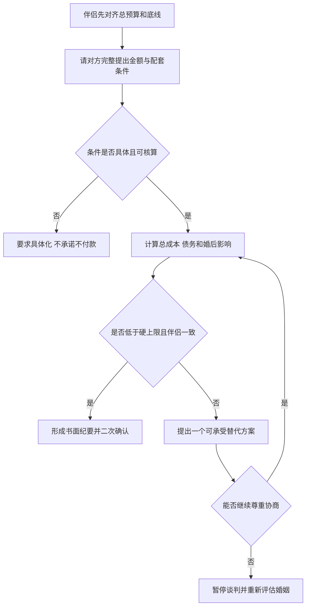

# 彩礼谈判与证据清单

本清单用于结婚前协商和事实整理，不代替针对具体纠纷的法律意见。法律依据为最高人民法院法释〔2024〕1号；个案仍取决于登记、共同生活、款项用途、嫁妆、孕育、过错、当地习俗和证据。

## 谈判前硬参数

先由本人和伴侣单独写出并对齐以下内容，再见双方父母：

| 参数 | 必须形成的结果 |
|---|---|
| 总预算 | 彩礼、婚礼、三金、住房、装修等分别列数，避免只谈一个数字 |
| 资金来源 | 自有资金、父母支持和借款分别列明；写出不接受的负债上限 |
| 收款人与用途 | 明确由谁接收、是否返还小家庭、是否对应嫁妆或特定支出 |
| 支付条件 | 金额、时间、方式、登记或婚礼节点、条件变化后的处理办法 |
| 双方权限 | 哪些由伴侣决定，哪些需父母参与，谁负责对外表达统一口径 |
| 底线 | 最高可承受总成本、最长决策期限，以及触发暂停或退出的条件 |

不要只准备一个金额。准备三个数字：理想方案、可接受上限、超过即暂停的硬上限。硬上限应按现金流和债务后果确定，不用“爱不爱”临时改动。

## 第一次正式沟通步骤

1. 先确认共同目标：“我们今天是把结婚安排谈清楚，不是判断哪家更重视孩子。”
2. 请对方一次说完金额、用途、收款人、支付时间，以及住房、婚礼、三金和嫁妆是否另算。
3. 复述条件并记录，不在信息不完整时立即答应。
4. 提出自己的完整方案，同时说明资金来源和婚后影响。
5. 对分歧逐项谈，不把总价、情感态度和面子混在一句话里。
6. 会后由伴侣双方核对书面纪要，再分别与父母确认；下一次只处理未决项。

可直接使用的话术：

> 阿姨叔叔，我们重视这件事，也希望承诺能兑现。请把彩礼金额、给谁、怎么用、什么时候付，以及婚礼、三金、住房和嫁妆是否另算一次说完整。我们会按双方预算核算，在___日前给明确答复。今天没有核算清楚的部分，我不随口承诺。

## 反应分支

| 对方反应 | 当场回答 | 下一步 |
|---|---|---|
| 给出完整条件 | “我复述一遍，确认没有漏项。” | 记录总成本、用途和时间，约定答复日 |
| 只说“看诚意” | “为了避免双方理解不同，请把诚意对应的金额、用途和其他安排具体说出来。” | 对方仍不具体时，不报价、不付款 |
| 要求立刻报数 | “我可以说明预算范围，但完整方案要把其他支出一起算完，___日前回复。” | 只给可承受区间，不突破硬上限 |
| 用“爱她就答应”施压 | “我愿意承担可兑现的责任，但不会用婚后负债证明感情。我们继续谈具体条件。” | 转回现金流与用途；重复施压则暂停 |
| 临时新增项目 | “这是新条件，需要重新计算总预算，今天的旧方案不再视为最终方案。” | 更新书面清单，重新设置答复时间 |
| 伴侣沉默或与父母口径冲突 | “这会影响我们共同生活，先由我们两人统一意见，再继续两家协商。” | 暂停家庭谈判，先解决伴侣内部授权 |
| 羞辱、威胁或拒绝任何协商 | “在能尊重沟通并明确条件前，我先暂停这次谈话。” | 离场并评估婚后家庭边界是否可行 |

文字版：伴侣先统一预算和底线；条件不具体就要求具体化；条件完整后核算总成本；可承受则书面确认，不可承受则只给一个替代方案；若对方拒绝尊重协商，暂停并重新评估。

## 证据清单

法释〔2024〕1号要求结合目的、习俗、给付时间和方式、财物价值、给付人与接收人等判断是否属于彩礼；返还问题还会考虑登记、共同生活、实际使用、嫁妆、孕育、过错和经济情况。按这些变量整理：

- 每笔转账的日期、金额、付款账户、收款账户、备注和银行流水；
- 关于款项的目的、条件、收款人和用途的聊天、书面协议与会谈纪要；
- 婚姻登记、共同居住时间及实际共同生活材料；
- 婚礼、住房、装修、三金、共同消费和赠与的票据，区分日常支出与彩礼；
- 嫁妆清单、购买凭证、交付记录及婚后实际控制和使用情况；
- 款项是否进入小家庭、是否已消费、剩余金额及对应凭证；
- 当地习俗只记录可说明来源的材料，避免把单方说法当成既定规则；
- 重要原始数据保留原设备和完整上下文，另做备份；不要只留裁剪截图。

协商纪要至少写明：参与人、日期、每个项目的金额与承担方、收付款人、用途、时间、尚未确定事项。纪要用于减少事实争议，不等于所有约定当然具有法律效力。

## 停止条件

- 总成本超过硬上限，且替代方案被明确拒绝；
- 要求借高息贷款、隐瞒债务、做虚假流水或签不理解的文件；
- 伴侣无法就关键条件形成一致意见，却要求先付款再解决；
- 条件反复增加，同时拒绝形成书面清单；
- 出现羞辱、威胁、限制人身自由或其他安全风险。

暂停后只保留一个备选方案：降低总成本并调整支付节点，使双方承担与婚后现金流可验证；对方拒绝后不继续加价竞标。

## 官方依据与限制

- 最高人民法院：《关于审理涉彩礼纠纷案件适用法律若干问题的规定》，法释〔2024〕1号，2024-02-01施行：<https://www.court.gov.cn/fabu/xiangqing/423442.html>
- 本清单提供谈判和取证准备。已发生大额支付、双方对款项性质有争议或准备诉讼时，应携带原始证据向当地合格律师咨询，并重新核验现行法律和当地裁判实践。
