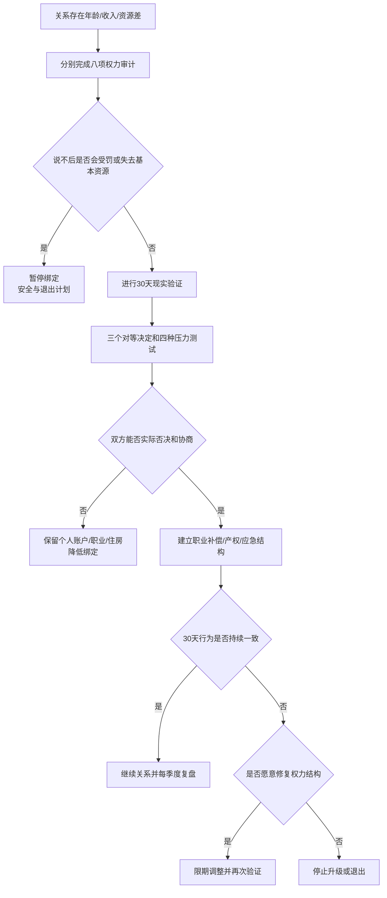

# 年龄差、收入差与社会资源不对等关系审计

年龄差、收入差、学历、户籍、住房、职业地位或社会经验不同，不自动表示关系不健康。真正需要审计的是：谁定义规则、谁能安全说不、谁承担长期代价，以及资源较少的一方是否仍保有工作、账户、社交和退出能力。

## Evidence base

Lee与McKinnish（2018，DOI 10.1007/s00148-017-0658-8）使用澳大利亚纵向家庭资料，发现不同年龄伴侣的满意度轨迹和面对经济冲击时的变化与同龄伴侣存在群体差异。Young与Seedall（2024，DOI 10.1111/famp.13008）回顾伴侣关系中的权力、影响和抵抗。研究支持检查长期压力和决定过程，不能用年龄差本身诊断控制或预测分手。

## 八项权力审计

双方分别评分“我能自由决定/需要协商/事实上由对方决定”，并写出最近一次具体事件：

1. **钱**：个人收入、共同支出、赠与、债务和大额购买谁决定？
2. **住房**：谁拥有产权或租约，发生冲突时谁能继续居住？
3. **职业**：谁搬迁、辞职、降薪或承担无偿照护？损失如何补偿？
4. **社交**：双方是否能保留朋友、家人、工作联系和独处时间？
5. **性与生育**：拒绝性行为、避孕、生育或终止妊娠是否安全？
6. **时间和照护**：健康、退休、父母养老与孩子时间表是否错位？
7. **公开身份**：关系是否被承认，是否利用地位差要求保密或服从？
8. **退出能力**：证件、账户、设备、住处、交通和法律信息是否独立可得？

任何一项出现“说不后会受罚”，直接进入安全和控制审计，不用平均分掩盖。

## 30 天现实验证

### 第1—7天：建立资源地图

列出双方收入、资产、债务、住房、职业、照护责任、健康与支持网络。区分“对方愿意提供的资源”和“本人依法或合同拥有的资源”。口头承诺不能替代账户、产权、合同或个人能力。

### 第8—14天：做三个对等决定

选择一次约会预算、一个周末安排和一项共同支出。轮流提出方案，验证收入高或年长者是否能接受对方否决，资源较少者是否能表达不同意见而不被嘲讽、冷战或断供。

### 第15—21天：压力测试

书面模拟：高收入者失业六个月、年长者提前出现健康照护需求、年轻者获得异地职业机会、双方生育时间表冲突。每个情景写付款人、照护人、迁移人、备用方案和退出方案。

### 第22—30天：建立保护结构

- 双方保留个人账户、证件、设备和可使用的应急金；
- 职业牺牲需本人同意，并写期限、补偿、保险和恢复计划；
- 共同资产写明出资、产权、使用和退出；
- 每项重大决定都设置双方否决权和冷静期；
- 30天后根据持续行为决定继续、调整、延后绑定或退出。

## 可直接使用的话术

> “年龄和收入可以不同，但重大决定必须允许双方安全说不。我们用最近三件事检查实际决定权。”

> “你承担更多费用不等于拥有我的职业、社交或身体决定权。我们把支出和决定权分开谈。”

> “如果我为关系搬迁或暂停工作，需要写清期限、生活资金、保险、重返工作和退出住房。”

> “我们先模拟你失业、我异地工作和健康照护三种情况。没有可执行方案就不升级共同债务或婚姻。”

## 对方可能的反应及回应

| 反应 | 回应 | 下一步 |
|---|---|---|
| “我年纪大，听我的不会错。” | “经验可以提供建议，不能取消我的否决权。” | 选择一个决定验证共同决策 |
| “钱都是我赚的，所以我决定。” | “出资比例影响预算，不购买对方的人身和身体决定权。” | 保留个人账户并写共同支出规则 |
| “我养你，你不用工作。” | “是否暂停工作由我决定，并需期限、保障和重返方案。” | 不先辞职或迁移 |
| “你朋友不成熟，少联系。” | “可以讨论具体伤害，不能因年龄差隔离我的支持网络。” | 保留固定社交和求助渠道 |
| 年轻一方用年龄羞辱或否定健康需求 | “年龄不能用来羞辱；我们按实际健康和照护容量安排。” | 做健康和照护预算 |
| 对方说签协议是不信任 | “资源差越大，写清越能保护双方自愿。” | 未写清前不共同借贷或转产权 |
| 短期尊重，遇到分歧就断供 | “断供是用资源惩罚意见，不是协商。” | 启动个人应急方案并降低绑定 |
| 出现威胁、监控或强迫 | “现在优先安全，不继续私下证明关系。” | 保存证据并寻求支持 |

## Stop conditions

- 以年龄、收入、学历、户籍、住房或人脉要求服从；
- 阻止工作、学习、就医或联系朋友家人，制造依赖；
- 控制证件、账户、工资、设备、交通或住处；
- 用断供、赶出住房、曝光隐私、影响职业或家庭报复逼迫同意；
- 强迫性行为、避孕、生育、终止妊娠或婚姻登记；
- 要求先辞职、迁移、共同借贷、转产权，再讨论保障；
- 重大决定长期由一方单独作出，另一方说不后受到惩罚；
- 出现暴力、威胁、跟踪或利用职权压制求助。

触发停止条件时，暂停共同债务、迁移、辞职、产权转移和生育升级；保护证件、账户、住处与支持网络。存在现实危险时不要单独对质，联系当地安全、法律或紧急支持。

## Mermaid分流图

文字版：资源差出现时先审计实际权力；说不受到惩罚就先保护安全和退出；否则做30天对等决定与压力测试；能持续协商再建立长期安排，不能则降低绑定或退出。

## Evidence boundary

澳大利亚初婚夫妻的纵向结果不能直接预测中国个体，也不能定义“安全年龄差”。收入高、年长或社会资源更多都不是控制的证据；同样，感情良好也不能抵消账户、住房和身体自主被控制的事实。最终判断依据是可观察的决定过程、自由同意、责任分担和退出能力。
