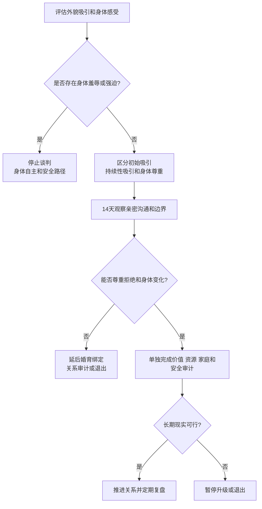

# 外貌吸引、身体尊重与长期关系判断

## Evidence base

Stiles 等的元分析（DOI 10.1177/02654075221128504）汇总 56 项研究，发现身体不满意与恋爱关系质量之间存在研究关联。实用判断把外貌吸引和身体尊重分开：吸引影响是否愿意开始，尊重和互动决定关系能否长期安全地运行。

## 四层判断

1. **初始吸引**：是否愿意接近、约会和建立亲密，不要求把吸引伪装成“完全不重要”。
2. **持续性吸引**：熟悉、压力、健康、年龄和相处质量改变后，双方是否仍能表达欲望和欣赏。
3. **身体尊重**：是否尊重拒绝、隐私、衣着、饮食、医疗和身体变化，不用羞辱逼迫改变。
4. **长期可行性**：外貌之外，价值观、收入、家庭、责任、性沟通和安全是否可持续。

## 14 天现实观察

1. 第 1–3 天分别写下“我被什么吸引”“我担心什么”“我不能接受什么身体评价”，不把审美偏好写成事实判断。
2. 第 4–7 天观察三类行为：对方如何评论自己和他人身体；如何回应拒绝和性需求；如何面对疾病、衰老、体重或外貌变化。
3. 第 8–10 天进行一次不羞辱的亲密沟通：说出喜欢、界限和希望，不要求对方立即改变身体。
4. 第 11–14 天把外貌吸引与婚姻现实审计分开：收入、家庭、城市、生育、家务和安全另行核对。

可直接使用的话术：

> “我承认吸引对我重要，但我不会用体重、脸或穿衣评价你的价值。我们可以讨论亲密偏好，也要尊重拒绝和身体变化。”

> “我想知道的是：当我们变老、变胖、生病或压力很大时，是否还能互相尊重并维护亲密，而不是现在照片上是否完美。”

## 反应分支

| 对方反应 | 回应 | 下一步 |
|---|---|---|
| “你不满意我的身材就是不爱我。” | “吸引和爱不是同一个变量。我会诚实表达偏好，但不接受羞辱、逼迫或把身体当作价值证明。” | 转向具体亲密需求和边界 |
| “为了我你必须减肥/整形。” | “你可以表达愿望，不能决定我的身体。是否改变由我和专业人员决定。” | 观察对方是否尊重拒绝 |
| 对方持续拿前任或网红比较 | “比较让我感到被贬低。请停止；如果要讨论亲密，我们谈自己的需要。” | 记录是否反复，必要时暂停亲密互动 |
| 一方确实缺乏性吸引 | “我不想用假装解决。我们要诚实评估是否能通过沟通、情境和亲密方式改善。” | 设定短期观察期，不仓促结婚或生育 |
| 怀孕、疾病、衰老导致身体变化 | “变化是共同生活的一部分。我们调整亲密方式和照护，不把责任归咎于身体。” | 需要时寻求医生或性治疗专业支持 |
| 对方用羞辱、威胁或经济惩罚控制身体 | “这不是审美分歧，是控制和安全问题。” | 保护账户、证件和退出能力，寻求外部支持 |

## Stop conditions

- 强迫减重、整形、节食、性行为或展示身体；
- 以外貌、体重、年龄、疾病或生育变化羞辱、威胁、比较和惩罚；
- 通过定位、照片、账户或饮食监控来证明“吸引/忠诚”；
- 一方没有性吸引却被迫推进婚姻、生育或共同资产绑定；
- 出现暴力、性胁迫、跟踪或因身体边界而产生的报复。

触发停止条件时，停止身体改变或亲密谈判，优先身体自主、安全和外部支持。涉及饮食障碍、严重身体焦虑或医疗美容决定时，交由合资格专业人员评估。

## Mermaid 分流图

