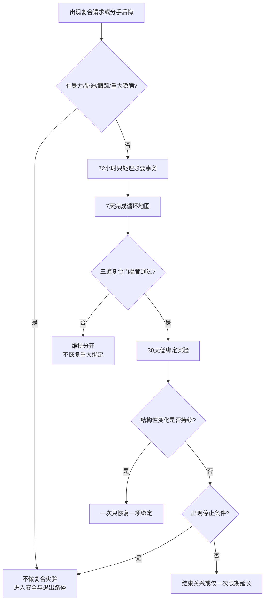

# 分手复合循环与重新进入关系门槛

## 明确结论

想念、孤独、性吸引、道歉和分手后的痛苦只能说明分开很难受，不能证明旧问题已经改变。复合前必须通过三道复合门槛：**旧问题说清、结构性变化已经发生、再次失败时能安全退出**。没有通过门槛时，不恢复同居、共同账户、借贷、订婚、生育计划、设备权限或全天候伴侣义务。

如果存在暴力、跟踪、强迫性行为、私密影像威胁或严重经济控制，不做复合实验，直接进入安全和退出路径。

## Evidence base

- Vennum 等（2014，DOI 10.1177/0265407513501987）：美国全国代表性样本包含 323 对同居伴侣和 752 对已婚伴侣；循环经历与未来不确定、退出约束、较低满意度及再次循环风险相关。
- Monk、Ogolsky 与 Oswald（2018，DOI 10.1111/fare.12336）：545 名同性和异性关系参与者中，循环频率与心理困扰相关。
- Le 与 Agnew（2003，DOI 10.1111/1475-6811.00035）：承诺同时受满意度、替代选择和投入影响；投入大不等于继续最有利。
- Stanley、Rhoades 与 Markman（2006，DOI 10.1111/j.1741-3729.2006.00418.x）：住房和资源绑定会增加关系惯性，升级前需要主动决定。

以下 72 小时、7 天和 30 天是保守的执行期限，不是研究证明的治疗阈值或复合成功公式。

## 第一步：72 小时稳定期

在没有安全危险且不影响孩子基本照护的前提下：

- 不在分手当晚决定复合、同居、怀孕、结婚、辞职、转账或共同借贷；
- 不用性行为、酒精、深夜长谈或自伤威胁推动决定；
- 只处理住处、药物、宠物、孩子交接和必要账单；
- 共同育儿者维持孩子作息，通过一个固定渠道处理孩子事务；
- 各自找一名可信任支持者，不让对方成为唯一情绪出口。

可直接说：

> “我现在也很难受，但难受不是复合证据。接下来 72 小时只处理必要事务，不恢复关系身份和重大绑定。”

## 第二步：7 天循环地图

双方分别填写，再核对事实：

| 项目 | 必须写清 |
|---|---|
| 时间线 | 每次分手与复合日期、谁提出、持续多久 |
| 直接原因 | 触发事件和具体行为，不写“性格不合” |
| 未解决原因 | 钱、忠诚、性、家庭、城市、育儿、暴力、成瘾或沟通中的哪一项仍存在 |
| 复合动力 | 实际变化，还是孤独、性、住房、经济、孩子、家庭压力和沉没成本 |
| 每轮代价 | 睡眠、工作、金钱、社交、孩子、身体和心理状态 |
| 绑定约束 | 租约、贷款、宠物、孩子、共同账户和社交圈怎样增加退出成本 |

如果双方对“为什么分手”都没有共同事实版本，先不复合。若出现暴力、胁迫或控制，不用共同会议逼迫受影响方对质。

## 第三步：三道复合门槛

### 门槛一：问题必须具体

每个核心问题写成：

> “当___发生时，谁做了___，造成___；今后需要___。”

“我会改”“我们都成熟了”“以后少吵架”不算问题定义。

### 门槛二：结构性变化必须先发生

至少选两个能被观察的变化，并写出证据和持续时间：

- 债务已列清、账户规则已改变，而不只是承诺少花钱；
- 前任或暧昧联系已按共同边界处理，而不只是删除一次聊天；
- 酒精、赌博、游戏氪金或其他成瘾风险已进入专业处理并有持续记录；
- 家务、育儿或父母责任已经完整转移并能连续履行；
- 冲突中能暂停并按时回来，不再用分手、失联或羞辱结束争论；
- 城市、婚育、住房或职业冲突出现双方都能承担的具体方案。

预约咨询、写保证书、送礼和连续几天热情只能算启动动作，不等于变化已稳定。

### 门槛三：再次失败时可以安全退出

必须提前写清：

- 各自住处、账户、证件和紧急联系人；
- 共同物品、押金、债务和宠物怎样处理；
- 有孩子时的交接、费用和不得让孩子传话的规则；
- 哪个行为一出现就结束实验；
- 谁在什么日期作决定，避免无限等待。

能退出不是“不认真”，而是防止住房、金钱和沉没成本替双方作决定。

## 第四步：30 天低绑定复合实验

通过三道门槛后，可以做一次 30 天实验：

1. 明确定义是否排他、联系频率、性健康和社交边界；
2. 每周只验证两个结构性变化，记录是否按时完成；
3. 每周一次 30 分钟复盘，只谈事实、影响和下周责任；
4. 已经分开的，不恢复同居、共同账户、借贷、订婚或生育计划；
5. 因住房或婚姻仍绑定的，不新增债务、产权、怀孕计划或对外承诺；
6. 性行为必须独立取得同意，并处理避孕、检测和非排他期间的健康信息；
7. 任何一方可停止实验，不以礼物、性、孩子或金钱索取继续。

30 天结束只能选择：

- **逐步稳定**：两个核心改变持续存在，再一次只恢复一项绑定；
- **结束关系**：执行退出清单，停止情侣身份和性/财务混合；
- **延长一次**：仅限外部事项尚未完成，必须写明唯一缺口和最终日期，不能无限延期。

## 对方可能反应及回答

| 对方反应 | 回应 | 下一步 |
|---|---|---|
| “我们还爱就应该复合。” | “爱说明关系重要，不说明导致分手的行为已经改变。先过三道门槛。” | 填写循环地图 |
| “先复合，我以后慢慢改。” | “先恢复关系会重新增加约束。请先完成一个可观察改变，再讨论进入实验。” | 保持分开状态 |
| “给我最后一次机会。” | “机会需要动作、期限和停止条件。只有请求，没有结构性变化，我不恢复绑定。” | 写两项行动及证据 |
| “你也有错，凭什么只看我？” | “双方责任可以分别列，但不能互相抵消。每个人各自承担具体改变。” | 建立双责任表 |
| “我们都在一起这么多年了。” | “时间、共同朋友和花过的钱是沉没成本与约束，不是关系质量证据。” | 只评估未来成本收益 |
| “先同居才看得出有没有改变。” | “同居会增加退出成本。先用低绑定方式验证 30 天，再决定是否恢复。” | 不恢复租约或钥匙 |
| 分手后以性行为维持联系 | “亲密接触会短暂缓解痛苦，但会模糊关系状态。先确定关系和性健康边界。” | 暂停或书面确认边界 |
| “为了孩子必须复合。” | “孩子需要稳定、安全和可预测照护；情侣身份是否恢复要单独验证。” | 先固定共同育儿安排 |
| 短期热情后同一行为重现 | “我们验证的改变没有持续。现在按预先约定停止实验，不再重启同一轮承诺。” | 执行退出清单 |
| 对方用自伤或报复威胁阻止结束 | “我会联系紧急支持，但不会用复合交换安全。” | 联系当地紧急/专业支持并保护自己 |

## Stop conditions

- 暴力、跟踪、限制出行、强迫性行为、私密影像威胁或破坏避孕；
- 用自伤、伤人、曝光、孩子、住房或债务逼迫复合；
- 每次冲突都以分手、失联、赶出住所或撤回生活费作为惩罚；
- 隐瞒仍在进行的其他关系、重大债务、赌博、成瘾或性健康风险；
- 拒绝定义问题，只要求凭爱、年龄、父母压力或共同投入恢复绑定；
- 30 天实验中同一个核心伤害再次发生，且责任方否认、转嫁或拒绝补救；
- 循环已持续影响睡眠、工作、照护或孩子安全，却拒绝独立支持和明确决定。

触发安全类停止条件时，不安排私下复合谈判；保护证件、账户、设备、住处、孩子和支持网络，并按所在地法律、医疗或专业资源处理。

## Mermaid 分流图

## Evidence boundary

研究显示的是分手复合循环与不确定、约束、满意度及心理困扰之间的群体关联，不能给某对伴侣计算复合成功率。一次循环也不自动证明关系有害；多次循环也不是临床诊断。此指南用低绑定、可撤回的方式检验行为变化，最终决定仍要结合安全、现实资源、孩子、双方目标和实际履约。

