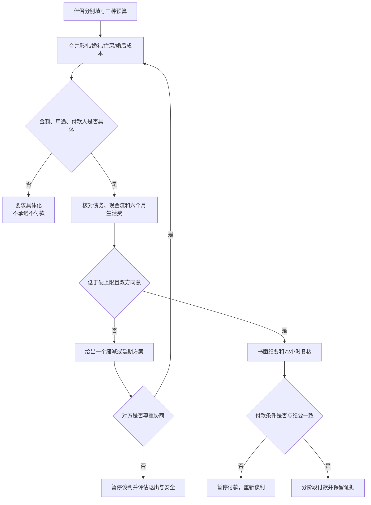

# 彩礼、婚礼支出与双方家庭谈判

这份指南用于结婚前把彩礼、婚礼、住房、三金、嫁妆和借款放进同一张现实账。目标不是证明哪一方更有诚意，而是确认总成本可承受、用途可追踪、条件能兑现，且双方仍有安全退出能力。

## Evidence base

经济压力与伴侣关系功能存在群体层面的关联（Falconier & Jackson, 2020，DOI 10.1037/str0000157）；住房、父母出资和产权也可能把一次性婚礼支出转化为长期风险（Deng、Hoekstra & Elsinga, 2019，DOI 10.1007/s10901-018-9619-0）。Lyu 与 Zhang（2021，DOI 10.3390/su132313058）提示，匹配方式和婚姻距离也与农村婚姻支付相关；Zhang（2020，DOI 10.5070/l3272051563）的法律分析提醒，婚姻支付纠纷要区分付款、用途、共同生活和当事人的能动性。中国涉彩礼纠纷还受最高人民法院法释〔2024〕1号关于给付目的、时间方式、价值、付款人、收款人、共同生活和实际使用等因素的约束。

这些资料支持“先核算、再承诺”的决策顺序，不能推出某个地区的固定彩礼标准，也不能替代当地律师对具体款项性质的判断。

## 先做三种预算，而不是只报一个彩礼数字

由伴侣两人分别填写，再一起核对：

| 预算 | 用途 | 触发动作 |
|---|---|---|
| 理想预算 | 双方愿意承担、不会挤压基本生活的方案 | 作为第一次提案 |
| 可接受上限 | 仍能保留应急金、还贷和婚后生活的最高总成本 | 任何新增项目都从这里扣减 |
| 硬上限 | 超过后会借高息债、失去住房/工作或无法应急 | 超过即暂停，不用感情讨价还价 |

“总成本”必须包含：彩礼、婚宴、场地、摄影、三金、嫁妆、服装、旅行、住房首付或租金、装修、搬迁、父母红包、贷款利息和婚后六个月生活费。分别写明现金、父母赠与、父母借款和商业贷款，不能把“父母以后会帮忙”记成确定收入。

## 七步谈判流程

1. **伴侣内部对齐**：先确定三种预算、付款节点、收款人、用途和不接受的债务；没有内部一致就不带着模糊方案见父母。
2. **各自列家庭条件**：双方父母分别写出彩礼、婚礼规模、三金、嫁妆、住房和婚后援助要求；把“面子”“诚意”翻译成金额、物品或服务。
3. **建立总成本表**：每项写金额区间、付款人、收款人、付款日、是否可退、凭证和婚后影响。
4. **区分性质**：每笔钱标注彩礼、赠与、借款、共同消费或家庭内部转账。性质不明的资金按高风险处理，先暂停支付。
5. **只提出一个可执行替代方案**：如果对方方案超过硬上限，给出降低桌数、分阶段支付、改租住或取消非必要项目等完整替代，不进行无限加价。
6. **书面确认**：会后由双方伴侣确认纪要，再分别向父母复述；金额、用途、条件、变更规则和谁有最终决定权必须一致。
7. **付款前复核**：登记、婚礼和大额转账前 72 小时重新核对总成本、借款合同、账户和证据；临时新增项目视为新提案。

## 记录表最低字段

| 项目 | 必填内容 |
|---|---|
| 彩礼 | 金额、给谁、用途、支付节点、是否返还或进入小家庭 |
| 婚礼 | 城市、桌数、单桌上限、谁定宾客、超支由谁承担 |
| 三金/首饰 | 品类、预算、购买人、保管人、是否另算彩礼 |
| 嫁妆 | 物品或现金、所有权、交付时间、婚后控制人 |
| 住房/装修 | 首付、月供、父母出资性质、产权与居住安排 |
| 借款 | 借款人、利率、期限、还款来源、最坏情况 |
| 变更规则 | 谁可提出新增、需谁同意、超过多少必须重新谈判 |

## 可直接使用的话术

> “我们把彩礼、婚礼、三金、住房和婚后六个月生活费放在一张总账里。今天先确认项目和用途，核算完成前不承诺金额、不转账。”

> “我们愿意承担可兑现的责任，但不会用借高息贷款来证明感情。我们的可接受上限是___，硬上限是___，超过后只能调整方案或延期。”

> “这笔钱是赠与、借款还是彩礼，会影响双方以后责任。请把付款人、收款人、用途和条件写进纪要，大家都按同一份理解执行。”

## 对方可能的反应及回应

| 对方反应 | 当场回应 | 下一步 |
|---|---|---|
| “别人家都给这么多。” | “我们先谈我们的现金流和总成本，不用别人的数字决定我们的债务。” | 要求给出具体项目和用途 |
| “谈钱就是不重视女方/男方。” | “正因为重视，才要把承诺写成能兑现的金额和安排。” | 回到预算表，不争论动机 |
| “先答应，婚后再说。” | “婚后再说会把不确定风险转给共同生活。未写清前不付款。” | 延后登记或婚礼节点 |
| 临时增加三金、酒席或住房要求 | “这是新条件，旧预算不再有效，我们需要重新核算。” | 重新开会并设置答复日 |
| 伴侣说“我父母决定就行” | “父母可以提出条件，但婚后承担风险的是我们两人，关键支出必须由我们共同同意。” | 暂停家庭谈判，先取得伴侣明确授权 |
| 要求借贷、担保或隐瞒债务 | “我不签不理解的借款，也不隐瞒共同风险。” | 不签字、不转账，独立咨询 |
| 对方只接受一个模糊的“看诚意” | “请把诚意对应成金额、物品、时间或责任，否则无法比较和执行。” | 对方仍模糊则暂停 |
| 讨论变成羞辱、威胁或逼迫 | “我们先结束这次谈话，等能尊重沟通时再继续。” | 离场、保存记录、评估安全和关系边界 |

## 付款前的 72 小时检查

- 总成本是否仍低于硬上限；新增项目是否已经从别的项目扣除；
- 是否需要借贷，借款合同和最坏情况由谁承担；
- 彩礼、赠与、借款、婚礼消费和日常消费是否有不同凭证；
- 收款账户、付款节点和婚后用途是否与书面纪要一致；
- 双方是否能在没有父母在场时自由说“不”；
- 任一方是否保留应急金、独立账户、住处和退出路线。

## Stop conditions

- 总成本超过硬上限，却要求用借高息贷款、透支信用或出售基本生活资产解决；
- 付款人、收款人、用途或借款性质被故意隐瞒；
- 伴侣无法与原生家庭形成统一口径，却要求先登记、先付款或先签共同债务；
- 条件持续增加，拒绝书面记录或拒绝给出答复期限；
- 以彩礼、婚礼、年龄、怀孕、家庭面子或性别角色强迫转账、辞职、迁移或领证；
- 出现威胁、羞辱、限制自由、报复、伪造凭证或经济控制。

触发停止条件时：暂停新付款和签字；保存流水、聊天和合同原件；把方案改为延期、缩减、租住或终止婚姻升级。已发生大额支付或准备诉讼时，携带完整证据咨询当地婚姻家事律师。

## Mermaid 分流图

## Evidence boundary

经济压力研究主要说明群体层面的关联；中国彩礼法律规则需要结合登记、共同生活、实际使用、当地习俗和证据。指南不提供固定彩礼价目表，也不把“父母出资”自动解释为赠与或借款。任何具体返还、产权、债务或诉讼结论都应在付款前或争议发生后核验现行法律和当地专业意见。
