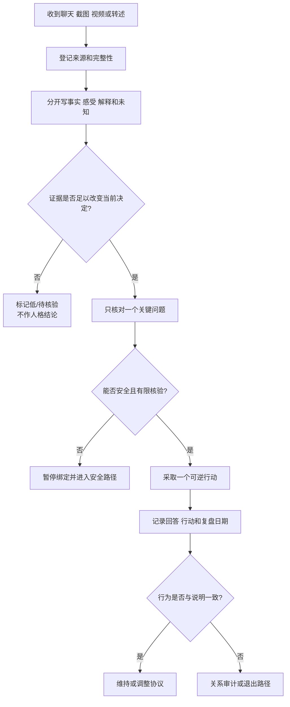

# 案例证据整理与关系决策记录

## 明确结论

处理聊天记录、截图、视频或朋友转述时，先把**事实、解释、证据强度和未知信息**分开，再给行动建议。单个视频、博主观点或一次冲突只能提供线索，不能直接证明某个伴侣的动机、人格或关系结论。每次记录只保存必要内容，私人案例、原始媒体和身份信息不进入公开知识库。

## Evidence base

关系建议需要同时考虑事实和解释。Slepian（2024，DOI 10.1177/09637214241226676）提醒我们，信息披露与秘密会影响关系决策，但不能把所有私人信息都当作必须公开的证据。Farrell 等（2023，DOI 10.1016/j.copsyc.2023.101628）也强调，应把可观察的伴侣行为与当事人的解释分开评估。本流程是证据整理工具，不是事实鉴定或心理诊断。

## 六步整理法

### 1. 先登记来源

记录材料类型、取得时间、是否原始、是否完整、是否经过剪辑、谁提供、是否可能有利益关系。视频笔记至少保存原链接、发布时间、账号、关键时间戳和提取文字；有完整图文笔记时，先使用笔记，不重复解析视频。

### 2. 分成四栏

| 栏目 | 写法 | 示例 |
|---|---|---|
| 事实 | 可以被材料直接支持的可观察内容 | “对方在周三 21:00 未回复，周四 10:00 回应” |
| 当事人感受 | 当事人的情绪、需要和影响 | “我感到被忽视，无法安排今晚计划” |
| 解释 | 对动机、人格或未来的推断 | “他故意冷暴力”“她一定不在乎我” |
| 未知 | 目前不能判断、需要核验的部分 | “是否临时发生急事、是否提前约定暂停” |

事实和感受都应认真对待，但感受不自动证明解释；未知信息也不能被假设填满。

### 3. 评估证据强度

- **高**：双方确认的原始记录、合同、检测或官方材料；
- **中**：连续多次可交叉核对的行为记录；
- **低**：单次截图、剪辑视频、转述、匿名帖子或博主个人经验；
- **待核验**：材料缺页、时间线冲突、来源不明或可能被编辑。

视频观点先标为“经验/观点”，只有能追溯到可靠研究或官方资料时，才提升为证据线索。

### 4. 只问会改变决定的问题

每个未知信息写成一个问题，并标注截止时间。例如：“周末是否已约定暂停联系？”“共同账户是否存在未披露债务？”不要为了缓解焦虑无限搜集与决定无关的聊天细节。

### 5. 做小范围行动

在事实尚未闭合时，先采取可逆动作：暂停转账、暂缓性或住房升级、约定一次谈话、保存必要记录、联系医生或外部支持。行动必须写负责人、日期和观察指标。

### 6. 记录结果与更新

每次谈话后写：对方实际回答、是否提供核验、是否完成承诺、风险是否上升或下降、下一次复盘日期。删除与决定无关的敏感细节；公开提交只保留去身份化的结构和研究来源。

## 可直接使用的话术

> “我先把能确认的事实和我的解释分开。我们只核对会改变当前决定的信息。”

> “这段视频可以作为一个观点来源，但我不会把它当作你伴侣动机的证据。我们还需要看具体行为和时间线。”

> “我愿意提供与共同风险有关的材料，但不会公开或交出与决定无关的私人信息。”

## 对方可能反应及对应回答

| 反应 | 回应 | 下一步 |
|---|---|---|
| “你是在调查我，不是在谈恋爱。” | “我只核对会影响共同决定的事实，范围和期限都可以一起确定。” | 写核验清单 |
| “网上都这么说，你为什么不信？” | “流行观点可以提供问题，但不能替代当前事实和可靠来源。” | 标记来源等级 |
| 对方愿意澄清并提供有限材料 | “我们把已确认、待核验和不需要追问的内容分别记下。” | 设复盘日期 |
| 对方拒绝任何与共同风险有关的核验 | “没有基本信息，我不会继续增加财务、住房、性或婚姻绑定。” | 暂停升级 |
| 对方要求公开你的全部记录 | “共同风险可以核验，但隐私不等于必须交出全部设备和密码。” | 限定范围；有威胁则停止 |
| 你自己不断搜集材料却无法行动 | “现在缺的是一个决定和日期，不是更多猜测。” | 选一个可逆动作并执行 |

## Stop conditions

- 用公开隐私、跟踪、搜查设备或威胁逼迫对方提供材料；
- 伪造、剪辑、销毁或篡改证据后要求对方立即做不可逆决定；
- 材料涉及未成年人、医疗、性经历或身份信息，却计划公开传播；
- 已出现暴力、性胁迫、经济控制或无法安全核验；
- 事实未闭合时仍被要求转账、结婚、怀孕、同居或发生性行为。

触发停止条件时，停止继续取证对质，先保护账号、证件、住处和人身安全，并联系可信支持、医疗、法律或当地安全服务。

## Mermaid 分流图

## Evidence boundary

本流程不能鉴定视频真伪、诊断伴侣动机或预测关系结果。它的作用是减少把单个案例、博主经验和个人解释混成事实的错误，并在信息不足时保护个人的选择权和退出能力。

