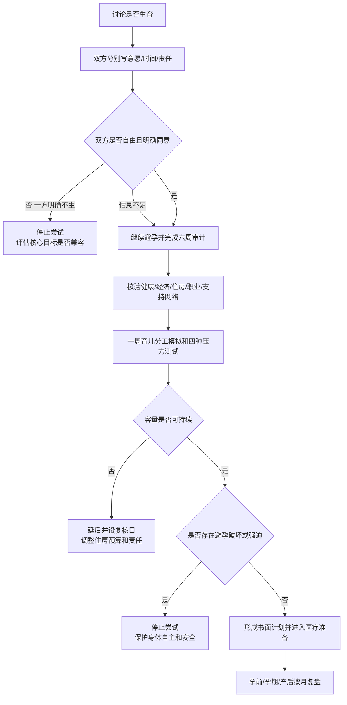

# 是否生育、何时生育与育儿容量审计

生育需要双方对养育责任达成一致，同时由承担妊娠的人对自己的身体作出自由决定。任何一方不同意、信息不完整或避孕受到干预，都不能用年龄、父母、婚期或“生了自然会解决”推进。

## Evidence base

Ranjbar 等（2024，DOI 10.1186/s12884-024-06385-3）的系统范围综述纳入 46 篇研究，归纳出个人、家庭人口、文化、社会、健康、经济、保险和政策八类因素。转为父母后，伴侣满意度可能发生变化（Bogdan et al., 2022，DOI 10.3389/fpsyg.2022.901362），心理负荷和家务责任需要在孩子出生前就具体分配。

这些资料提供审计维度，不提供“应该生”的结论。生育、延后和不生育都是需要尊重的选择。

## 先分别回答四个问题

双方独立填写，不能替对方作答：

1. 我是否想养育孩子，而不仅是喜欢婴儿、满足父母或害怕后悔？
2. 我想要几个、最早何时、最晚在什么条件下重新评估？
3. 如果无法自然受孕、出现妊娠风险或孩子有额外照护需要，我接受哪些路径？
4. 我愿意承担哪些每天、每周和突发责任？

答案分为“愿意”“不愿意”“信息不足”。“以后再说”属于信息不足，不自动解释为愿意。

## 六周容量审计

### 第 1 周：意愿与知情同意

分别确认生育、不生育、孩子数量、时间和可撤回边界。讨论避孕由谁执行、失败后如何处理，以及任何一方是否遭遇催生、避孕破坏或怀孕胁迫。双方未明确同意时继续可靠避孕。

### 第 2 周：健康与时间

梳理既往疾病、用药、遗传和生殖健康疑问。需要时分别向合格医疗人员咨询；不共享未经许可的隐私，不用网络概率替代个人检查。写出就医、检查、妊娠、产后和恢复期的时间安排及陪诊责任。

### 第 3 周：经济、住房和职业

制作至少两年的压力预算：医疗、生产、托育、保险、住房、教育准备和应急金。分别写明产假/陪产假、职业中断、收入下降、工作地点和恢复计划。任何职业牺牲必须由本人自由同意，并写补偿、保险和重返工作方案。

### 第 4 周：完整育儿责任

把夜间照护、喂养支持、就医、接送、采购、清洁、托育联络和情绪安抚分配到“发现、计划、执行、跟进、备用人”。不能只说“我会帮忙”。至少做一周模拟：按预计作息分配家务和夜间起床，观察谁持续提醒和兜底。

### 第 5 周：家庭和支持网络

确认双方父母是否提供帮助、帮助时长、费用、居住和干预边界；托育机构、保姆和备用照护人都要核验。没有支持网络时，按没有祖辈帮忙的情况计算，不把口头承诺当确定资源。

### 第 6 周：压力测试和决定

模拟四种情况：一方失业六个月、产后健康问题、孩子需要额外照护、祖辈无法帮助。只选一个结果：开始准备；延后并设复核日期；维持不生育；因核心意愿不兼容重新评估关系。不能把“先怀上再说”当方案。

## 可直接使用的话术

> “我想先区分喜欢孩子和愿意长期养育。我们分别写意愿、时间和每天愿意承担的责任，再交换答案。”

> “在双方都明确同意前，我们继续可靠避孕。父母催促、婚期和年龄不能替代知情同意。”

> “你说会帮忙还不够。请具体选择夜间照护、就医、托育联络或接送，并承担发现、计划、执行和跟进。”

> “如果我承担职业中断，我们要提前写清收入、保险、退休积累、重返工作和你增加的育儿责任。”

## 对方可能的反应及回应

| 反应 | 回应 | 下一步 |
|---|---|---|
| “生了自然就会带。” | “孩子出生后不能撤回，我们先用一周模拟和压力预算验证。” | 不通过则延后 |
| “我父母会帮忙。” | “请确认谁、多久、是否同住和不能帮时的备用方案。” | 未确认按无帮助计算 |
| “你负责生，我负责赚钱。” | “生育、恢复和育儿都影响双方；我们按具体任务和职业风险分配。” | 写责任表和补偿方案 |
| “不生以后一定后悔。” | “后悔无法预测，我们基于当前意愿和可承担责任决定。” | 设六个月复核而非施压 |
| “先停避孕看看。” | “停止避孕就是开始尝试，需要双方明确同意。” | 继续可靠避孕 |
| 一方想生、另一方明确不生 | “这是核心人生目标冲突，不能靠拖延或意外怀孕解决。” | 暂停婚姻升级并评估关系 |
| 一方担心职业损失 | “把损失具体化，并由受影响者决定是否接受。” | 写收入、保险和返岗方案 |
| 父母以养老、香火或彩礼施压 | “生育由我们决定，家庭资源不能交换身体和养育义务。” | 限制信息并由各自子女执行边界 |

## Stop conditions

- 偷停避孕、破坏避孕套、强迫怀孕或强迫终止妊娠；
- 用暴力、分手、出轨、经济断供、彩礼或住房逼迫生育；
- 一方明确不生育，另一方仍以拖延、欺骗或意外怀孕改变结果；
- 拒绝讨论健康、债务、职业影响和完整育儿责任，却要求立即尝试；
- 要求承担妊娠者辞职、失去账户或放弃医疗决定权；
- 父母控制避孕、就医、产检、分娩或孩子监护决定；
- 压力测试显示基本生活或安全无法维持，且拒绝延后或调整。

触发停止条件时，停止怀孕尝试和新的共同绑定，保护个人证件、账户、医疗隐私和可靠避孕。出现生殖胁迫、暴力或安全风险时，不单独对质，联系可信支持者、医疗人员或当地安全服务。

## Mermaid 分流图

## Evidence boundary

系统范围综述中的研究地区和设计差异较大，且伊朗样本较多；经济、政策和文化因素不能直接外推个人。医学年龄、生育力、遗传和妊娠风险必须个别评估。本指南只帮助形成可执行决定，不催促生育，也不把不生育视为需要纠正的问题。
