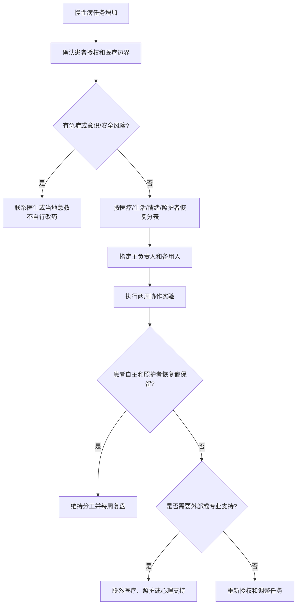

# 慢性病照护与伴侣协作

## Evidence base

Weitkamp 等（2021）的系统综述（DOI 10.3389/fpsyg.2021.722740）总结了慢性躯体疾病伴侣的共同应对。指南将证据转化为任务透明、患者自主、照护者恢复和专业协作四个动作，不替代医生的诊疗或康复计划。

## 先确定授权和安全

患者先明确三件事：哪些医疗信息可以共享、伴侣能否代为预约/取药、出现什么情况可以联系医生或急救。若疾病伴随认知障碍、意识变化或即时危险，由医疗团队和当地紧急服务处理；伴侣不能自行修改药物或治疗方案。

## 四类负担分表

每周一次把任务写成清单，避免“我一直在照顾你”的争论：

| 类别 | 具体任务 | 负责人 | 备用人 | 复核时间 |
|---|---|---|---|---|
| 医疗 | 预约、记录问题、取药、复诊交通 |  |  |  |
| 生活 | 饮食、家务、睡眠安排、接送 |  |  |  |
| 情绪 | 倾听、陪伴、联系外部支持 |  |  |  |
| 照护者恢复 | 休息、工作、朋友、个人就医 |  |  |  |

每项只指定一名主负责人和一名备用人，写清完成标准。患者同意伴侣协助，不等于把所有决定权交出。

## 两周协作实验

1. **第 1 天**：双方各自列出最耗时的五项任务，标记“必须由患者决定”“可以委托”“必须由专业人员决定”。
2. **第 2–7 天**：执行一套分工；每天用 0–10 分记录疼痛/症状负担、照护者精力和冲突强度，不用记录替代医疗评估。
3. **第 8 天**：删掉没有价值的提醒和重复劳动；把至少一项任务交给备用人、家人、社区或专业服务。
4. **第 14 天**：复盘四个指标：任务是否按时完成、患者自主是否被保留、照护者是否获得休息、是否有新的安全问题。

可直接使用的话术：

> “我愿意帮你完成预约和交通，但治疗选择由你和医生决定。我们现在把能委托的事情列出来，也给我安排固定的休息时间。”

> “我听到你今天最需要的是陪伴，不是提醒吃药。提醒和用药方案按医生的安排执行，我们今晚只约定一件具体的事。”

## 反应分支

| 对方反应 | 回应 | 下一步 |
|---|---|---|
| “你不盯着我，我就会忘记。” | “我可以在约定时间提醒一次，但不会全天监控。我们一起设置药盒、日历或询问医生更合适的工具。” | 用工具和备用人分担提醒 |
| “你帮忙就应该随叫随到。” | “我会在 19:00–19:30处理非紧急事务；紧急症状按医生/急救指引，不等我回复。” | 固定容量和紧急路径 |
| 患者拒绝任何协助 | “你的身体和信息由你决定。我只想确认哪些事情你愿意授权，哪些由专业人员处理。” | 尊重拒绝，避免偷偷联系或控制 |
| 照护者出现失眠、怨恨或工作受损 | “这已经是照护负荷信号，不靠再忍耐解决。” | 在 7 天内联系医生、照护者支持或心理咨询 |
| 家属要求伴侣承担全部照护 | “我们按清单分配，不把未被同意的任务默认交给一个人。” | 召开短会，明确主责、备用人和费用 |
| 症状突然恶化或出现急症信号 | “现在先按医疗计划处理，不讨论谁做得不够。” | 联系医生/急救；不自行改药或等待争论结束 |

## Stop conditions

- 未经同意查看病历、定位、用药或向他人泄露医疗信息；
- 以照护为由限制出门、金钱、社交、就医选择或身体自主；
- 一方长期承担全部照护和情绪劳动，另一方拒绝分工、外部支持或休息安排；
- 照护者已经出现明显身心损害，却被要求继续独自承担；
- 出现急症、严重意识变化、呼吸困难、过量用药或自伤风险。

触发停止条件时，停止关系争论，优先患者和照护者的即时安全，联系医疗团队、急救、可信任的人或专业照护服务。任何药物、治疗和康复调整由合资格医疗人员决定。

## Mermaid 分流图

