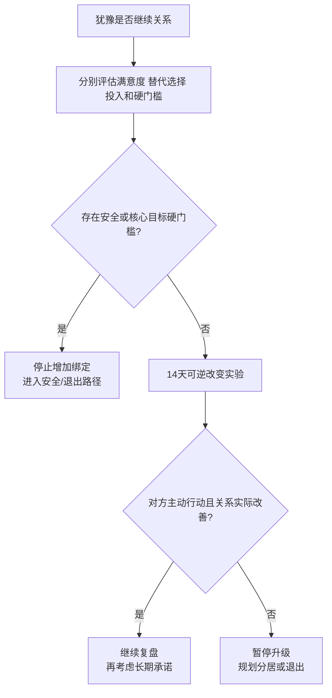

# 承诺、沉没成本与继续/退出审计

## Evidence base

Le 与 Agnew（2003）的投资模型元分析（DOI 10.1111/1475-6811.00035）覆盖 52 项研究、60 个独立样本和 11,582 人。指南把承诺拆成满意度、替代选择和投入，并增加安全与核心目标硬门槛，避免因为在一起久、买了房或见过父母就被迫继续。

## 四栏关系审计

双方分别填写，避免被对方答案带偏：

1. **满意度**：关系中得到的尊重、吸引、陪伴、成长和安全，哪些长期存在，哪些只是偶尔补偿；
2. **替代与选择**：单身、朋友/家人支持、住房、职业和社会网络是否真实可行，不把“没人要我”当事实；
3. **投入与成本**：时间、共同资产、宠物、孩子、社交圈和家庭期待；分别写可带走、可分割和不可逆的部分；
4. **硬门槛**：暴力、胁迫、重大隐瞒、核心生育冲突、持续控制和无法安全退出。

## 14 天继续/退出实验

1. 第 1–3 天分别写出继续、暂停、退出三种方案，不讨论谁对谁错。
2. 第 4–7 天观察三项行为：对方是否主动承担责任、是否尊重边界、是否能在压力下兑现承诺。
3. 第 8–10 天完成一项可逆改变，例如停止暧昧、分开管理账户、安排咨询、重新分工；写明负责人和截止时间。
4. 第 11–14 天复盘：满意度是否实际改善，投入是否只是增加锁定，替代方案是否被现实核验，硬门槛是否仍存在。
5. 只要硬门槛存在，不进入结婚、生育、共同借贷或继续加大不可逆投入。

可直接使用的话术：

> “我们在一起很久、花了很多钱，这说明投入很大，不说明关系一定值得继续。我们看现在的行为和安全，再决定下一步。”

> “我不拿‘没人会要我’做决策依据。我们分别列出继续、暂停和退出的现实成本，14 天后再决定。”

## 反应分支

| 对方反应 | 回应 | 下一步 |
|---|---|---|
| “都谈这么久了，不能分。” | “时间是投入，不是义务。继续需要现在仍有安全、尊重和可行改变。” | 做四栏审计 |
| “你离开就什么都没有。” | “这是锁定和恐惧，不是承诺证明。” | 盘点住房、财务和外部支持 |
| 对方承诺改变但无行动 | “承诺需要截止日期和结果。” | 14 天实验，未兑现就暂停升级 |
| 关系满意度低但投入很高 | “投入越高，越需要核算退出成本，而不是继续增加成本。” | 资产、居住和社交退出计划 |
| 对方出现暴力或控制 | “安全优先，不做共同修复实验。” | 外部支持、安全计划和退出路径 |
| 双方都愿意改变且无硬门槛 | “我们先用可逆措施验证，再考虑更深绑定。” | 每周复盘，暂缓不可逆决定 |

## Stop conditions

- 任何暴力、威胁、跟踪、性胁迫、财务控制或无法安全离开；
- 重大隐瞒、持续背叛、拒绝承担责任或拒绝停止伤害；
- 核心生育、忠诚、城市或债务目标无法调和；
- 一方以共同资产、孩子、宠物、家庭压力或“投入太多”阻止退出；
- 14 天实验没有可验证改变，却要求继续结婚、购房、生育或加大财务绑定。

触发停止条件时，停止增加投入，优先保护人身、账户、证件、居住和法律权益。

## Mermaid 分流图

