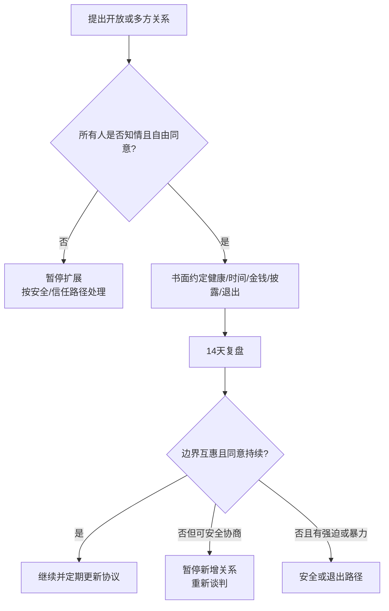

# 协商式非单偶关系边界指南

## Evidence base

Gupta, Tarantino & Sanner (2023), DOI 10.1111/jftr.12546, synthesized 209 studies on polyamory and consensual non-monogamy (CNM). The review covers diverse relationship processes and family forms; it does not show that CNM is universally better or worse than monogamy. The central operational criterion is informed, ongoing, and freely revocable consent from everyone affected.

## 先判断是不是共同选择

每个人分别回答，不在对方施压时回答：

1. 我是因为持续想要这种关系，还是因为害怕失去对方、挽救危机、对方威胁分手，或已经发生了隐瞒后的被动接受？
2. 我能否拒绝某个新增关系、活动、性行为、公开方式或时间安排，而不被惩罚？
3. 我是否知道会影响我的事实：伴侣数量、性健康风险、时间和金钱投入、共同生活变化、对外披露范围？
4. 每个人的边界是否同等有效，包括新加入关系的人，而不是只有“核心伴侣”有否决权？
5. 如果有人改变主意，是否有不报复的暂停、重新协商和退出方案？

只要存在威胁、欺骗、强迫、经济控制或无法安全拒绝，就先按安全或信任修复路径处理，暂不扩展关系。

## 写一份可执行协议

协议至少写清：

- **关系目标**：开放是长期关系形式、阶段性尝试，还是仅限某类活动；
- **披露范围**：何时告知新增关系、哪些隐私仍属于个人隐私；
- **性健康**：检测、保护措施、暴露通知、暂停条件和医疗联系人；
- **时间与金钱**：约会频率、共同预算、旅行、节假日和照护责任；
- **家庭与社交**：对子女、家人、同事和公开平台的披露边界；
- **冲突处理**：暂停信号、复盘时间、谁可以单独寻求支持；
- **退出机制**：如何结束一段关系、搬离、分配物品和停止联系。

建议开场：

> 我们讨论的是一种需要所有人持续同意的关系安排，不是把任何人逼进“开放”或“保守”的答案。先分别说清愿望、不能接受的事、健康和时间成本，再决定是否有必要尝试；任何人都可以暂停或退出。

## 新增关系后的 14 天复盘

每周一次分别回答：

1. 我是否仍然自愿，而不是在忍受或讨好？
2. 信息、时间、性健康和金钱是否按协议执行？
3. 嫉妒或不安是需要安慰、规则调整，还是暴露了欺骗和控制？
4. 新关系中的人是否拥有真实的知情权和拒绝权？
5. 下周要保留、修改还是暂停哪一项安排？

## 反应分支

| 对方反应 | 当下回答 | 下一步 |
|---|---|---|
| “你爱我就应该同意开放” | “爱不等于必须同意特定关系形式。我的同意必须自由且可撤回。” | 暂停推进，不在威胁中谈判 |
| “我们已经开放，所以不用再说” | “开放不是一次性同意。新增的人、风险、时间和边界都需要持续沟通。” | 更新协议并确认所有人知情 |
| 新加入的人不知道已有规则 | “没有知情同意就不能把这段关系当作协商式安排。” | 停止推进，先完成透明与安全沟通 |
| 一方开始被忽视或承担不成比例的成本 | “形式可以多元，但责任、信息和尊重不能只由一方承担。” | 重新分配时间/金钱，必要时暂停新增关系 |
| 嫉妒出现 | “嫉妒是需要处理的信息，不是控制对方的许可证。” | 区分事实、解释、需求，使用低侵入边界实验 |
| 出现欺骗、威胁或强迫 | “这已经不是关系形式争论，而是安全和同意问题。” | 进入安全、医疗或退出路径 |

## Stop conditions

- 一方在威胁、隐瞒或关系危机中被迫接受开放；
- 新增关系的人没有获得影响自身决定所需的信息；
- 以开放为理由强迫性行为、交出隐私、承担不对等经济或照护成本；
- 性健康协议被违反且对方拒绝暂停、检测或通知；
- 任何人不能安全地拒绝、暂停或退出，或出现暴力、跟踪、报复。

