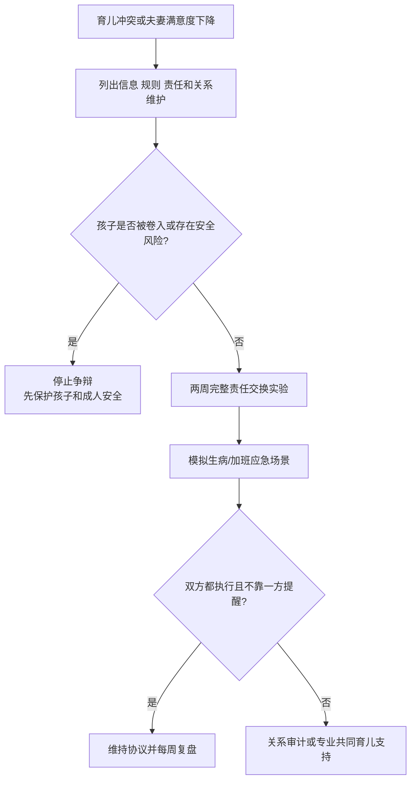

# 共同育儿与婚姻协作

## Evidence base

Ronaghan 等（2024）的元分析（DOI 10.1037/fam0001149）覆盖 108 项研究，发现婚姻满意度与共同育儿质量存在中等正向关联。指南将育儿协作写成具体责任和冲突规则，不把孩子当作夫妻矛盾的裁判。

## 五项共同育儿协议

1. **信息共享**：医疗、学校、作息和重要变化在 24 小时内同步；
2. **规则一致**：确定 3–5 条核心规则，例外情况写明谁可临时决定；
3. **责任完整**：发现、计划、执行、跟进和复盘由同一主责承担，不把任务变成“帮忙”；
4. **冲突隔离**：不在孩子面前辱骂、拉票或让孩子传话；
5. **关系维护**：每周安排一次不谈育儿的夫妻时间，避免关系只剩项目管理。

## 两周共同育儿实验

1. 第 1–3 天列出夜间照护、接送、医疗、教育、家务和情绪安抚任务，标明心理负荷。
2. 第 4–7 天由双方各自独立负责一组完整任务，不能由另一方持续提醒。
3. 第 8 天模拟孩子生病、加班或临时停课，测试备用人和应急规则。
4. 第 9–14 天复盘任务完成、冲突次数、孩子是否被卷入和双方恢复时间。

可直接使用的话术：

> “我们现在讨论的是育儿责任，不是在孩子面前判谁对谁错。先把信息、规则、主责和备用人写清楚。”

> “我愿意共同育儿，但不会接受让孩子传话或在孩子面前互相羞辱。争议留到孩子不在场时处理。”

## 反应分支

| 对方反应 | 回应 | 下一步 |
|---|---|---|
| “孩子听我的就行。” | “重大规则需要双方知情；紧急情况可以先处理，再在 24 小时内复盘。” | 写明紧急授权范围 |
| “你更擅长，所以你全权负责。” | “能力不同不等于永久主责。完整责任需要轮换和备用人。” | 两周交换一组任务 |
| 在孩子面前争吵或让孩子传话 | “我们暂停，孩子不承担成人冲突。” | 立即结束争吵，改用书面或专业支持 |
| 双方规则不一致 | “先选三条核心规则，其他差异留到每周复盘。” | 记录例外和后果 |
| 对方拒绝共享医疗/教育信息 | “这会影响孩子安全和共同责任。” | 先保护孩子，必要时联系专业/法律支持 |

## Stop conditions

- 在孩子面前威胁、辱骂、拉票、让孩子传话或阻断另一方接触孩子；
- 以育儿、抚养费、探视、医疗或教育控制伴侣；
- 一方承担全部夜间照护和心理负荷，另一方拒绝任何完整责任；
- 存在暴力、性胁迫、跟踪、药物失控或孩子即时安全风险；
- 重大医疗/教育决定被单方面隐瞒或强行执行。

触发停止条件时，优先孩子和成人安全，联系可信任的人、医疗、学校、法律或当地保护服务，不进行现场争辩。

## Mermaid 分流图

