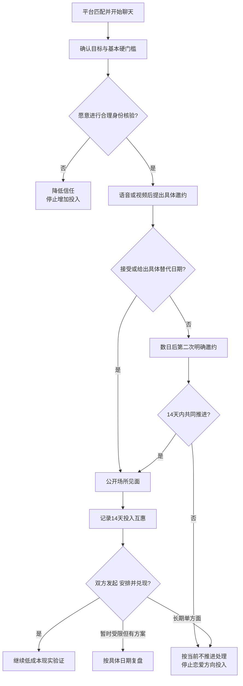

# 从线上聊天到现实约会：投入互惠与推进指南

## 明确结论

聊天热度不等于关系进展。判断一段初期约会是否值得继续，主要看双方是否共同完成下一步：明确目标、核验身份、提出或接受具体邀约、承担安排并兑现。完成基本安全核验后，最多进行两次明确邀约；14 天内对方既不接受，也不给出可执行替代方案，就停止把这段联系当作正在发展的恋爱机会。

“两次”和“14 天”是为了限制单方面等待的决策规则，不是判断对方人格或感情的科学阈值。疾病、出差、照护和异地等现实限制可以延长时间，但需要具体替代日期。

## Evidence base

Coduto 与 Fox（2024，DOI 10.1177/02654075241265064）通过 37 次深度访谈发现，约会软件用户会组合使用软件、社交媒体、文字、视频和面对面互动，并按关系推进、核验和减少不确定性等目标切换渠道。这种“渠道编织”说明，高频聊天只是一个渠道，是否推进还要看双方有没有共同完成现实动作。

## 第一步：先明确当前目标

在投入大量时间前，用一句话说明目的：

> “我使用平台主要是认真认识适合长期交往的人。你目前更倾向长期关系、轻松约会，还是还没确定？”

答案不必和你相同，但必须足够诚实，让你决定是否继续。不要把“随缘”“看感觉”自动翻译成长期关系意愿；继续观察时按“尚未确定”处理。

## 第二步：按目标进行渠道编织

1. **平台文字**：确认基本目标、城市、年龄范围和明显硬门槛，不发送证件或私密影像。
2. **语音或短视频**：在见面前核验真人和基本沟通感受；拒绝视频本身不是欺骗证明，但会降低可核验度。
3. **具体邀约**：提出日期、时间、公开场所和大致时长。
4. **现实见面**：第一次控制在 60–90 分钟，各自到达和离开，不借钱、不去住所。
5. **见面后复盘**：24 小时内明确“愿意继续、暂不确定或不继续”，不靠突然冷淡让对方猜。

可直接使用的邀约：

> “我愿意继续了解。周六下午 3 点在___咖啡馆见 60–90 分钟怎么样？我们各自过去。如果这个时间不行，你可以给一个下周能确定的时间。”

## 第三步：执行两次明确邀约

**第一次邀约**必须包含时间、地点类型和时长。对方忙但有兴趣，应当参与提出替代日期。

若第一次因合理原因未成，间隔数天后只再发一次：

> “上次时间没对上。我下周二或周四晚上有空。如果你也想见面，请选一个时间或给出你的具体方案；如果目前不方便推进，直接说也可以。”

两次明确邀约后停止追问。没有具体替代方案就按“当前不推进”处理，不继续用陪聊、礼物、转账或情绪劳动换取可能性。

## 第四步：做 14 天投入互惠记录

互惠不要求消息数、花费和主动次数完全相等。记录双方是否轮流承担以下行动：

| 项目 | 你做了什么 | 对方做了什么 | 是否兑现 |
|---|---|---|---|
| 发起联系 |  |  |  |
| 提出问题并记住答案 |  |  |  |
| 安排时间地点 |  |  |  |
| 处理改期 |  |  |  |
| 承担合理费用和路程 |  |  |  |
| 见面后表达选择 |  |  |  |

第 14 天只看行为：

- 双方都有发起、安排和兑现：继续安排第二或第三次低成本见面；
- 一方暂时忙但给出具体日期并兑现：按现实限制继续；
- 只有一方维持聊天、提问、计划和修复：停止主动 7 天，观察对方是否接手；
- 对方只在深夜、寂寞或需要帮助时出现：按其实际提供的关系类型判断，不按暧昧语言判断。

## 常见反应与相应回答

| 对方反应 | 你的回答 | 实际动作 |
|---|---|---|
| “最近很忙，以后再约。” | “理解。你确定时间后可以联系我；在此之前我不按正在推进处理。” | 不继续反复邀约 |
| 拒绝时间但给出具体替代方案 | “这个时间可以，我们按新方案确认。” | 观察是否兑现 |
| 连续取消但每次理由合理 | “原因可能合理，但当前仍不适合推进。等你能稳定安排时再联系。” | 暂停投入 |
| “先聊几个月再见面。” | “我不适合长期只聊天。可以先视频；若仍不能安排现实见面，我会停止恋爱方向的投入。” | 一次视频核验后决策 |
| “见面必须来我家/酒店。” | “第一次只在公开场所，各自往返。这是我的安全条件。” | 不满足就不见 |
| 对方担心安全 | “我们可以先短视频，见面选白天公共场所，各自交通，并告诉朋友。” | 共同降低风险 |
| 总让你选地点、订票、提醒 | “下一次请你完整负责时间和地点，确定后告诉我。” | 观察是否承担安排 |
| 只发暧昧信息，不回答现实问题 | “我需要通过实际见面和基本信息核验来了解，不继续只靠暧昧聊天。” | 降低联系频率 |
| 见面后不想继续 | “谢谢见面，我没有继续发展恋爱关系的意愿，祝好。” | 清楚结束，不留假希望 |
| 对方因路程或收入有限难以见面 | “我们把距离、预算和可行频率写清楚，再判断是否适合。” | 共同提出低成本方案 |

## 决策规则

- **有回应、有替代日期、有兑现**：继续低成本现实验证。
- **回复慢但稳定兑现**：按行为质量判断，不用即时回复速度代替适配度。
- **聊天积极但不核验、不见面、不安排**：停止把它当作正在推进的关系。
- **投入暂时不对称但原因明确且会补位**：观察一个周期，不要求机械对半。
- **长期由你发起、计划、付款和修复**：收回投入；这已经是可观察的不互惠。
- **明确拒绝或不回复**：接受结果，不换账号追问，不找其亲友施压。

## Stop conditions

- 要求转账、投资、代付、借款、购买礼物或提供账户验证码；
- 拒绝任何合理核验，却要求发送证件、住址、裸照或私密视频；
- 强迫第一次见面去住所、酒店、偏僻地点或乘坐对方控制的车辆；
- 多次失约、冒用身份、婚恋状态前后矛盾或隐瞒已有伴侣；
- 因你拒绝性行为、金钱或私人地点而羞辱、威胁、跟踪或曝光；
- 你已明确结束后，对方持续换账号联系、堵门或骚扰。

触发诈骗或人身安全风险时，停止见面和转账，保存证据，联系平台、可信任的人或当地紧急支持。

## Mermaid 分流图

## Evidence boundary

本指南不能凭回复间隔、一次改期或消息长短判断对方是否喜欢你，更不能诊断“回避型”“养鱼”或人格问题。它只使用目标、具体邀约、替代方案和兑现行为管理自己的投入。文化、残障、照护责任、轮班、城乡距离和收入都会影响渠道与节奏，应围绕可行性调整，而不是降低知情、安全和互惠标准。
