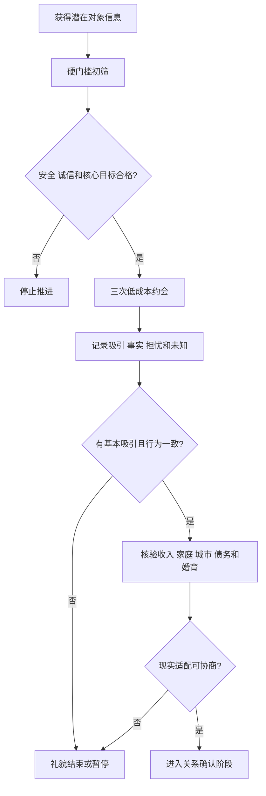

# 择偶条件与真实约会验证

## Evidence base

Eastwick、Luchies、Finkel 与 Hunt（2014）的综述与元分析（DOI 10.1037/a0032432）指出，抽象理想伴侣偏好对真实关系评价的预测效度取决于情境。指南保留必要底线，同时用低成本现实互动验证吸引与适配。

## 三层择偶清单

每层最多五项，防止清单无限膨胀：

1. **硬门槛**：安全、基本诚信、婚育目标、忠诚协议、重大债务/婚史、性同意；任一不合格即可停止。
2. **重要偏好**：外貌吸引、收入、教育、城市、生活方式、家庭背景；用于排序和现实权衡。
3. **待验证行为**：守时、尊重、倾听、冲突、花钱、对服务人员态度、承诺兑现；只能通过时间观察。

## 三次低成本约会法

只适用于通过安全和硬门槛初筛的人：

1. **第一次：基本感受**——公共场所 60–90 分钟，观察交流、安全感和基本吸引；不谈重大承诺。
2. **第二次：现实兼容**——安排需要一点协作的活动，讨论城市、工作、家庭、婚育和消费，不审讯。
3. **第三次：边界与行动**——观察计划改变、不同意见或小压力下的反应，核对说法是否一致。

每次见面后分别记录：想继续的具体原因、担忧的具体事实、仍未知的信息。连续没有吸引或出现硬门槛问题时停止，不用“再培养一下”强迫自己。

可直接使用的话术：

> “我的底线是诚信、安全和婚育方向一致；外貌、收入和城市是重要偏好，但我会通过几次真实相处判断，而不是只看资料标签。”

> “我愿意再见两次验证相处感，但这不代表承诺关系。每个人都可以随时礼貌停止。”

## 反应分支

| 对方反应 | 回应 | 下一步 |
|---|---|---|
| “条件这么多就是物质。” | “现实条件会影响长期生活，我会坦诚权衡，也不会把单项条件等同于人的价值。” | 说明硬门槛与偏好的区别 |
| 条件很好但没有吸引 | “适合不等于有恋爱吸引。我不靠婚姻压力强迫继续。” | 礼貌结束或最多三次验证 |
| 很有吸引但现实条件冲突 | “吸引不能解决生育、债务、城市和家庭责任。” | 进入现实适配审计 |
| 对方要求第一次见面就排他或承诺 | “我需要经过现实验证后再确认关系。” | 保持独立出行和财务边界 |
| 清单筛掉所有人 | “检查是否把偏好误写成硬门槛，或要求单个人同时满足互相冲突的条件。” | 每层限制五项并排序 |
| 对方隐瞒硬门槛信息 | “这不是偏好差异，而是诚信和风险问题。” | 停止推进并核验安全 |

## Stop conditions

- 暴力、威胁、跟踪、性胁迫、诈骗、重大身份/婚史/债务隐瞒；
- 核心婚育、忠诚、城市或生活方式目标无法调和；
- 以收入、学历、外貌、户籍或家庭背景羞辱并要求服从；
- 强迫快速排他、见父母、同居、转账、性行为或结婚；
- 连续三次见面仍没有基本吸引、尊重或继续了解的意愿。

触发停止条件时，不继续做约会实验；礼貌结束。存在安全或欺诈风险时，保留证据并使用平台、法律或外部支持路径。

## Mermaid 分流图

