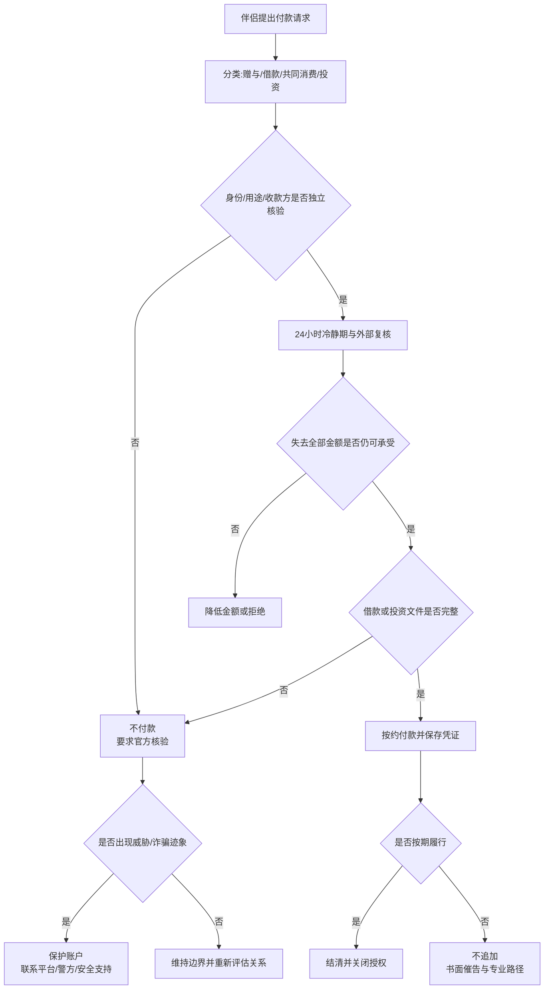

# 恋爱借款、大额转账、礼物与共同消费边界

恋爱中的钱先分为赠与、借款、共同消费和共同投资四类。付款前不能说清属于哪一类，就先不付。爱、信任、婚期和“以后是一家人”不能替代身份、用途、还款能力与书面证据。

## Evidence base

Lazarus等（2023，DOI 10.1016/j.jeconc.2023.100013）系统回顾26项网络恋爱诈骗实证研究，梳理了关系建立和说服操控方式，同时指出地区和资料偏差。Garbinsky等（2020，DOI 10.1093/jcr/ucz052）讨论伴侣间财务隐瞒及其关系影响。这些研究支持外部核验和财务透明，不能仅凭某个“红旗”认定诈骗。

## 四类款项必须分开

| 类型 | 付款前必须明确 | 默认规则 |
|---|---|---|
| 赠与 | 金额、对象、是否附条件、是否承受得起不返还 | 只送得起失去的钱 |
| 借款 | 借款人、用途、金额、到账账户、期限、还款计划和违约处理 | 无书面确认不出借 |
| 共同消费 | 项目、预算、分摊比例、退款进入谁的账户 | 消费前对齐，凭证共享 |
| 共同投资 | 标的、所有权、平台、风险、退出和监管状态 | 未独立核验不参与 |

转账备注只是证据的一部分，不能单独保证款项法律性质。具体争议应核对完整聊天、协议、流水、实际用途和当地法律。

## 付款前七步核验

1. **暂停24 小时**：大额、借款、投资或对方催促的付款至少等待24小时；紧急医疗也要直接向医院等机构核验并尽量对公支付。
2. **核验身份**：视频、真实姓名、稳定联系方式和现实见面相互一致；不把头像、证件照片或来电显示当唯一证据。
3. **核验用途**：直接联系医院、学校、房东、商家或正规平台，不使用对方提供的陌生“客服”。
4. **核验收款方**：收款人为什么是本人、亲友、公司或虚拟币地址；第三方账户默认高风险。
5. **核验还款能力**：收入来源、现有债务、日期和分期金额能否闭合。还款计划靠下一笔借款就停止。
6. **形成书面记录**：借款双方、金额、币种、日期、用途、还款和争议处理写清；复杂或大额情况先咨询当地律师。
7. **外部复核**：把不含隐私的付款结构交给可信者审阅。若对方禁止咨询银行、家人、律师或警方，不付款。

## 金额规则

- 赠与上限：失去后不影响房租、医疗、债务和应急金；
- 恋爱借款上限：即使完全无法收回，也不会需要新增借贷；
- 未现实见面、身份未独立核验：借款和投资上限为0；
- 首笔未按期归还：不追加第二笔，不用新钱“解冻”旧钱；
- 任何验证码、银行卡、支付密码、屏幕共享和远程控制请求：拒绝。

## 已付款后的48小时动作

1. 立即停止追加付款、借贷、担保和代收代转；
2. 保存完整聊天、账号、链接、电话号码、收款账户、流水和时间线，不只截取局部；
3. 通过官方渠道联系银行、支付平台或交易平台，询问止付、冻结或申诉可能；
4. 怀疑诈骗时联系当地警方或反诈渠道，不再按对方指示支付“保证金”“税费”或“解冻费”；
5. 若是真实伴侣借款逾期，发一次书面催告，列金额、到期日和回复期限；之后转专业协商或法律路径，不用持续情感争吵追债。

## 可直接使用的话术

> “请先说明这是赠与、借款还是共同消费。性质、用途、收款人和期限没有写清之前，我不转账。”

> “大额付款统一有24小时冷静期，我会通过官方渠道核验。催得越急，越不会跳过流程。”

> “第一笔还没有按约归还，我不会追加。请在___日前书面确认余额和还款计划。”

> “我不会提供验证码、银行卡、远程控制或替你代收代转。这条边界不因恋爱关系改变。”

## 对方可能的反应及回应

| 反应 | 回应 | 下一步 |
|---|---|---|
| “爱我就应该帮我。” | “帮助不能取消核验和承受上限。” | 要求用途、账户和期限 |
| “只有今天能解决。” | “紧急不等于向陌生账户付款，我直接向机构核验。” | 通过官方号码联系 |
| “写借条太见外。” | “写清是保护双方理解一致。” | 拒绝无书面借款 |
| “先付解冻费就能全部返还。” | “不以新付款追回旧付款。” | 停止追加并联系平台/警方 |
| “不要告诉家人或银行。” | “禁止外部核验本身就是停止条件。” | 不付款，保存记录 |
| 借款到期后反复改日期 | “请一次给出可执行分期；再失约就进入正式催收路径。” | 停止新借款 |
| 对方说共同消费应由收入高者全付 | “比例可以协商，但项目、预算和上限要双方同意。” | 改为事前预算表 |
| 对方威胁曝光隐私或伤害自己 | “我不会因威胁转账，会联系能够提供安全帮助的人。” | 保存证据并联系专业支持 |

## Stop conditions

- 未现实见面或身份无法独立核验，却要求借钱、投资或代收代转；
- 要求验证码、银行卡、支付密码、远程控制、虚拟币或陌生平台充值；
- 使用疾病、事故、海关、军人、海外工程、投资内幕等理由持续制造紧迫付款；
- 首笔未归还却要求追加，或要求支付解冻费、保证金、税费追回旧款；
- 拒绝书面记录、官方核验或第三方复核；
- 强迫贷款、担保、套现、隐瞒债务或伪造资料；
- 通过羞辱、分手、自伤、暴力、曝光隐私或扣押财物逼迫付款；
- 控制收入、阻止工作、没收账户或让一方失去基本退出能力。

触发停止条件时不追加、不担保、不代转；保护账户和设备，保存证据并使用银行、平台、警方、律师或安全支持的官方渠道。

## Mermaid分流图

文字版：先分类，再核验身份、用途和收款方；经过24小时冷静期并确认损失可承受，借款或投资文件完整才付款；失约后不追加，转书面催告和专业路径；出现威胁或诈骗迹象立即保护账户并使用官方渠道。

## Evidence boundary

恋爱诈骗研究不能形成“受害者画像”，也不能把信任或曾经付款解释为受害者责任。真实伴侣之间的借款、赠与和共同消费同样可能发生争议，但是否构成债务、诈骗或可撤销交易需要依据证据和当地法律判断。本指南提供风险控制和资料整理，不替代法律意见。
