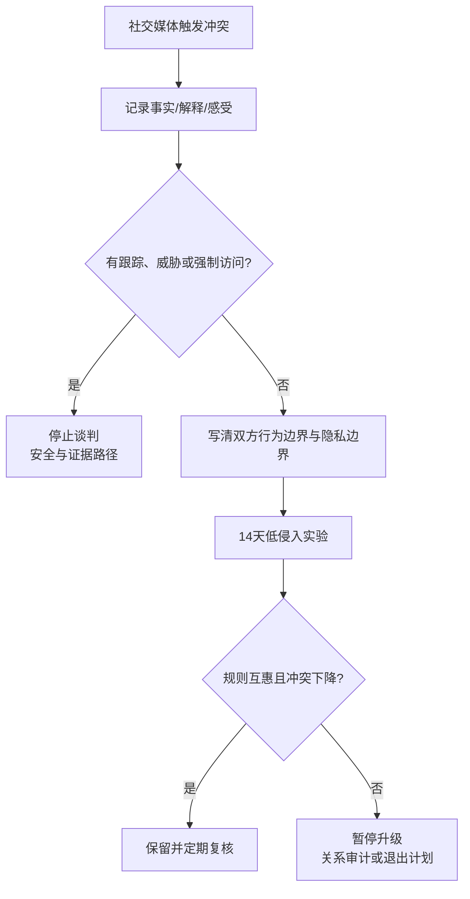

# Digital boundaries and social-media jealousy

## Evidence base

Tandon, Dhir & Mäntymäki (2021), DOI 10.1108/intr-02-2020-0103, reviewed 45 empirical studies on social-media-induced jealousy. The abstract identifies individual, partner, rival, and platform factors and notes possible links to intimate-partner violence and cyberstalking. Because this package has only verified the abstract, use it to structure questions, not to label a person or infer infidelity.

## Classify the issue before changing access

Ask privately:

1. What observable event triggered concern: a message, follow, hidden story, delayed reply, location change, public post, or refusal to disclose?
2. What conclusion did each person draw from that event?
3. What boundary is actually requested: exclusivity, response time, public acknowledgment, no private flirting, location privacy, or no contact with a specific person?
4. Is the request mutual, specific, proportionate, and freely revocable, or is it a demand for passwords, constant location, screenshots, or isolation from friends?
5. Has anyone threatened, impersonated, exposed private material, installed tracking, or repeatedly monitored an account without consent?

If there is tracking, threats, exposure of intimate material, impersonation, or retaliation for refusing access, stop treating the issue as a jealousy negotiation and use a safety and evidence-preservation path.

## A 25-minute boundary conversation

1. Each person names one fact, one interpretation, and one feeling. Do not argue the interpretation before both facts are recorded.
2. State the relationship rule in behavior terms: “我们不与暧昧对象私下约会” is clearer than “你要让我有安全感”。
3. State privacy terms: what remains private, what is voluntarily shared, when consent expires, and how either person can withdraw access.
4. Choose one low-intrusion experiment for 14 days, such as a predictable check-in time or a clear response when plans change. Do not use password exchange as the experiment.
5. Review whether anxiety decreased, whether the rule was mutual, and whether either person felt controlled or isolated.

Suggested opening:

> 我们先把事实、猜测和边界分开。我要讨论的是___这个具体行为，不要求你交出密码或放弃隐私。我们一起写出双方都适用、可以随时撤回的规则，14 天后看它是否真的减少了冲突。

## Reaction branches

| 对方反应 | 当下回答 | 下一步 |
|---|---|---|
| “你不让我查手机就是有鬼” | “隐私不等于出轨证据。我们可以谈具体行为和共同规则，但不以强制检查作为信任证明。” | 记录事实，拒绝扩大监控 |
| 对方愿意说明具体边界 | “我们把规则写成双方同样适用的行为，并注明例外。” | 14 天低侵入实验 |
| 要求全天定位或实时截图 | “持续监控会改变关系结构，不是一次性透明。我不接受把它作为亲密义务。” | 提出低侵入替代；若伴随威胁，进入安全路径 |
| 发现确实有暧昧或欺骗 | “我们先确认事实和影响，再决定修复、暂停或退出，不用争论谁更有资格生气。” | 进入修复或关系可行性审计 |
| 对方辱骂、威胁或曝光私密内容 | “我停止这次沟通。后续只保留必要书面联系。” | 保存证据、告知可信任的人、寻求专业或法律支持 |
| 双方规则总被打破 | “问题已经不是某条动态，而是规则不被执行。” | 暂停升级承诺，进入 30 天审计或退出计划 |

## Stop conditions

- 未经同意读取设备、安装定位或跟踪软件、冒用账号；
- 以分手、金钱、住房、暴力或曝光私密内容强迫提供密码、定位或性相关材料；
- 迫使一方断绝朋友、家人或正常工作社交；
- 反复删除、篡改或伪造证据来操纵对方判断；
- 任何网络跟踪或网络行为升级为现实跟踪、威胁或人身危险。

