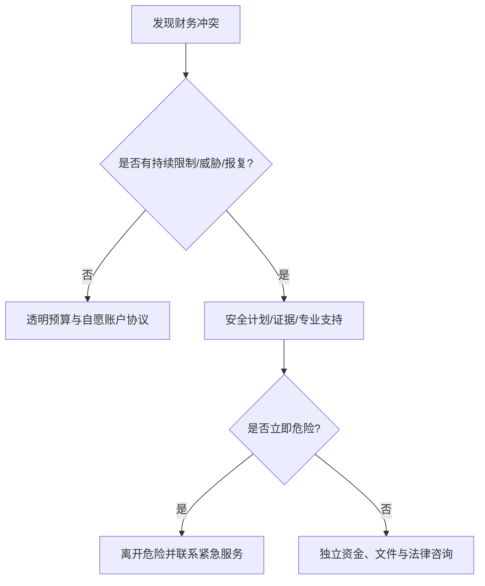

# 经济控制识别与财务安全计划

这份指南用于区分普通的共同理财分歧与以钱限制自由的控制。出现胁迫、暴力或报复迹象时，安全优先，不能把“坐下来谈谈”作为唯一方案。

## Evidence base

Adams 等（2022，DOI 10.1186/s12889-022-13297-4）的范围综述把经济虐待与就业、账户、债务、住房和离开关系后的结果联系起来。研究是跨研究的群体证据，不能仅凭一次争吵下诊断；是否构成控制要看持续模式、权力和后果。

## 先做事实分层

分别记录：就业限制、收入上交、账户和密码、债务/担保、证件和住房、医疗与交通、转账凭证、威胁及报复。问三件事：能否自由知道资产负债？能否拒绝转账？拒绝后是否会失去基本生活、工作或人身安全？

## 安全步骤

1. 在安全设备上保存身份证件、银行卡、合同、联系人和重要号码的副本。
2. 保留一笔本人可访问的应急资金和独立联系方式；不要在可能被监控的设备上留下计划。
3. 不签未知共同债务、不交出密码、不为对方担保；需要时咨询当地法律援助或反家暴机构。
4. 若存在威胁、跟踪、暴力或强制转账，先离开危险场景，联系可信任的人和当地紧急服务，不安排对质。
5. 只有在没有胁迫且双方都安全时，才做账户、预算和偿债会议，并记录谁能执行什么。

## 反应与回应

| 反应 | 回应与下一步 |
|---|---|
| “情侣就该共用所有账户。” | “共同财务需要自愿、透明和可退出；我保留个人账户。”拒绝交密码。 |
| “不给钱就是不爱我。” | “感情不等于无条件转账或担保。”暂停付款，保留记录。 |
| 对方承诺改但要求先删记录 | “安全记录不能删除，改变要通过持续可验证行为。”通知支持者。 |
| 对方发现安全计划后报复 | 不对质；转移到安全地点，联系当地专业支持。 |

## Stop conditions

- 扣留证件、工资或药物，限制工作、就医、交通或住房；
- 强迫借贷、担保、转账、隐瞒债务或用分手/暴力威胁；
- 监控设备、账户或通讯，发现独立资金即报复；
- 任何人身暴力或迫在眉睫的危险。

