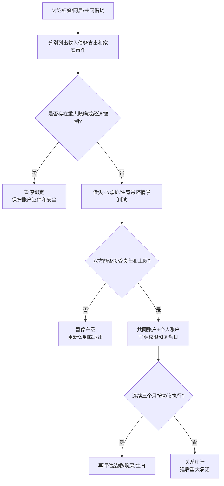

# 婚恋经济压力与婚姻现实可行性审计

## Evidence base

Falconier 与 Jackson（2020）的元分析（DOI 10.1037/str0000157）显示，经济压力与伴侣关系质量下降、冲突和情绪疏离相关。指南把经济问题转化为婚前和婚后都能执行的审计，不把收入高低直接等同于伴侣价值。

## 先分开五个问题

1. **现金流**：每月税后收入、固定支出、可变支出和可用结余；
2. **负债与风险**：房贷、消费贷、担保、失业概率、重大医疗或照护支出；
3. **价值观**：储蓄、消费、借钱给父母、买房、生育和生活水平优先级；
4. **家庭责任**：双方父母支持、彩礼/婚礼、兄弟姐妹、城乡迁移和照护预期；
5. **权力与安全**：谁掌握账户、谁能查账、谁承担债务、是否用钱控制或惩罚。

## 婚前两周财务审计

1. 各自单独填写收入、资产、债务、固定支出和家庭转移，不要求展示与婚姻无关的隐私消费明细。
2. 把项目分为“必须共同承担”“可以协商”“个人承担”“不得隐瞒”四栏。
3. 用最坏情景测试：一方失业 6 个月、父母急需照护、孩子出生后收入下降、房贷利率上升。写出谁承担、持续多久、备用方案是什么。
4. 设立共同账户只覆盖约定共同支出，保留双方个人账户和最低应急金；共同金额按收入、责任和双方同意确定，不机械追求一半一半。
5. 写成一页协议：金额、日期、权限、每月复盘日、重大支出门槛和违约后的处理。结婚或共同借贷前让专业人士审阅法律和税务风险。

可直接使用的话术：

> “我不是只看你现在赚多少，而是要知道我们遇到失业、父母照护和生育时怎么活下去。我们把数字写出来，再决定哪些能承受、哪些不能。”

> “共同生活需要透明，但透明不等于一方控制全部账户。共同支出共同确认，个人账户和应急金都保留。”

## 反应分支

| 对方反应 | 回应 | 下一步 |
|---|---|---|
| “谈钱太伤感情。” | “不谈钱会把风险留到婚后。我们只谈五类数字，谈完再决定是否继续。” | 设定 60 分钟审计会议 |
| 拒绝透露债务或收入 | “你可以保留与关系无关的隐私，但共同借贷、婚礼和家庭责任相关信息必须在承诺前知道。” | 暂停结婚/共同借贷，要求书面核验 |
| “我的父母以后都由我们负责。” | “这是家庭责任，不是默认义务。我们要先确定金额上限、持续时间和两个人都同意的方案。” | 写入上限和复盘日期 |
| 一方收入高，要求全部决策权 | “贡献可以不同，知情权和重大决定权不能被收入自动替代。” | 分开权限、建立共同审批 |
| 对方短期答应，长期继续隐瞒或超支 | “承诺需要连续三个月的可验证记录。” | 延后婚礼/购房/共同债务，进行关系审计 |
| 出现经济控制、威胁或强迫借贷 | “这已经不是预算分歧，而是安全问题。” | 保留证据、保护账户和证件，联系外部支持与法律服务 |

## Stop conditions

- 隐瞒重大债务、担保、收入来源或法律责任；
- 强迫共同借贷、转账、买房、彩礼或承担对方家庭债务；
- 以收入、性别、彩礼或住房控制对方的人身自由、社交、就医或退出能力；
- 对方拒绝任何透明、复盘和责任协议，却要求继续推进结婚或生育；
- 出现威胁、暴力、报复、扣押证件或冻结生活费。

触发停止条件时，暂停结婚、共同借贷和重大资产绑定；先保护账户、证件和居住安全，再寻求法律、财务或安全支持。

## Mermaid 分流图

