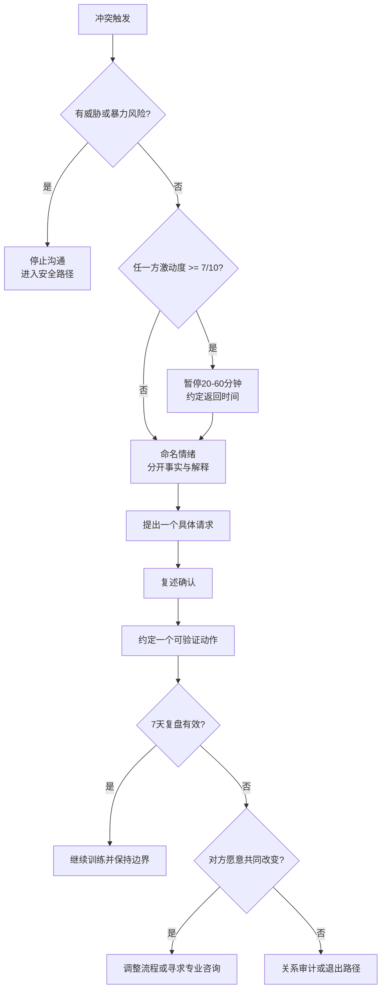

# 情绪调节与冲突降温

## Evidence base

Jardine、Vannier 与 Voyer（2022）的系统综述与元分析（DOI 10.1016/j.paid.2022.111713）汇总 78 个样本、90 个效应量，发现情绪智力与恋爱关系满意度存在总体正向关联。指南把它转化为可观察、可复盘的行为训练，不使用情绪智力分数诊断任何人。

## 先判断是否适合继续谈

若出现威胁、暴力、跟踪、性胁迫、摔东西、堵门或一方无法安全离开，立即停止沟通并进入安全路径。没有安全风险时，用 0–10 分自评激动程度：任一方达到 7 分，先暂停 20–60 分钟；暂停时说清返回时间，不能用消失惩罚对方。

## 五步降温协议

1. **命名**：各自用一个情绪词和一个身体信号描述当下，例如“我现在是害怕，胸口发紧”。
2. **分开事实和解释**：写下能被录音或记录验证的事实，再写自己的猜测；暂不把猜测当结论。
3. **说出需要**：用“当……时，我感到……，我需要……，请你在……前……”表达一个请求。
4. **确认理解**：听者先复述，不急着反驳：“我听到你在意的是___，我复述对了吗？”
5. **选择动作**：一次只约定一项可验证行为，并写明完成时间；下次复盘时讨论结果，不重新审判人格。

可直接使用的话术：

> “我现在是 7 分，继续说会变成攻击。我需要暂停 30 分钟，今晚 21:00 回来谈这一个问题。回来后我先复述你的重点，再说我的请求。”

> “我听到的事实是___；我的解释是___，这部分可能不准确。我希望你在明天 18:00 前告诉我是否能___。”

## 7 天微型训练

每天用 3 分钟记录一次：触发事件、情绪词、激动分数、冲动反应、实际需要。每次冲突只练一个动作，例如本周只练“暂停并按时返回”。第 7 天共同复盘：暂停是否按时返回、请求是否具体、是否减少辱骂和翻旧账。若没有改善，先检查安全、睡眠、酒精/药物和现实压力，再决定是否需要伴侣咨询。

## 反应分支

| 对方反应 | 回应 | 下一步 |
|---|---|---|
| “你又在用技巧逃避。” | “我不是结束讨论，而是把返回时间定在 21:00。到时只谈这一个事实。” | 按时返回；若反复失约，讨论可信度而非继续争吵 |
| “你应该自己知道我想要什么。” | “我愿意理解，但我不会靠猜。请给我一个具体请求，我也会给你一个。” | 每次只提出一项请求 |
| “我道歉了，你还要怎样？” | “我需要的是具体改变：下次发生___时请做___，我们 7 天后检查。” | 区分道歉、补偿和持续行为 |
| 对方只要求你调节，自己继续辱骂 | “调节不能替代基本尊重。出现辱骂我会停止谈话，等安全且能互相尊重时再谈。” | 记录模式，必要时进入关系审计或安全路径 |
| 双方都无法降到 6 分以下 | “今天先处理安全和必要安排，争议留到明天或交给专业人士。” | 暂停争议，预约专业帮助 |

## Stop conditions

- 任何威胁、暴力、堵门、跟踪、性胁迫或报复；
- “暂停”被用来惩罚、消失、扣留金钱或故意制造恐惧；
- 一方持续要求另一方猜测、安抚和调节，却拒绝承担自己的表达和行为责任；
- 反复训练 2–4 周仍只有一方改变，且对方拒绝咨询、边界或任何可验证的行为调整。

触发停止条件时，不继续做沟通技巧实验；优先安全、外部支持、专业咨询和关系可行性审计。

## Mermaid 分流图

