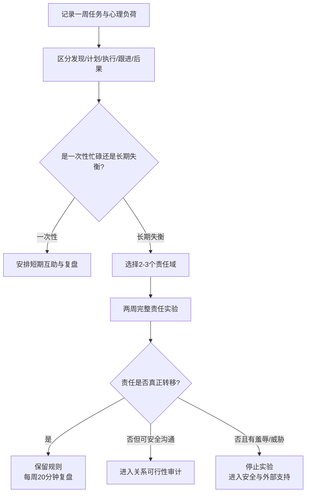

# 情绪劳动与心理负荷指南

## Evidence base

Reich-Stiebert, Froehlich & Voltmer (2023), DOI 10.1007/s11199-023-01362-0, systematically reviewed 31 full-text studies on mental labor in household and childcare work. The abstract describes planning, anticipating, remembering, delegating, monitoring, and decision-making as distinct from physical execution, and links unequal cognitive load with stress and lower relationship satisfaction. The review is recorded as `abstract_reviewed`; it does not define a universal gender rule or个人诊断标准。

## 先记录一周，而不是争论谁更累

连续 7 天记录每项重复性任务：

| 任务 | 谁先发现需要做 | 谁做计划 | 谁执行 | 谁提醒/跟进 | 谁承担失败后果 |
|---|---|---|---|---|---|
| 例如：孩子体检 | ___ | ___ | ___ | ___ | ___ |

同时把关系中的非家务负担单独记录：安抚争吵、记住纪念日、安排双方家庭、维持社交联系、提醒伴侣就医或完成承诺。记录行为，不给人贴“懒”“不体贴”标签。

## 把“帮忙”改成完整责任制

一个责任只有在同一个人能够完成以下闭环时，才算真正转移：

1. **发现**：主动知道什么时候需要做；
2. **规划**：决定步骤、时间、资源和备选方案；
3. **执行**：亲自完成或协调完成；
4. **跟进**：确认结果，没有把提醒任务退回给另一方；
5. **复盘**：出现问题时调整流程并承担后果。

建议话术：

> 我需要的是完整负责，不是等我分配任务。我们先记录谁承担发现、计划、执行、跟进和失败后的处理，再决定怎样重新分工。

## 两周重新分工实验

1. 从一周记录中选 2—3 个高频、可观察的责任域，例如孩子就医、家庭采购、账单、双方家庭沟通或冲突后的复盘。
2. 每个责任域只指定一名主要负责人；负责人独立完成发现、计划、执行和跟进，另一方不做隐形项目经理。
3. 每周安排一次 20 分钟复盘，只问三件事：完成了什么、哪里卡住、下一周流程改什么。
4. 允许提供资源和培训，但不把“我更擅长”自动变成永久垄断；必要时使用清单、日历或外部服务。
5. 两周后比较：提醒次数是否下降、遗漏是否减少、双方压力是否变化、责任是否真正转移。没有行为变化就暂停继续加码，进入关系审计。

## 反应分支

| 对方反应 | 当下回答 | 下一步 |
|---|---|---|
| “你直接告诉我就行” | “如果我继续发现、计划和提醒，责任并没有转移。你需要自己接住完整闭环。” | 指定责任域和截止日期，不逐项派工 |
| 只愿意执行，不愿意规划 | “执行有价值，但规划和跟进仍然是负担的一部分。” | 让同一负责人完成全流程 |
| 短期积极，随后回到原状 | “我们看的是两周后的稳定行为，不是今天的态度。” | 保留记录，按结果调整分工或进入审计 |
| “这是性别/收入/谁更擅长决定的” | “能力差异可以决定培训和资源，不能自动决定谁永久承担全部心理负荷。” | 用任务闭环和后果分布重新核对 |
| 要求继续由一方安抚所有情绪 | “支持可以互相提供，但不能由一个人永久负责两个人的情绪调节。” | 约定暂停、返回和各自的自我调节责任 |
| 因分工讨论出现羞辱或威胁 | “现在先停止分工谈判。安全和尊重恢复前，不继续这项实验。” | 进入安全路径或寻求外部支持 |

## 停止条件 / Stop conditions

- 一方拒绝承担任何完整责任，却要求另一方继续提醒和管理；
- 责任转移只停留在口头承诺，连续两周没有可观察行为变化；
- 用性别、收入、专业能力或“谁更在意”合理化长期不平等；
- 一方被要求承担对方全部情绪安抚、冲突修复或关系维护；
- 讨论中出现羞辱、威胁、报复、财务控制或其他安全风险。

