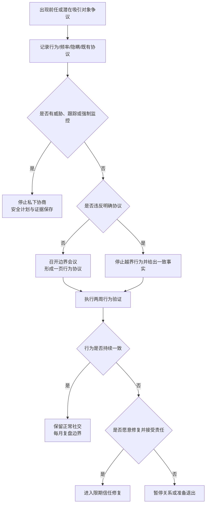

# 前任、潜在吸引对象与社交边界

健康边界针对具体行为、信息和风险，不按性别全面禁止朋友。前任联系、私聊、单独见面或赠礼本身不能自动证明出轨；隐瞒、删除记录、反复改变说法、违反已同意的规则以及把伴侣排除在现实之外，才需要升级审计。

## Evidence base

Salavati 与 Boon（2024，DOI 10.1111/pere.12532）在135名参与者和30种私信情境中发现，隐瞒对越界判断的影响最大，其次是频率。Tandon 等（2021，DOI 10.1108/intr-02-2020-0103）的系统综述显示，社交媒体嫉妒涉及个人、伴侣、竞争者和平台等多层因素。两者都不能把嫉妒当证据，也不能证明某次联系就是不忠。

## 先做四级行为分类

| 级别 | 行为示例 | 处理 |
|---|---|---|
| 1 日常社交 | 公开群聊、工作联系、正常朋友活动 | 不需逐次报备 |
| 2 需要透明 | 高频私聊、单独深夜见面、前任因共同事务联系 | 说明目的、频率和必要性 |
| 3 明确越界 | 性暗示、贬低伴侣换取亲密、隐藏见面、删除记录、违反协议 | 停止行为并做信任审计 |
| 4 安全风险 | 跟踪、威胁、勒索、散布隐私、强制查设备或隔离社交 | 安全计划与专业支持 |

级别按行为和协议判断，不按性别、性取向或朋友身份自动归类。

## 一次边界会议

双方分别写出以下答案，再逐项对齐：

1. 哪些联系无需报备，哪些需要事前说明，哪些不可接受？
2. 前任是否因孩子、财产、工作或共同社交圈必须联系？使用什么渠道和频率？
3. 单独见面、深夜聊天、饮酒、旅行、赠礼和倾诉关系问题的边界是什么？
4. 什么叫隐瞒：撒谎、删除、改备注、关闭通知，还是单纯没有逐条汇报？
5. 违反一次和重复违反分别如何修复？
6. 哪些隐私仍然保留，例如朋友秘密、工作机密和个人日记？

最后形成一页协议，只写可观察行为。例如“与前任因孩子事务联系使用固定渠道；非紧急联系在22点前；不让孩子传话”，不要写“永远让我安心”。

## 两周行为验证

### 第1—3天：核对事实

记录触发事件、已知事实、未知信息、双方旧协议和实际影响。只问与共同风险有关的信息，不要求交出全部历史聊天、密码或实时定位。

### 第4—7天：执行三个动作

- 越界联系暂停或改为必要的公开/固定渠道；
- 需要继续的前任联系明确目的、频率和结束条件；
- 双方各恢复一个正常社交活动，验证边界是否保护关系而非隔离个人。

### 第8—14天：观察一致性

检查是否按时说明、是否删除或改变说法、是否尊重拒绝、是否停止把伴侣与第三方比较。评估的是持续行为，不以一次展示手机作为信任证明。

第14天只选一个结果：协议有效并继续；缩紧某项具体边界再观察14天；进入信任修复；或因重复欺骗、控制或目标不兼容暂停关系。

## 可直接使用的话术

> “我不按性别禁止你交朋友。我需要讨论的是这次联系的目的、频率、是否隐瞒，以及它是否违反我们的协议。”

> “我现在确认的事实是___，不知道的是___。请直接回答这两个问题，不需要交出全部设备证明清白。”

> “与前任因孩子/财产联系可以保留，但请使用固定渠道，只谈必要事项，并把临时变化写清。”

> “删除记录和改变说法破坏的是可验证性。修复需要停止该行为、给出一致事实并连续两周执行新边界。”

## 对方可能的反应及回应

| 反应 | 回应 | 下一步 |
|---|---|---|
| “只是朋友，你想太多。” | “朋友身份不能回答隐瞒和协议问题，我们只核对具体行为。” | 回到四级分类 |
| “你不信任我就分手。” | “我在提出可执行边界，不接受用威胁代替回答。” | 暂停谈话，观察是否愿意协商 |
| “那你把手机也给我查。” | “边界应对称，但全面监控不是信任方案。” | 只核验共同风险信息 |
| “删记录是怕你误会。” | “删除让事实更难核验；以后直接说明并保留必要上下文。” | 两周行为验证 |
| 前任因共同孩子频繁联系 | “孩子事务需要渠道和响应规则，不需要延伸为私生活倾诉。” | 建立共同育儿沟通表 |
| 对方要求切断所有朋友 | “我们可以限制具体越界行为，不能用关系隔离正常支持网络。” | 拒绝全面禁令并评估控制 |
| 口头答应但持续私聊和撒谎 | “现在问题是重复违反协议，不是朋友性别。” | 进入信任修复或停止关系 |
| 出现威胁、跟踪或曝光隐私 | “我不继续私下协商，先处理安全。” | 保存证据并寻求支持 |

## Stop conditions

- 重复撒谎、删除记录、秘密见面或在核验后继续改变说法；
- 与第三方维持性/情感越界，同时要求伴侣无限等待；
- 强制密码、实时定位、设备监控、尾随或冒名登录；
- 按性别禁止所有朋友、工作往来或家人联系，造成社交隔离；
- 用自伤、分手、经济断供、曝光隐私或暴力阻止设定边界；
- 前任联系涉及骚扰、勒索、跟踪、危险交接或孩子安全；
- 连续两轮两周验证仍重复越界，且拒绝修复或专业支持。

触发停止条件后，不继续争夺设备或私下对质；保护个人账户、设备、住处和支持网络。涉及安全风险时保存证据并联系当地专业或紧急支持。

## Mermaid分流图

文字版：先核对具体行为和原协议；有安全风险先停止私下协商；无安全风险则形成一页行为协议，执行两周；持续一致就恢复正常社交，继续撒谎或控制则进入限期修复或退出。

## Evidence boundary

情境研究测量的是人们如何判断行为，不是对真实出轨的诊断。嫉妒可能提示不确定性，也可能受个人经历影响，不能独立证明欺骗。建议只基于可观察行为、双方协议和安全风险作决定，不把全面监控或社交隔离包装成边界。
