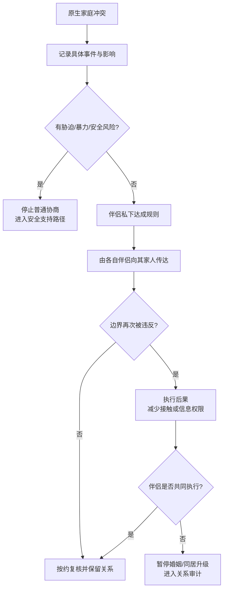

# 原生家庭与姻亲边界指南

## Evidence base

Bryant & Conger (2001), DOI 10.1111/j.1741-3737.2001.00614.x, prospectively linked discord with in-laws to later marital success indicators in long-term marriages. The evidence supports treating recurring extended-family conflict as a relationship governance issue; it does not justify stereotyping a partner's family or demanding isolation.

## Classify the boundary problem

Write down one concrete event before discussing “你家人总是这样”：

1. What happened, who was present, and what was requested or taken?
2. Is the issue privacy, money, visits, childcare, living arrangements, decision rights, insults, or safety?
3. Is the boundary mutually applicable, or is one person seeking special access for their own family?
4. Can the partner whose family is involved communicate and enforce the boundary without leaving the other partner exposed?
5. Is this a disagreement that can be negotiated, or coercion, violence, stalking, financial control, or retaliation that needs a safety path?

## The three-layer boundary method

1. **Couple agreement:** privately agree on the rule, exception, consequence, and who communicates it. Example: “未经我们双方同意，不留宿、不转发私密信息、不替我们答应大额支出。”
2. **Family-facing message:** the family member communicates their own boundary first. “这是我们两个人的决定，之后请先问我们，不要直接安排。”
3. **Enforcement:** apply one predictable consequence: end the visit, pause information sharing, decline the request, or move future discussions to writing. Do not threaten consequences you will not use.

Suggested partner-to-family script:

> 我们会自己决定住房、钱、孩子和隐私。你可以表达意见，但不能替我们答应或公布决定。以后如果没有先得到我们双方同意，就不执行这项安排；如果继续发生，我们会结束这次谈话并改用书面沟通。

Suggested partner-to-partner script:

> 我不要求你和家人断绝关系。我需要的是我们先私下达成规则，再由你向你的家人说明，并在规则被违反时一起执行。

## Common scenarios and responses

| 场景 | 当下回答 | 后续动作 |
|---|---|---|
| 未经同意上门或留宿 | “今天不方便接待。请下次先联系并得到双方确认。” | 结束当次接待，约定预约规则 |
| 逼问收入、彩礼或生育计划 | “这是我们的私人信息。需要讨论时我们会主动说。” | 停止回答，限制信息范围 |
| 直接向一方施压、绕过另一方 | “这件事我们会一起决定，请不要要求我单独答应。” | 只接受共同回复 |
| 以孝顺、面子或内疚逼迫 | “尊重长辈不等于放弃共同决定权。” | 重复规则，不进入价值观争吵 |
| 伴侣不愿向自己家人设边界 | “我不要求你选边，但共同生活需要共同执行的规则。” | 暂停同居、结婚或财务升级，进入 30 天审计 |
| 对方家人辱骂、威胁或干涉安全 | “现在先结束接触，安全问题不通过争辩解决。” | 保存记录，使用安全、法律或外部支持路径 |

## Stop conditions

- 伴侣要求你独自承受其家人的骚扰、羞辱或经济要求；
- 以断绝关系、住房、金钱、孩子或身份威胁迫使你接受越界；
- 一方私下答应重大事项，再要求另一方事后服从；
- 边界每次都被口头承诺但从不执行；
- 出现暴力、跟踪、限制就医、扣留证件或其他即时安全风险。

