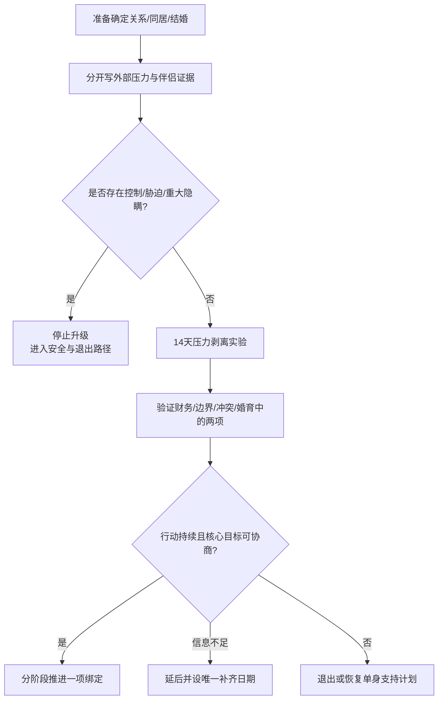

# 害怕单身、催婚压力与伴侣选择审计

## 明确结论

在确定关系、同居、订婚或结婚前，先区分两件事：**我是否适合这个人**，以及 **我是否只是想摆脱单身、孤独或外部压力**。害怕单身可能让人依赖不满意的关系、降低对回应性和尊重的要求；但它不是诊断，也不意味着单身一定更好。实用做法是暂停不可逆绑定，完成 14 天“压力剥离”审计，再用现实行为验证伴侣匹配。

## Evidence base

- Spielmann 等（2013，DOI 10.1037/a0034628）：多项研究显示，害怕单身与在不满意关系中更强依赖、较低结束可能性和较少选择性相关；包含 longitudinal 结果，但不能推出个人结局。
- Sprecher 与 Felmlee（2021，DOI 10.5964/ijpr.6139）：616 single adults 的调查发现，家庭/父母和朋友的进入关系压力与害怕单身相关。
- Eastwick 等（2014，DOI 10.1037/a0032432）：理想偏好与真实互动中的伴侣评价并不总是相同，纸面标准不能替代现实相处观察。

14 天是决策降压实验，不是研究确立的治疗周期。

## 第一步：把压力来源和伴侣证据分开

分别写两张表，不要混在一起：

| 外部压力 | 伴侣匹配证据 |
|---|---|
| 父母催婚、亲戚比较、朋友结婚 | 对方是否尊重拒绝、兑现承诺、承担责任 |
| 年龄、生育窗口、住房或户籍焦虑 | 婚育目标、城市安排和健康信息是否一致 |
| 孤独、性需求、社交圈重叠 | 冲突后能否修复、是否存在控制或羞辱 |
| 害怕重新认识人、害怕被评价 | 收入、债务、家务、父母责任和退出能力 |

外部压力是真实约束，尤其是家庭压力，但它不能替代伴侣质量证据；伴侣有优点，也不能自动消除安全和核心目标冲突。不要因催婚把外部期限当成伴侣匹配证据，明确不因催婚仓促绑定。

## 第二步：14 天压力剥离实验

### 第 1–3 天：暂停升级

- 不新增同居、共同借贷、订婚、备孕、辞职或不可退大额付款；
- 不在被催婚、争吵、酒后或性行为后作决定；
- 告知家人：“我会在___日期前自己决定，期间不接受每日追问。”

### 第 4–10 天：每天一次双问题记录

每天回答：

1. 如果没有人知道我的关系状态，我还会主动选择这个人吗？
2. 如果我确定未来一年不会遇到新对象，我还愿意接受这段关系目前的具体行为吗？

然后各写三条事实：对方最近一次可靠行动、最近一次让我不安全的行动、一个仍未解决的现实差异。只写行为，不写“他/她本质怎样”。

### 第 11–14 天：做两项现实验证

选择最影响婚姻的两个领域，例如财务、父母边界、冲突修复、性健康、城市和生育：

1. 双方各提出一个具体行动和截止日；
2. 行动必须可观察、可复核、双方对等；
3. 不用礼物、情绪保证或公开秀恩爱代替行动；
4. 第 14 天只根据完成情况决定推进、延后或退出。

## 第三步：三种压力测试问题

把下面问题写下来，分别回答后再讨论：

1. **没有催婚时点**：如果没有年龄和家庭期限，我仍会在今年推进吗？为什么？
2. **可以安全单身一年**：如果住房、收入和社交支持已经稳定，我还会选择当前伴侣吗？
3. **朋友不会评价我**：我会保留哪些关系边界？我会要求伴侣改变哪些具体行为？

答案不需要是“继续”或“分手”，但必须指出一个现实证据和一个信息缺口。

## 可直接使用的话术

> “我理解你们希望我稳定下来，但伴侣选择和结婚时间由我承担后果。我会在___日前完成自己的审计，在此之前不接受每天催问。”

> “我现在要区分两件事：我是否想和你一起生活，以及我是否只是害怕继续单身。我们先看财务、边界和冲突中的具体行为。”

> “我不会因为孤独、年龄或已经投入很多，就先领证再赌问题会改变。信息和行动完成后，我们再决定下一步。”

## 对方可能反应及回答

| 对方反应 | 回应 | 下一步 |
|---|---|---|
| “你审计我说明你不爱我。” | “我也接受同样审计。爱不能替代共同生活需要的事实和行为。” | 双方各选两项行动 |
| 家人说“再挑就没人要了” | “婚姻后果由我承担。我会听建议，但不会用恐惧替代核验。” | 重复边界，不提供每天进度 |
| “你都这个年纪了还想什么” | “年龄影响时间安排，不决定我必须接受谁。” | 延后不可逆决定 |
| 对方突然给承诺、送礼或公开表态 | “我看见你的重视，但我们按 14 天行动记录判断，不用一次热情替代稳定性。” | 观察兑现和复盘 |
| 对方要求你马上公开订婚 | “公开会增加退出成本。双方事实和行动未完成前，我不做公开绑定。” | 暂停仪式和不可退付款 |
| 你发现主要动力是逃避单身 | “这说明我要先处理孤独和支持网络，再决定是否继续关系。” | 安排朋友、兴趣、咨询或生活计划 |
| 伴侣确实可靠，但你仍害怕单身 | “害怕可以存在，但不能单独决定。我们继续用行为验证，不把焦虑当否决票。” | 延长一次 14 天验证 |
| 发现伴侣不尊重拒绝或有控制行为 | “这不是普通选择焦虑，而是安全和自主问题。” | 停止升级，进入安全/退出路径 |

## 决策结果

- **推进**：两个现实领域有持续行动，核心目标一致，决定来自自己而非催促。
- **延后**：伴侣尚可，但财务、城市、婚育或家庭边界信息不足；写唯一缺口和日期。
- **退出**：主要靠恐惧、孤独、住房或沉没成本维持，或出现控制、欺骗、核心目标冲突。
- **继续单身一段时间**：不是失败，而是恢复选择权的有效决策；为这段时间安排社交、身体、经济和家庭边界计划。

## Stop conditions

- 以年龄、生育、家庭面子、住房或经济依赖逼迫领证、同居、怀孕或转账；
- 对方因你需要时间而威胁、羞辱、跟踪、限制社交或报复；
- 你无法安全说“不”，或必须先投入财务/身体/住房资源才能换取基本信息；
- 14 天实验中只有口头保证，没有可观察行动，却要求立即公开或增加绑定；
- 你持续出现失眠、恐慌、无法工作或明显功能下降，却仍被要求独自承担决定压力；
- 核心婚育、忠诚、城市、财务或安全目标不一致，且一方靠“以后你会改变”推进。

## Mermaid 分流图

## Evidence boundary

研究支持的是害怕单身、社会压力与关系选择之间的群体关联，不能判断某个人的关系一定不合适，也不能把单身描述成自动更健康的状态。14 天审计和两项现实验证是降低压力、恢复选择权的工具；最终决定仍需结合安全、健康、经济、家庭和个人目标。

