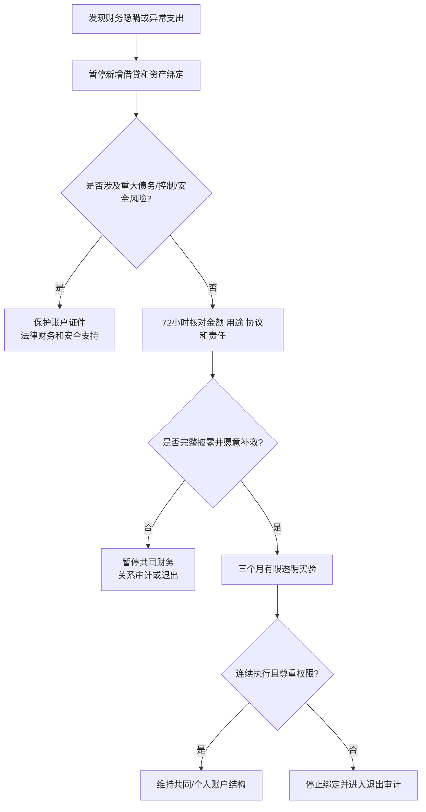

# 财务隐瞒、共同账户与金钱边界

## Evidence base

Garbinsky 等（2020）的研究（DOI 10.1093/jcr/ucz052）讨论亲密关系中的财务不忠，帮助区分普通财务分歧与故意隐瞒/欺骗。指南用于婚前和婚后审计，不把透明变成全面监控。

## 先定义共同财务边界

双方在结婚、同居或共同借贷前写下：

1. 哪些账户和资产属于共同；
2. 单笔超过多少需要共同同意；
3. 借钱、担保、投资和给父母援助的上限；
4. 哪些个人消费不需要报备；
5. 失业、疾病、离婚或分居时如何保护生活费和个人账户。

## 发现隐瞒后的 72 小时处理

1. 暂停新借贷、购房、结婚和生育绑定，不要在情绪激烈时签字。
2. 合法保存账单、合同、转账和债务信息；不盗号、不公开报复。
3. 列出事实：金额、时间、用途、是否持续、是否有共同债务或法律风险。
4. 要求对方在 72 小时内说明完整范围，并共同核验银行、贷款和资产信息。
5. 涉及担保、诈骗、隐匿资产或人身威胁时，联系专业法律/财务和安全支持。

可直接使用的话术：

> “我现在不先争论你是不是坏人。我们要核对金额、债务、用途和法律责任；在核对完成前不新增共同借贷。”

> “共同财务需要重大风险透明，但我不会交出所有个人消费和账户控制权。我们把共同部分、个人部分和审批门槛写清楚。”

## 反应分支

| 对方反应 | 回应 | 下一步 |
|---|---|---|
| “这是我的钱，你无权过问。” | “个人账户可以保留隐私，但共同债务、共同资产和会影响家庭的转账必须知情。” | 按协议划分共同/个人边界 |
| “只是小钱，不算隐瞒。” | “金额不是唯一标准，关键是是否违反约定和是否造成共同风险。” | 核对协议和重复模式 |
| “给父母钱是孝顺，你不能管。” | “孝顺可以讨论，但共同预算和援助上限需要双方同意。” | 设定金额、频率和复盘日 |
| 对方愿意完整披露并补救 | “披露是第一步，还需要停止隐瞒、修复债务和连续三个月按协议执行。” | 有限核验和月度复盘 |
| 对方删账、转移资产或继续借贷 | “这已经是风险升级，不进入普通沟通。” | 保护账户、证件和法律权益 |
| 对方要求你签担保或共同贷款 | “我不会在信息不完整或没有退出方案时签字。” | 独立咨询，必要时暂停关系升级 |

## 三个月透明实验

1. 每月一次共同看总账、债务和共同目标；不查看与共同责任无关的隐私细节。
2. 共同支出使用共同账户，双方保留个人账户和应急金。
3. 重大支出按门槛共同批准；给父母、投资和借贷按书面上限执行。
4. 连续三个月记录：是否按时披露、是否有未经同意支出、是否尊重账户权限。
5. 三个月后决定维持、调整、延后购房/结婚，或进入关系退出审计。

## Stop conditions

- 隐瞒重大债务、担保、收入来源、资产或法律责任；
- 强迫共同借贷、担保、转账、买房或承担对方家庭债务；
- 扣留生活费、冻结账户、没收证件或用钱限制就医、工作、社交和退出；
- 反复删账、转移资产、伪造信息或报复核验；
- 伴随威胁、暴力、跟踪、性胁迫或其他安全风险。

触发停止条件时，停止共同财务绑定，保护账户和证件，联系独立法律/财务与安全支持。

## Mermaid 分流图

