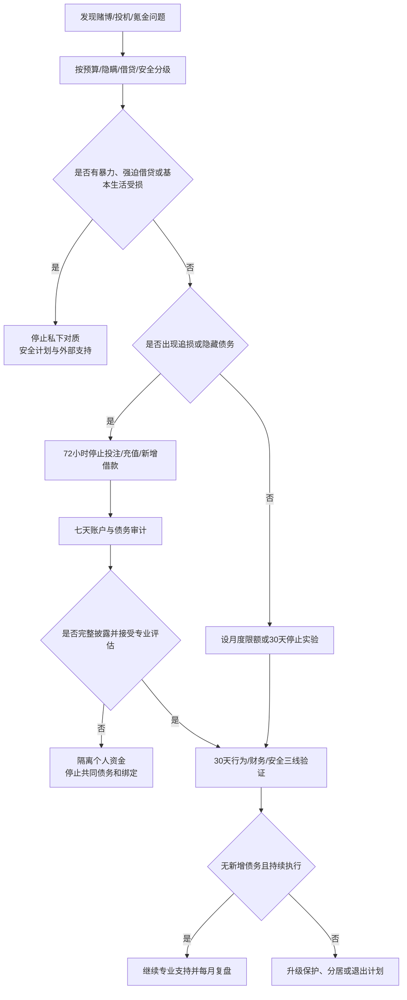

# 赌博、投机、游戏氪金与共同债务边界

判断重点不是“有没有玩过”，而是是否出现追损、隐瞒、借贷、失控、基本生活受损或暴力控制。普通娱乐应有事前预算、可停止且不侵占共同责任；出现隐藏债务和追损后，先停止新增资金，再谈修复关系。

## Evidence base

Hing等（2022，DOI 10.3389/fpsyg.2022.987379）的整合综述显示，赌博伤害可能波及伴侣和家庭，并与经济虐待、强制控制及家庭暴力同时出现。Garea等（2021，DOI 10.1080/14459795.2021.1914705）的荟萃分析报告战利品箱消费与问题赌博、过度游戏存在小到中等相关。两者都不能证明每次投注或游戏氪金都是成瘾，也不能用赌博为暴力开脱。

## 四级风险分类

| 级别 | 可观察行为 | 行动 |
|---|---|---|
| 1 可控娱乐 | 预算内、公开、随时停止、不影响责任 | 月度限额 |
| 2 风险上升 | 超预算、情绪性投注、高频氪金、反复借小额 | 30天停止或限额实验 |
| 3 财务失控 | 追损、隐瞒流水、网贷、套现、挪用共同资金 | 72小时止损与专业评估 |
| 4 安全危机 | 威胁、暴力、强迫借贷、夺取账户、非法筹资 | 安全计划和外部介入 |

股票、虚拟币、体育竞猜、棋牌、彩票、直播打赏和游戏氪金，只要出现追损、隐瞒或借贷，都按行为后果审计，不因产品名称改变规则。

## 前72 小时止损

1. 停止新投注、新充值、新借款、担保和“翻本资金”；
2. 在本人合法权限内保护个人账户、工资、支付工具和双重验证；共同账户如何限制需按合同和当地法律处理，不擅自转移争议资金；
3. 下载本人可访问的银行、信用卡、网贷、游戏、交易和支付流水，形成债务时间线；
4. 保障未来30天住房、食物、医疗、交通和孩子费用，暂停非必要共同支出；
5. 不替对方向家人、单位或银行编造理由，不借新债填旧债；
6. 若有自伤、暴力、威胁、危险驾驶或非法催收，停止私下对质并联系当地紧急、安全或专业支持。

## 七天事实审计

逐项列明平台、实名人、余额、债务、利率、到期日、担保人、是否使用共同财产以及是否存在非法资金。对“已经全部说完”进行一次独立核验：信用报告、银行流水、合同、平台记录和债权人信息相互一致后才进入还款计划。

将问题拆成三条线：

- **行为治疗线**：预约合格的赌博/成瘾或心理专业评估，设置自我排除、平台限额等可用工具；
- **财务止损线**：预算、债务优先级和必要生活支出由专业人士协助；
- **关系安全线**：伴侣保留独立账户、住处、支持网络和退出权，不承担全天监控职责。

## 30天验证标准

- 无任何新增投注债务、隐瞒账户或追损；
- 按时参加专业评估并执行本人承诺的限制措施；
- 每周提供事先约定的债务与还款进度，不要求伴侣全面监控；
- 基本生活、孩子和医疗费用先于非必要偿债或娱乐；
- 发生复发时24小时内主动披露、立即停止并联系专业支持，而不是借款掩盖。

一次复发不自动决定关系结局，但隐瞒、追加债务或暴力会直接升级处理。

## 可直接使用的话术

> “现在不讨论翻本。今天先停止投注、充值和借款，72小时内把全部账户、债务和到期日列出来。”

> “我可以支持你预约专业帮助，但不会替你借钱、撒谎、还隐藏债务或全天监控。”

> “游戏氪金是否有问题看预算、隐瞒和后果。连续超支或追随机奖励时，先停止30天再评估。”

> “任何还款方案都要先保护房租、食物、医疗和孩子费用，不用新债填旧债。”

## 对方可能的反应及回应

| 反应 | 回应 | 下一步 |
|---|---|---|
| “再给我一次就能翻本。” | “追损会扩大风险，我不会提供新资金。” | 停止账户访问并专业评估 |
| “只是娱乐，你管太多。” | “我们看的是超预算、隐瞒和共同后果。” | 对照四级分类和流水 |
| “我保证以后不玩。” | “承诺需要账户清单、限制措施和30天行为验证。” | 设置预约和复盘日期 |
| “你先替我还，别让家人知道。” | “我不承担未核验债务，也不替你隐瞒。” | 核验债务并咨询专业人士 |
| 对方拒绝提供任何债务事实 | “信息不完整时我不会共同借贷或合并账户。” | 保护个人资金，降低绑定 |
| 对方复发后主动披露 | “先停止、记录金额并联系专业支持，再调整计划。” | 不羞辱、不追加资金 |
| 对方因断资威胁或暴力 | “我不继续私下协商，现在先处理安全。” | 离开现场并联系支持 |
| 催收联系伴侣或家人 | “先核验债权、合同和身份，不按陌生指示转账。” | 保存记录并咨询银行/法律渠道 |

## Stop conditions

- 偷用伴侣或孩子资金、冒名借贷、伪造签名或非法筹资；
- 清空共同账户、抵押住房或处置共同资产以追损；
- 要求伴侣贷款、担保、套现或向家人隐瞒；
- 持续隐瞒平台、债务和流水，拒绝独立核验；
- 用自伤、暴力、威胁、砸物、危险驾驶或曝光隐私索取资金；
- 孩子的食物、住房、医疗或照护因赌博和游戏氪金受损；
- 多次承诺后仍新增债务，且拒绝专业评估和限制措施；
- 伴侣被迫全天监控、偿债或失去自己的账户与退出能力。

触发停止条件时，不提供新资金、不单独对质、不替其掩盖；保护证件、账户、住处和孩子，保存材料并联系当地金融、法律、成瘾治疗或安全支持。

## Mermaid分流图

文字版：先按行为和后果分级；有暴力或基本生活风险先做安全计划；有追损或隐藏债务立即72小时止损和七天审计；完整披露且接受专业支持才进入30天验证，否则隔离资金并停止绑定。

## Evidence boundary

赌博与暴力的关联不能证明因果，也不能把赌博者自动视为施暴者。战利品箱消费与问题赌博的相关结果不能诊断个人成瘾。具体诊断、治疗、债务责任、账户控制和财产处置应由当地合格医疗、金融和法律专业人士评估；现实暴力风险始终优先处理。
