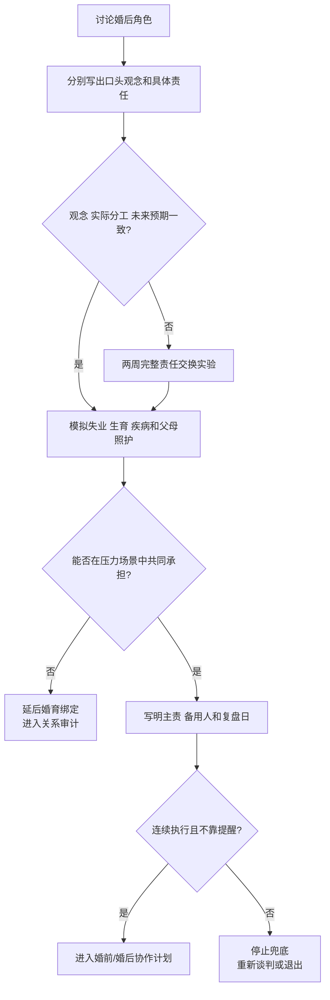

# 性别角色观念与婚后分工审计

## Evidence base

Park 等（2025）的研究（DOI 10.1093/pnasnexus/pgae589）提示，伴侣性别角色观念的一致程度和方向与关系满意度有关。实用判断不看口号，而看观念、实际责任和未来预期是否一致。

## 三栏核对法

双方分别写下答案，再逐项对照：

| 领域 | 现在谁负责 | 结婚/生育/失业后谁负责 |
|---|---|---|
| 收入与职业 | 谁挣钱、谁承担加班和迁移 | 谁可以降薪、暂停工作或转城市 |
| 家务与心理负荷 | 谁发现、计划、执行、跟进 | 谁在忙碌或生病时接手完整责任 |
| 育儿与照护 | 谁夜间照护、请假、联系学校 | 谁承担产后、老人和长期照护 |
| 双方家庭 | 谁沟通父母、提供金钱和时间 | 援助上限、探访频率和边界谁执行 |
| 决策与资产 | 谁决定买房、借贷、生育 | 重大决定是否需要双方同意 |

## 两周一致性实验

1. 第 1 天分别写出“我认为公平是什么”和“我愿意长期承担什么”，不能只写“看情况”。
2. 第 2–7 天按实际责任记录发现、计划、执行、跟进和失败后果；不要只统计做了几次家务。
3. 第 8 天模拟一个压力场景：一方失业、孩子生病、父母需要照护或一方加班两周。
4. 第 9–14 天让双方交换至少一项完整责任，包含发现、规划、执行和复盘；不能由原承担者继续提醒。
5. 第 14 天决定：维持、修改、延后结婚/生育，或进入关系审计。没有时间、负责人和复盘日的承诺视为未完成。

可直接使用的话术：

> “我们不争论谁更传统或更平等，先把收入、家务、育儿和父母责任写成具体行为，再看两个人能不能接受。”

> “如果未来我请产假/失业/生病，不能只说‘到时候再看’。我们现在要写出谁负责、持续多久、备用方案是什么。”

## 反应分支

| 对方反应 | 回应 | 下一步 |
|---|---|---|
| “男人/女人本来就应该这样。” | “社会观念可以讨论，但婚姻责任需要双方明确同意，不能用性别直接替代协商。” | 要求转成具体任务和期限 |
| “我支持平等，但你更擅长所以你做。” | “能力差异不等于永久主责。完整责任包含发现、计划、执行和跟进。” | 两周交换一项完整责任 |
| “家务可以以后再说。” | “婚后时间会更少，生育和工作会放大分歧。” | 结婚/生育前完成分工实验 |
| 对方只愿意做执行，不愿计划和提醒 | “我需要的是完整责任，不是等我管理后的帮忙。” | 记录心理负荷，必要时延后升级 |
| 双方都认同传统角色且实际可持续 | “可以采用，但要写清收入、照护、个人自由和角色变化时的调整机制。” | 每季度复盘，保留退出和重新谈判权 |

## Stop conditions

- 用性别、收入、学历或“谁更擅长”合理化一方永久承担全部家务、育儿或情绪劳动；
- 一方拒绝透明讨论，却要求先结婚、生育、买房或迁移；
- 以经济供养换取对身体、社交、职业或生育决定的控制；
- 任何羞辱、威胁、报复、暴力或安全风险；
- 两周实验中只有口头承诺，实际责任始终回到原承担者。

触发停止条件时，暂停婚姻、生育和重大资产绑定，先做安全评估、责任审计和外部咨询。

## Mermaid 分流图

