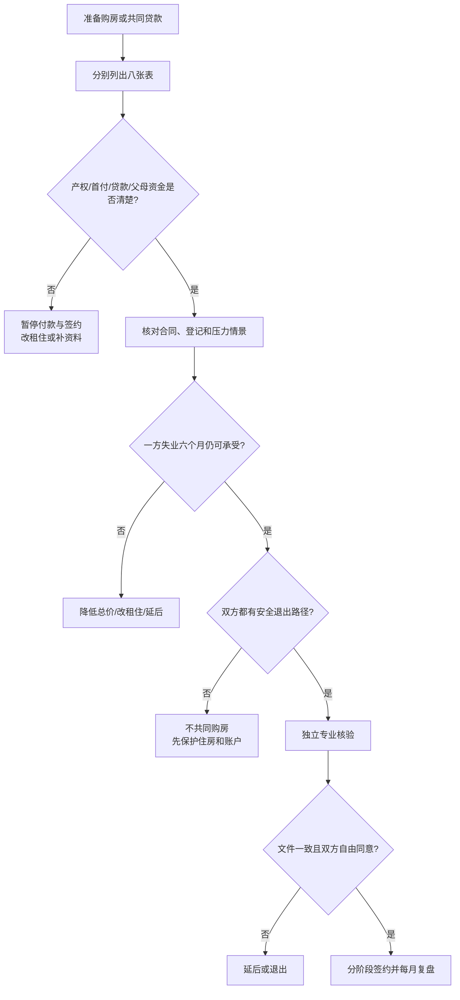

# 住房产权、首付来源与共同购房审计

## 明确结论

不要把“愿意一起买房”当作“产权、出资和风险已经公平”。在签购房合同、支付不可退定金、共同贷款或接受父母出资前，双方必须把产权人、首付来源、还贷责任、父母资金性质、居住安排和退出方案写清楚并核验。任何一项无法确认，先租住或延后购房，不用婚礼日期逼迫签字。

## Evidence base

Krapf 与 Wagner（2020，DOI 10.1007/s10680-019-09549-6）在德国 3,441 对同居伴侣的七年事件史分析中发现，住房成本后的剩余收入与关系解体风险相关；住房所有权与较高稳定性相关，但研究不能证明买房造成稳定。

Deng、Hoekstra 与 Elsinga（2019，DOI 10.1007/s10901-018-9619-0）基于重庆 31 次访谈，显示代际转移、女性住房资产和婚后共同拥有之间存在现实差异。两项研究都不能替代中国具体产权和婚姻法律核验。

## 八张表必须分别写清

1. **产权表**：登记人、共有比例、是否有抵押、谁有居住权。
2. **首付表**：每笔金额、付款人、付款日期、来源是个人积蓄、父母赠与还是借款。
3. **贷款表**：借款人、共同借款人、担保人、月供、利率、失业时谁承担。
4. **装修表**：装修和家具支出由谁支付，是否形成可追溯凭证。
5. **父母资金表**：给谁、给多少、是否要求返还、是否附带居住/控制条件。
6. **居住表**：婚前同住、双方父母居住、出租、出售和迁移安排。
7. **退出表**：分手、离婚、失业或一方想搬走时，出售、买断、出租和还贷如何处理。
8. **证据表**：合同、转账、借条、聊天确认、发票和登记文件存放在哪里。

## 30 天购房前审计

### 第 1–7 天：分开算账

双方各自列出收入、现金、债务、首付来源和最多可承受月供。至少做三种压力情景：

- 一方失业六个月；
- 房贷或生活成本上升；
- 父母突然需要照护或停止资助。

如果任何情景只能靠继续借贷、隐瞒或一方永久牺牲工作才能维持，不进入签约阶段。

### 第 8–14 天：核对产权与资金性质

把每笔父母出资明确为：

- 明确赠与；
- 明确借款；
- 有条件资助；
- 性质不明。

性质不明的资金不能直接当作“以后不会要回”。由出资人和双方书面确认金额、用途、产权影响和返还条件；不要只依赖口头承诺。

### 第 15–21 天：获取独立专业意见

在签约前分别确认：

- 不动产权属和抵押信息；
- 贷款合同、共同借款和担保责任；
- 父母赠与/借款的书面证据；
- 结婚、离婚、赠与和共同还贷可能产生的法律后果。

复杂情况咨询当地不动产、婚姻家事或金融专业人士，不能用网络帖子替代合同审查。

### 第 22–30 天：做可逆决定

四种结果只选一种：

1. 继续签约，产权和出资文件已核验；
2. 改成租住，保留购房选项；
3. 延后购房，补齐资料并设新日期；
4. 终止共同购房和相关婚姻绑定。

## 可直接使用的话术

> “我们今天不先讨论谁更爱谁，只核对产权、首付、贷款、父母出资和退出方案。没有写清之前，我不支付不可退定金。”

> “父母这笔钱到底是赠与还是借款，会影响产权和未来责任。请把金额、付款人、用途和返还条件写下来。”

> “共同还贷不自动等于共同产权。我们先看登记、合同和法律后果，再决定是否共同买。”

> “如果最坏情况是一方失业六个月，我们谁还贷、住哪里、是否出售或出租？没有答案就先租房。”

## 对方可能反应及回答

| 对方反应 | 回应 | 下一步 |
|---|---|---|
| “结婚了房子自然就是共同的。” | “婚姻、登记、出资和贷款责任不是同一个问题。” | 查产权和合同 |
| “我父母出钱，所以他们决定产权。” | “出资可以影响谈判，但必须明确性质和登记安排，不能事后改变规则。” | 书面确认并独立咨询 |
| “先交定金，文件以后补。” | “不可退支出必须在事实和合同核验后发生。” | 暂停付款 |
| “你要写清楚就是不信任我。” | “写清楚是保护双方和父母，不是全面监控。” | 继续逐项审计 |
| 一方出首付、另一方长期还贷 | “首付和还贷都要记录，并提前约定产权、补偿和退出。” | 书面协议和法律核验 |
| 对方拒绝公开贷款或担保 | “我尊重你保留私人账户，但不能在共同购房前隐瞒共同风险。” | 不共同贷款、不签约 |
| 双方无法承受最坏情景 | “感情可以继续观察，购房先延后或改租住。” | 采用可逆方案 |
| 父母要求把房子登记给一方并控制婚后生活 | “父母可以决定是否出资，但不能用住房换取对婚姻的控制。” | 重新评估家庭边界 |

## Stop conditions

- 产权人、首付来源、贷款或担保人故意隐瞒；
- 父母出资性质不明，却要求先登记、先付款或先领证；
- 要求一方共同还贷但拒绝任何产权、补偿或退出安排；
- 以房子、彩礼、婚期、怀孕或家庭面子逼迫签约；
- 伪造合同、转账、收入或产权材料；
- 购房会使一方失去独立住房、账户、工作或安全退出能力。

触发停止条件时，不支付新款、不签新合同、不新增担保；保存材料并寻求当地法律、金融和住房专业意见。

## Mermaid 分流图

## Evidence boundary

住房稳定与产权安排之间的研究关联不能直接预测某套房子会不会让婚姻成功。指南也不替代中国不动产权属、贷款、赠与、借款和离婚分割的法律意见。最保守的规则是：信息不完整时保留租住和独立账户，把不可逆购房延期。

