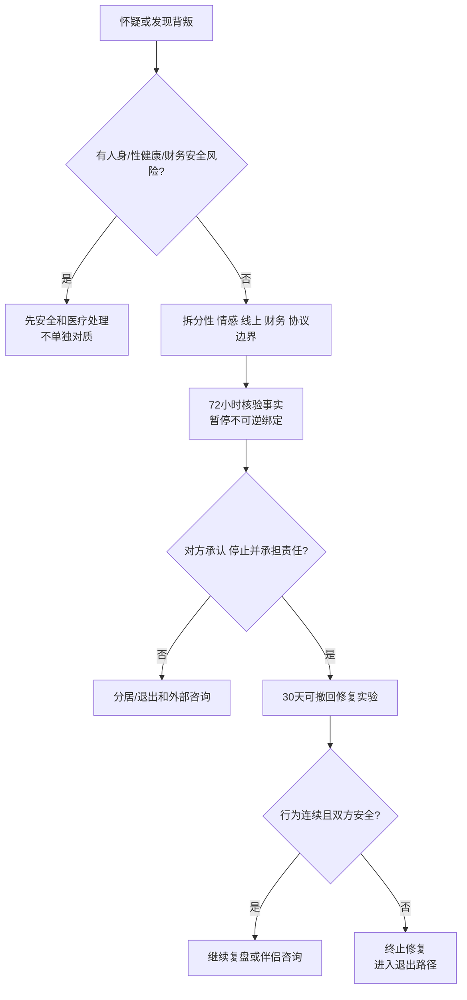

# 背叛边界、事实核验与修复决策

## Evidence base

Warach 等（2024）的系统综述与元分析（DOI 10.1111/pere.12571）覆盖 305 项研究，指出背叛定义和测量差异很大。实用判断先确认违反了哪条边界，再决定核验、修复、分居或退出，不使用单一发生率吓迫决策。

## 第一步：把“背叛”具体化

分别记录事实，不立即写人格结论：

- **性边界**：接吻、性行为、性服务、未披露的性健康风险；
- **情感边界**：持续暧昧、秘密倾诉、把伴侣排除在重要关系之外；
- **线上边界**：隐秘账号、暧昧聊天、删除记录、发送私密照片；
- **财务边界**：为第三者隐瞒转账、借贷、共同资产或债务；
- **协议边界**：违反双方明确约定的开放关系、异性相处、社交和隐私规则。

## 72 小时事实与安全处理

1. 若出现暴力、威胁、性健康风险或经济控制，先保护人身、账户和医疗安全，不单独对质。
2. 在情绪可控时保存合法获得的记录：时间线、转账、医疗检测和已明确的协议；不盗号、不安装跟踪软件、不公开报复。
3. 暂停三类不可逆决定 72 小时：结婚、生育、共同借贷/出售资产。性健康暴露则尽快咨询医生和检测机构。
4. 只提出需要核对的问题：发生了什么、持续多久、是否仍在继续、是否还有健康/财务风险、是否愿意停止并承担责任。

可直接使用的话术：

> “我现在先确认事实和安全，不在今天决定原谅或分手。请说明时间线、是否仍在联系、是否有健康和金钱风险。”

> “修复不是交出全部密码。我的最低要求是停止第三方关系、完成检测、说明财务影响，并在 30 天内用行动证明。”

## 修复、分居与退出分流

只有同时满足以下条件，才进入 30 天修复实验：

1. 对方明确承认违反了哪条约定，不把责任推给伴侣；
2. 停止隐瞒关系并接受合理的健康、财务和时间线核验；
3. 双方都能安全拒绝、暂停和退出，不存在暴力或胁迫；
4. 约定每周一次 20 分钟复盘，检查行为而非重复审判人格。

不满足时，优先分居、法律/财务咨询和安全退出。是否修复是被伤害者可以撤回的选择，不是义务。

## 反应分支

| 对方反应 | 回应 | 下一步 |
|---|---|---|
| “所有人都会出轨。” | “群体研究不能替代这次事实。我们讨论具体约定和行为。” | 回到时间线和边界 |
| “只是聊天，不算背叛。” | “定义要看我们的明确协议、隐瞒和影响，不由单方重新命名。” | 核对既有协议和事实 |
| “你想修复就必须给我全部密码。” | “修复需要透明，但不等于无限监控。我们约定必要核验和期限。” | 采用有限、可撤回的核验 |
| 对方道歉但继续联系第三者 | “道歉不能覆盖持续行为。” | 终止修复实验，进入分居/退出 |
| 对方承认、停止并愿意承担后果 | “我们先完成检测、财务核对和 30 天行为计划。” | 每周复盘，可随时撤回 |
| 对方威胁、羞辱或报复 | “现在先保证安全，不继续谈修复。” | 离开危险、外部支持和必要的法律/急救路径 |

## Stop conditions

- 持续隐瞒、删证、转移资产或反复改变说法；
- 把背叛归咎于伴侣，拒绝停止第三方关系或拒绝健康/财务责任；
- 以密码、定位、隔离社交、性行为或经济惩罚强迫“证明信任”；
- 出现暴力、性胁迫、跟踪、威胁、自伤威胁或报复；
- 30 天内没有可验证改变，或被伤害者明确不愿继续。

触发停止条件时，停止修复实验，优先安全、医疗、财务和法律支持。

## Mermaid 分流图

