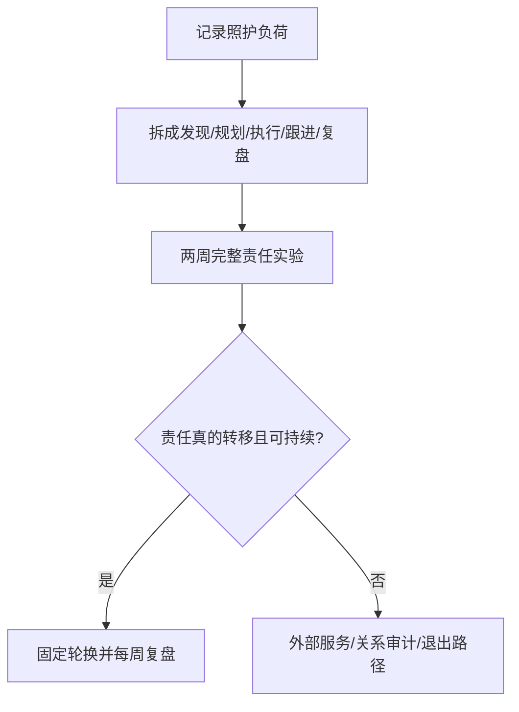

# 代际照护与关系中的照护负荷审计

父母支持可以是资源，也可能把时间、金钱、情绪安抚和决策责任隐形地压到一方。审计目标是让责任完整可见，并由承担风险的人参与决定。

## Evidence base

Fingerman 等（2012，DOI 10.1093/geront/gnr139）综述代际支持受父母需要、子女价值、家庭结构、迁移和社会环境影响；Reich-Stiebert、Froehlich 与 Voltmer（2023，DOI 10.1007/s11199-023-01362-0）将心理负荷定义为计划、预判、记忆、分配和跟进，并与压力和关系满意度作群体层面关联。两者都不能推出某性别天然更适合照护。

## 照护负荷五栏表

一周内记录每次照护的：时间、金钱、居住安排、决策权、情绪劳动。每项继续拆成“发现—规划—执行—提醒/跟进—复盘”，不要只统计最后一次跑腿。

## 两周完整责任实验

1. 两人各自填写一周基线，标记谁发现问题、谁承担失败后果。
2. 把一个完整领域（如就医、汇款、探亲或育儿）交给一人端到端负责两周。
3. 负责者拥有必要信息和预算，另一方不做隐形提醒；紧急事项设明确升级规则。
4. 每周 20 分钟复盘负荷、质量、情绪和可持续性，必要时轮换领域。
5. 两周后决定继续、调整、购买外部服务或拒绝承担超出能力的照护。

## 反应与回应

| 反应 | 回应与动作 |
|---|---|
| “谁的父母谁负责。” | “亲属联系可由各自维护，但共同生活的时间、钱和风险要共同决策。”填五栏表。 |
| “你比较会照顾，所以你做。” | “能力不能自动转化为永久责任。”实行两周完整责任实验。 |
| 对方只愿意执行，不愿规划 | “我需要完整负责，包括发现、计划、跟进和复盘。”不给隐形提醒。 |
| 父母说“不孝就该多做” | “孝顺不能取消成年人的预算和边界。”提出可承受的具体支持。 |

## Stop conditions

- 一方拒绝承担任何完整责任，却要求另一方继续提醒和管理；
- 用性别、收入、孝顺或“谁更擅长”合理化长期单向负荷；
- 照护导致基本生活、工作、健康或安全持续受损；
- 出现羞辱、威胁、报复，或拒绝任何可验证的复盘。

