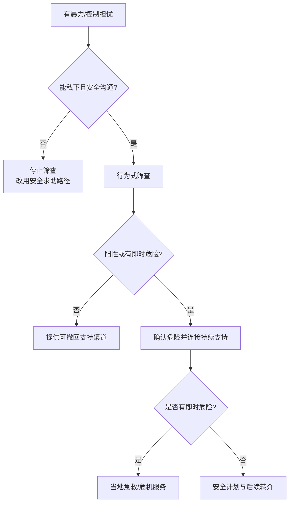

# 亲密伴侣暴力私下筛查与支持指南

## Evidence base

The USPSTF review, DOI 10.1001/jama.2018.14741, found moderate net benefit for screening women of reproductive age and providing ongoing support or referral when screening is positive. Adams et al.（2022，DOI 10.1186/s12889-022-13297-4）的范围综述指出，经济虐待会控制伴侣获取、使用和维持资源，并影响健康、财务、亲子互动和生活质量。Information-only handouts were not sufficient evidence of benefit. This is a clinical evidence summary, not a substitute for local emergency or legal services.

## 私下筛查原则

筛查必须在伴侣不在场、设备和记录安全的情况下进行。用行为问题代替“你是不是受害者”：

1. 过去一年是否有人打你、推你、掐你、限制你行动，或威胁伤害你、孩子、宠物或亲友？
2. 是否有人强迫性行为、破坏避孕、限制就医或控制药物？
3. 是否有人控制你的钱、证件、手机、定位、住房或工作？
4. 你拒绝、离开或寻求帮助时，是否担心对方报复？
5. 你现在是否能安全地接听电话、保存信息和联系支持者？

## 阳性后的四步支持

1. **相信并确认**：说“你经历的事情值得被认真对待”，不要追问为什么不早点离开。
2. **确认当前危险**：是否有即时伤害、武器、跟踪、被锁住、儿童危险或医疗急症。
3. **连接持续支持**：协助联系医疗机构、当地家暴服务、社工、法律援助或可信任的人；不要只给一个网址就结束。
4. **制定可撤回计划**：安全地点、交通、证件、药物、现金、孩子用品、证据保存和紧急联系人。计划应由当事人控制，不能在可能被发现的设备上留下危险记录。

可使用的回应：

> 我相信你说的行为。你不需要现在决定是否离开，也不需要当面对质。我们先确认你此刻是否安全，再一起找一个能持续联系的专业支持渠道。

## 反应分支

| 当事人反应 | 回应 | 下一步 |
|---|---|---|
| “我不想报警/离开” | “决定由你掌握。我可以先陪你做安全计划和医疗/支持咨询。” | 保持支持，不以离开作为帮助前提 |
| “现在没事，不需要帮助” | “我尊重你的判断。你可以选择一个安全联系方式，以后需要时能找到支持。” | 提供低风险、可撤回的联系方式 |
| 担心记录被发现 | “安全比完整记录更重要。我们只保存不会增加风险的信息。” | 使用安全设备或不留记录的求助方式 |
| 对方在场或可能查看设备 | “我们先谈普通健康事项，等你有安全空间再继续。” | 不在当前环境追问或发送敏感信息 |
| 出现即时危险 | “现在先离开危险区域并联系当地急救或危机服务。” | 按当地应急路径，找可信任的人陪同 |

## Stop conditions

- 伴侣在场、监控设备或可能读取记录，无法保证私密性；
- 以筛查结果要求当事人立即报警、离婚、对质或离开；
- 只提供信息但没有实际的持续支持或转介；
- 当事人因求助而面临报复、跟踪、住房/财务控制或儿童风险；
- 任何即时人身危险、强迫性行为或医疗急症。

