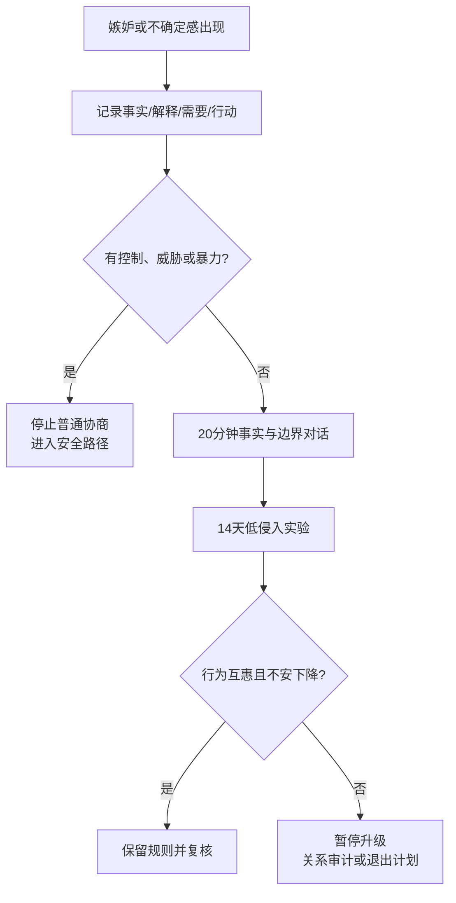

# 嫉妒与不确定感管理指南

## Evidence base

The 2017 systematic review, DOI 10.4067/S0718-48082017000200203, included 230 studies and grouped jealousy-related variables into personal, interpersonal, and sociocultural factors. Use it to separate facts, interpretations, boundaries, and safety; do not use jealousy as proof of infidelity or as permission to monitor or punish.

## 四格记录法

在采取行动前写四行：

1. **事实**：我实际看见或听到的行为是什么？
2. **解释**：我担心它意味着什么？有哪些其他解释？
3. **需要**：我需要的是信息、安慰、关系规则、距离，还是安全？
4. **行动**：哪一个最小、互惠、可撤回的行动能验证问题？

例子：把“她和同事聊天就是要出轨”改写为“我看到下班后连续三次私聊；我担心关系边界不清；我需要明确暧昧和工作沟通的规则；我提议 20 分钟讨论并约定双方相同的边界”。

## 20 分钟不升级对话

1. 先说明目标：“我想核对一件具体行为，不是来审问你。”
2. 每人只说三分钟事实和感受，另一人复述后再解释动机。
3. 把边界写成双方都适用的行为：私下见面、暧昧称呼、与前任联系、工作应酬、公开关系和回复时间。
4. 选择一个低侵入、14 天内可观察的实验，例如提前说明临时安排、固定一次 check-in 或共同确认第三方边界。
5. 约定复盘日期；不使用查手机、定位或隔离朋友作为默认验证手段。

## 反应分支

| 对方反应 | 当下回答 | 下一步 |
|---|---|---|
| “你就是不信任我” | “我在讨论一个具体行为和共同规则，不要求你交出全部隐私。” | 回到事实和互惠边界 |
| 对方能解释且愿意协商 | “我会把解释和后续行为分开观察。” | 执行 14 天低侵入实验 |
| 对方拒绝任何边界讨论 | “没有共同规则，我不会靠猜测继续升级投入。” | 暂停升级，进入关系审计 |
| 自己忍不住反复查证 | “查证冲动是真实感受，但不是必须执行的命令。” | 延迟 20 分钟，先记录四格信息并联系支持者 |
| 对方用嫉妒限制社交或工作 | “不安可以讨论，限制我的朋友、工作或行动不属于平等边界。” | 记录模式，评估控制与安全风险 |
| 出现威胁、暴力、跟踪或报复 | “现在停止讨论，先保证安全。” | 进入安全、医疗或法律支持路径 |

## Stop conditions

- 以嫉妒为理由强制查手机、定位、交出密码或隔离正常社交；
- 以分手、金钱、住房、暴力或曝光隐私逼迫对方证明忠诚；
- 反复用未经核实的猜测惩罚、羞辱或限制伴侣；
- 讨论第三方边界时出现现实跟踪、威胁或人身危险；
- 任何一方无法自由暂停、拒绝或退出这次对话。

