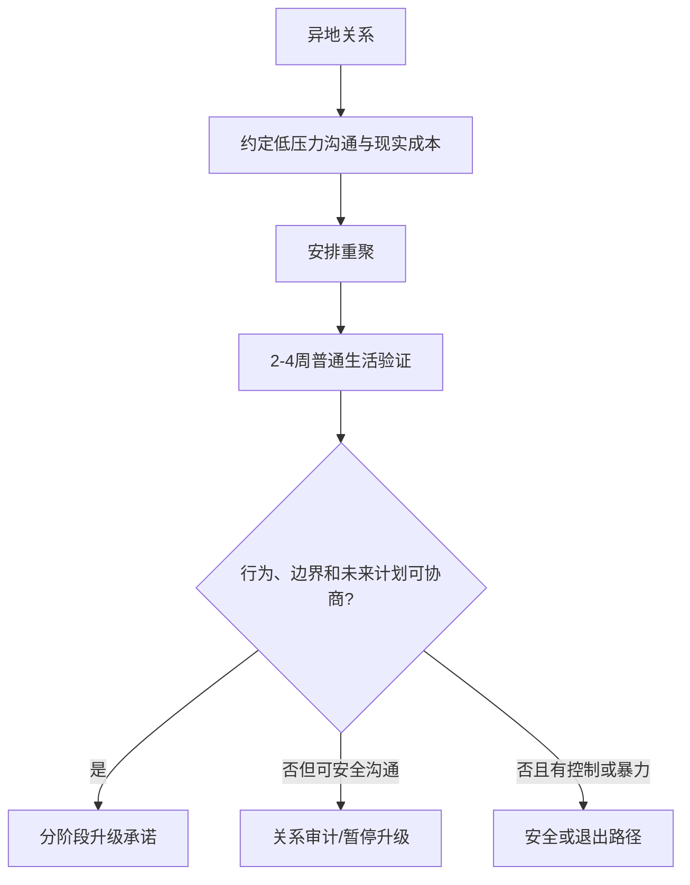

# 异地关系维护与重聚验证指南

## Evidence base

Jimenez & Holmes (2007), DOI 10.1177/0265407507072578, reported higher idealization and communication satisfaction in long-distance dating relationships, with greater stability during separation but greater breakup risk after reunion when absences were long and idealization was extreme. This is an `abstract_reviewed` evidence card; use it to plan tests, not to predict a particular couple.

## 先区分两个阶段

### 异地维护

1. 约定沟通窗口，而不是要求全天在线：固定一次深聊、一次轻量联系，并允许临时调整。
2. 记录双方可接受的关系边界：异性朋友、前任、社交活动、公开关系、性健康和隐私。
3. 每月核对三项现实信息：时间和见面成本、金钱投入、未来结束异地的可行路径。
4. 保持各自的工作、朋友和睡眠，不把“秒回”当作忠诚证明。
5. 对重要计划保留书面版本：下次见面、费用、取消方案、冲突后什么时候回来谈。

### 重聚验证

不要用一次浪漫旅行替代现实测试。重聚后至少观察 2—4 周：

1. 连续体验普通日程：通勤、家务、休息、社交和预算；
2. 讨论一次真实分歧，观察能否暂停、复述、修复和兑现改变；
3. 观察对隐私、性同意、金钱和双方家庭边界的实际行为；
4. 分别记录“原先想象—实际看到—需要调整”的三列；
5. 在决定同居、结婚、怀孕或大额共同投入前，完成一次复盘。

## 可直接使用的话术

> 我珍惜异地期间的连接，但我们不把想象当成现实证据。重聚后先用两到四周观察普通生活、冲突、金钱、隐私和边界，再决定是否升级承诺。

## 反应分支

| 对方反应 | 当下回答 | 下一步 |
|---|---|---|
| “你这样观察就是不够爱” | “爱可以存在，观察仍然是共同生活前需要的事实。” | 继续低压力验证，不用情绪证明替代信息 |
| 要求重聚后立即同居或结婚 | “重聚是验证阶段，不是自动升级承诺的按钮。” | 先完成 2—4 周现实测试 |
| 只愿意视频，不愿谈费用和未来 | “沟通频率不能替代时间、钱和结束异地的方案。” | 写清预算、见面计划和时间表 |
| 重聚后现实差异明显 | “我们分别写下观察和需要调整的地方，再决定是否可协商。” | 进入关系审计，不急于互相定性 |
| 一方用秒回、定位或查设备证明安全感 | “安全感可以协商，但全天监控不是默认义务。” | 采用低侵入边界；有威胁则进入安全路径 |
| 见面成本长期只由一方承担 | “异地关系的成本和风险需要共同承担。” | 重做预算和见面安排，观察是否有实际改变 |

## Stop conditions

- 见面、住房、签证、金钱或未来计划长期只有口头承诺，没有可核对行动；
- 重聚后出现暴力、胁迫、跟踪、强迫性行为或财务控制；
- 一方拒绝任何现实接触，却要求另一方持续投入金钱和承诺；
- 用秒回、定位、查设备或隔离社交替代互信；
- 在未完成现实验证前推进同居、结婚、怀孕、共同债务或大额转账。

