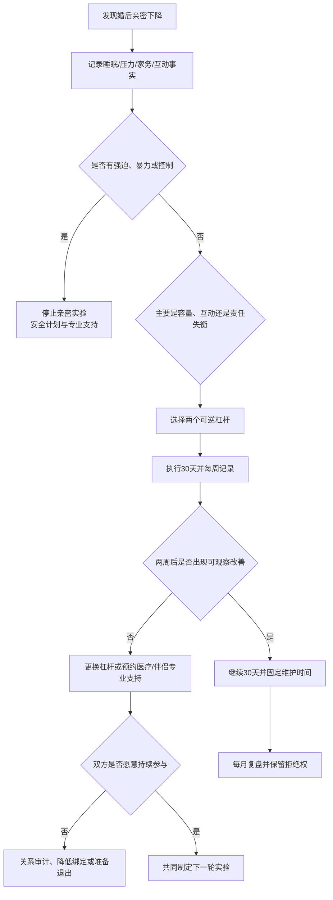

# 婚后亲密衰退与主动维护

婚后亲密减少可能来自睡眠、育儿、工作、健康、家务失衡、未修复冲突或性需求变化。先确认具体变化和可调整因素，再做可逆实验；不要把一次低谷直接诊断成“不爱了”，也不要用性、冷战或监控逼迫恢复。

## Evidence base

关系满意度会随人生阶段变化，但个体轨迹差异很大（Bühler et al., 2021，DOI 10.1037/bul0000342）。性沟通与关系和性满意度相关（Mallory et al., 2019，DOI 10.1080/00224499.2019.1568375；Mallory, 2022，DOI 10.1037/fam0000946）。伴侣睡眠与关系质量也存在群体层面的关联（Wang et al., 2025，DOI 10.1016/j.smrv.2024.102018）。这些证据支持沟通、容量调整和持续维护，不提供个人关系结局的保证。

## 先区分四种情况

1. **容量下降**：睡眠不足、育儿、加班、疼痛、抑郁或药物影响欲望和耐心。
2. **互动断裂**：只有事务沟通，没有感谢、触碰、共同活动或冲突修复。
3. **责任失衡**：一方承担大部分家务、心理负荷和主动发起，导致怨气和回避。
4. **伤害或控制**：羞辱、强迫性行为、威胁、出轨隐瞒、经济控制或暴力。此类问题先处理安全和边界，不用“约会计划”掩盖。

## 30 天主动维护实验

### 第 1—3 天：基线记录

双方分别记录一周内的睡眠、压力、家务时间、无冲突相处时间、亲密接触、性邀约、拒绝后的反应和最常见的冲突触发点。只记录事实，不给对方贴“冷漠”“无趣”标签。

### 第 4—7 天：选两个杠杆

从以下项目中各选一个：

- 睡眠：每周至少三晚保护连续睡眠，必要时临时分床并约定复盘；
- 家务：把一个高频任务交给一人完整负责，包含发现、计划、执行和跟进；
- 非性亲密：每天 10 分钟不看手机的交流，每周一次 60—90 分钟共同活动；
- 性沟通：在非性时段讨论喜欢、边界、频率、避孕和拒绝后的安抚，不把谈话变成当场索取；
- 冲突修复：争执升级时暂停 20—60 分钟，约定当天或次日恢复讨论。

### 第 8—21 天：按约执行并记录

每次只改变两项，记录完成、障碍和对方感受。拒绝亲密时不惩罚、不冷暴力、不追问到对方屈服；改约一个双方都同意的时间或活动。连续两周都由同一方提醒和组织，说明责任没有真正转移。

### 第 22—30 天：复盘和决定

比较基线与实验：睡眠、压力、争执恢复时间、非性亲密、性沟通质量和家务公平是否改善。只选一个结果：继续同方案 30 天；换一个杠杆；预约伴侣/性治疗或医疗评估；降低共同绑定；或启动关系审计与退出准备。

## 性与非性亲密的边界

- 性同意每次都可撤回，婚姻、同居、过去发生过性行为都不构成自动同意；
- 讨论欲望差异时说“我想要更多拥抱/更慢节奏/每周一次约会”，不要说“你从来不爱我”；
- 先处理疼痛、药物、产后变化、勃起/润滑困难、睡眠和心理健康，再讨论频率；
- 不以出轨、离婚、经济支持、冷战或曝光隐私威胁性行为；
- 双方可选择性行为之外的亲密：拥抱、按摩、散步、共同洗澡或单独相处，不能把替代活动变成新的义务。

## 可直接使用的话术

> “我观察到我们过去两周只有事务沟通，睡眠也不足。我想先做 30 天实验，先保护睡眠，再安排每周一次不带手机的约会。”

> “我愿意讨论性和频率，但任何一次都可以说不。我们先谈边界、身体状态和喜欢的方式，不在拒绝后惩罚对方。”

> “我需要的是完整分担：发现、计划、执行和跟进都由你负责。我不会继续做提醒人，然后把它叫作共同维护。”

> “如果我们连续两周仍然无法在安全状态下沟通，就预约专业帮助；在此之前不靠争吵或强迫解决。”

## 对方可能的反应及回应

| 反应 | 回应 | 下一步 |
|---|---|---|
| “结婚久了都这样，别折腾。” | “波动可能正常，但我们先用 30 天验证哪些因素可改变。” | 记录基线并选两项实验 |
| “你想要亲密就是你需求太多。” | “我们先讨论双方需求和容量，不用羞辱替代协商。” | 具体化频率、方式和可接受范围 |
| “你直接告诉我，我来帮忙。” | “维护不是等我派工；你负责一个任务的发现、计划、执行和跟进。” | 两周责任转移实验 |
| 一方只愿意安排性，不愿意处理睡眠和家务 | “亲密需要容量和安全感，先处理影响最大的基础问题。” | 暂缓性目标，先做睡眠/家务实验 |
| 拒绝一次后对方冷战或报复 | “拒绝不会触发惩罚。出现报复时我们先暂停亲密谈判。” | 记录并评估控制风险 |
| 说“去咨询就是关系有病” | “专业支持是学习工具，不是给关系贴标签。” | 预约一次评估；拒绝则降低升级计划 |
| 短期积极，第三周回到原状 | “我们需要看持续行为，不以一周好转作为结论。” | 延长 30 天或启动关系审计 |
| 出现强迫、威胁、暴力或严重羞辱 | “现在优先安全，不继续做亲密实验。” | 私下求助、保留证据、准备安全退出 |

## Stop conditions

- 以性、拥抱、同住、怀孕或生育作为控制、交换或惩罚；
- 出现强迫性行为、威胁、暴力、跟踪、经济报复或限制就医；
- 一方拒绝任何可撤回的同意和拒绝权；
- 长期睡眠、疼痛、抑郁、成瘾或药物问题被否认且拒绝医疗评估；
- 一方承担全部家务、心理负荷和关系维护，另一方拒绝完整责任；
- 连续两轮 30 天实验无变化，且对方拒绝专业支持或事实审计。

触发停止条件时，暂停性和共同升级，不在私下对质中增加风险；保留独立账户、住处和支持网络。存在现实危险时先联系当地紧急服务或家暴支持机构。

## Mermaid 分流图

## Evidence boundary

婚姻满意度、性沟通和睡眠研究主要是群体层面的相关证据，不能替代医学诊断、性治疗或安全评估。任何改善都必须建立在自由同意、尊重拒绝和可持续容量之上；有伤害或控制时，优先安全和退出能力。
