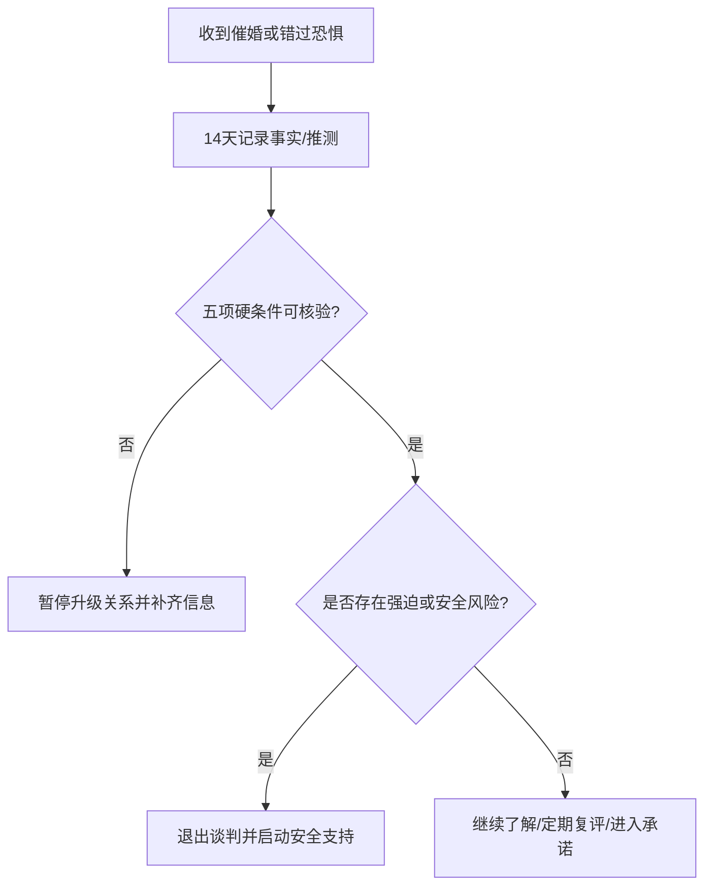

# 婚姻市场压力与反催婚决策节奏

这份指南把“年龄、性别比、亲友比较和害怕错过”拆成可核验的压力来源，帮助伴侣决定是否继续了解、订婚或结婚。结构性压力可以解释环境，不能替代对具体对象的评估。

## Evidence base

Jiang、Li 与 Feldman（2016，DOI 10.1007/s11205-015-0981-y）讨论中国婚姻挤压与年龄、性别结构的关系；Spielmann 等（2013，DOI 10.1037/a0034628）发现害怕单身与降低择偶标准、留在不满意关系的倾向相关。证据是群体层面的关联，不能预测个人一定会错过机会，也不能证明某个性别必须接受不合适的关系。

## 14 天压力核验

1. 各自写下“我想结婚的理由”和“我害怕不结的后果”，逐条标为事实、推测或他人意见。
2. 记录两周内的催促来源、具体要求、截止日期和可验证依据；“再不结就没人要”没有数据支持时标为推测。
3. 只评估五项硬条件：尊重与安全、债务和收入透明、冲突修复、居住与照护安排、是否同意生育及时间。
4. 设一个不因催促缩短的冷静期：重大转账、登记、共同借贷和怀孕计划至少延后 72 小时复核。
5. 14 天后选择继续了解、定期复评、暂停或退出，并写明触发条件。

## 反应与回应

| 反应 | 回应 | 下一步 |
|---|---|---|
| “再不结就没机会了。” | “机会是概率问题，结婚是责任决定。先核对五项硬条件。” | 回到记录表，拒绝当场承诺 |
| 伴侣要求马上登记证明诚意 | “诚意可以用透明、兑现和共同计划证明，不用压缩审查期。” | 延后节点，安排一次无家长会议 |
| 亲友拿同龄人比较 | “比较不能代替我们的现金流和相处证据。” | 结束比较话题，保留自己的时间表 |
| 一方承认只是怕单身 | “先处理害怕，再决定关系；不把恐惧当成对方的优点。” | 做个人支持/咨询，暂停升级关系 |

## Stop conditions

- 以年龄、性别或“市场稀缺”逼迫登记、借贷、性行为或生育；
- 拒绝披露债务、健康、婚史、居住和照护安排；
- 反复用分手、曝光、经济惩罚或家人施压取消冷静期；
- 核心条件不一致，却要求先付款或先登记。

