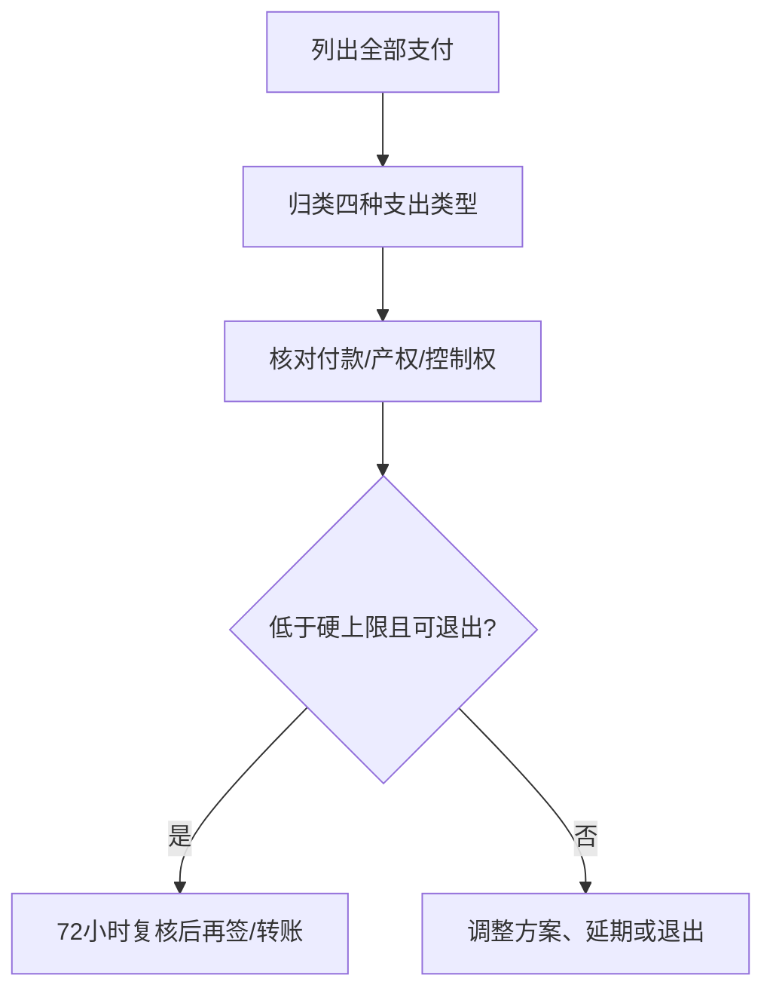

# 婚姻支付类型与资产风险审计

这份审计补充预算谈判指南，重点回答“这笔钱是什么、谁控制、失败时怎么办”，而不是比较哪种婚姻支付更体面。

## Evidence base

Duan、Jin 与 Teng（2022，DOI 10.3390/su14148666）区分农村婚姻支出的不同组合；Lyu 与 Zhang（2021，DOI 10.3390/su132313058）讨论匹配、距离与支付；Zhang（2020，DOI 10.5070/l3272051563）提醒法律争议取决于付款目的、使用、共同生活等事实。分类是审计工具，不是法律结论。

## 四种支出类型

| 类型 | 典型结构 | 首要风险 |
|---|---|---|
| 彩礼+婚房 | 现金支付与住房并重 | 产权、债务和双重支出不透明 |
| 混合型 | 彩礼、房、婚礼和嫁妆分担 | 责任分散，容易临时加码 |
| 彩礼偏重 | 现金/首饰/婚礼支出占大头 | 现金流、用途和返还争议 |
| 婚房偏重 | 首付、装修或房产投入占大头 | 出资与产权、居住权不匹配 |

## 八步风险审计

1. 把每笔钱标为彩礼、赠与、借款、共同消费或家庭转账。
2. 写付款人、收款人、账户、用途、日期和凭证。
3. 核对资产登记、贷款人、还款人、居住权和出售/退出规则。
4. 分开婚前资产、婚后共同支出和父母支持；不以口头“以后都是我们的”替代文件。
5. 做理想、可接受和硬上限三档预算。
6. 运行失业、分手、迁移失败和父母撤回支持四个压力测试。
7. 让双方在没有家长时复述同一方案。
8. 签约或转账前 72 小时复核；性质不明就暂停并咨询当地专业人士。

## 反应与回应

| 反应 | 回应 |
|---|---|
| “钱给了就是一家人，不用写。” | “写清用途和控制权是在保护双方，不是怀疑感情。”暂停转账。 |
| “房子写谁的都一样。” | “产权决定风险和居住权，必须按当地法律核实。”要求文件。 |
| 临时增加金额 | “这是新方案，旧预算失效。”重新审计，不当场答应。 |
| 要求隐瞒真实金额或债务 | “我不参与隐瞒。”保留记录，寻求独立咨询。 |

## Stop conditions

- 以高息借贷、变卖基本资产或隐瞒债务支付；
- 收款人、用途、产权或借款责任拒绝书面确认；
- 任一方不能独立拒绝，或出现羞辱、威胁、报复；
- 方案依赖不可验证的“婚后自然会解决”。

