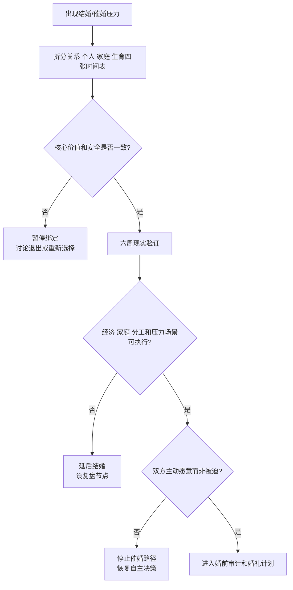

# 结婚时间表与催婚压力审计

## Evidence base

Yu 与 Xie（2015）的中国城市人口研究（DOI 10.1007/s13524-015-0432-z）显示，婚龄推迟且经济前景对婚姻进入的影响增强。指南把年龄、关系质量、经济条件和生育计划分开评估，避免在压力下仓促结婚。

## 先拆开四个时间表

1. **关系时间表**：认识、确定关系、共同经历压力、婚前审计是否完成；
2. **个人时间表**：职业、住房、健康、心理准备和独立生活能力；
3. **家庭时间表**：父母期待、彩礼婚礼、照护和迁移要求；
4. **生育时间表**：双方是否想要孩子、医学信息、照护资源和不孕/不育风险应对。

四张时间表不必完全同步，但必须明确冲突。例如“想要孩子”不能自动推出“现在就结婚”，而“年龄焦虑”也不能替代对关系安全和现实可行性的核验。

## 六周反催婚验证计划

1. **第 1 周**：各自写下想结婚的原因，标记是主动愿望、家庭压力、同龄比较、经济/户籍需要，还是生育时间考虑。
2. **第 2 周**：核对收入、债务、住房、城市、父母责任、家务、生育和性边界；未完成的事项列为风险，不用“感情好”覆盖。
3. **第 3–4 周**：经历至少两次真实压力场景并观察兑现，例如双方家庭谈判、预算冲突、工作加班或异地安排。
4. **第 5 周**：分别写出结婚、延后、分手三种方案的成本和收益；不把“不结婚”自动等同于失败。
5. **第 6 周**：只在双方都能说出具体责任、日期和备用方案时推进订婚/结婚；否则延后并设下一复盘节点。

可直接使用的话术：

> “年龄和父母催促是真实压力，但它们不能替我们判断关系是否安全、经济是否能承受、婚后分工是否可执行。我们按六周计划核验。”

> “我愿意讨论生育时间，但不会用仓促结婚解决焦虑。先确认伴侣、住房、照护和医学信息，再决定时间表。”

## 反应分支

| 对方反应 | 回应 | 下一步 |
|---|---|---|
| “再拖就没人要了。” | “这是群体焦虑，不是对我们关系的证据。我们看事实和方案，不用恐惧做决定。” | 回到四张时间表 |
| “父母已经同意，你还犹豫什么？” | “父母意见可以参考，但婚后责任由我们承担。” | 明确双方共同决策边界 |
| “先领证，问题以后解决。” | “领证会增加法律和财务绑定，未解决的问题需要先列出责任和期限。” | 暂停领证/购房/生育绑定 |
| 一方想要孩子，另一方不确定 | “这是核心目标差异，不靠拖延或逼迫解决。” | 设定医学咨询、时间节点或关系退出讨论 |
| 对方拿同龄人比较 | “别人的婚龄不能代替我们的条件。” | 停止比较，做现实审计 |
| 年龄压力导致隐瞒问题 | “越接近绑定，越需要透明。重大隐瞒会让时间表失效。” | 核验债务、健康、婚史和家庭责任 |

## Stop conditions

- 以年龄、父母、彩礼、生育或“市场价值”强迫结婚、怀孕或领证；
- 重大债务、婚史、健康、子女或家庭责任隐瞒；
- 一方拒绝婚前审计，却要求先领证、买房或生育；
- 核心生育目标冲突，且一方试图靠欺骗、停药或拖延改变对方；
- 出现威胁、暴力、性胁迫、经济控制或无法安全退出。

触发停止条件时，暂停婚姻、生育和资产绑定，优先事实核验、专业咨询和安全计划。

## Mermaid 分流图

