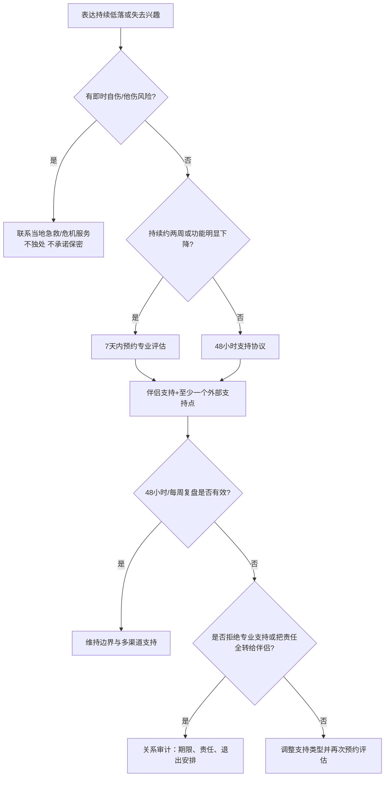

# 伴侣心理健康支持与关系协作

## Evidence base

Gariépy、Honkaniemi 与 Quesnel-Vallée（2016）的系统综述（DOI 10.1192/bjp.bp.115.169094）纳入 100 项研究，发现社会支持与抑郁保护存在关联，但研究测量异质、队列效应较弱，并不能替代个人诊断。下面的流程把伴侣支持限定为协作和转介，不把一方变成另一方的治疗者。

## 先做安全和严重程度分流

先私下问三个问题，不在争吵中逼问：

1. “最近两周，情绪低落或对原来有兴趣的事失去兴趣，是否大多数天都出现？”
2. “睡眠、吃饭、工作或照顾自己的能力有没有明显下降？”
3. “有没有伤害自己、活着没意义，或已经想好怎么做的念头？”

若有正在发生的自伤行为、明确计划、无法保证当下安全，立即联系当地急救/危机服务，陪同到急诊或请可信任的人到场；不要只承诺保密，也不要让当事人独处。若没有即时危险但症状持续约两周、功能明显下降，建议在 7 天内预约精神科/心理科或家庭医生。这里不做诊断，专业人员负责评估。

## 把“支持”拆成五种可执行行为

先问：“你现在需要哪一种？”每次只承诺一到两项，避免无限责任：

| 支持类型 | 可执行动作 | 不承担的责任 |
|---|---|---|
| 倾听 | 约 10–20 分钟，复述事实和感受，不急着讲道理 | 不负责证明对方的所有判断正确 |
| 陪伴 | 陪散步、吃饭、去预约地点，提前约结束时间 | 不全天候监控情绪 |
| 实际协助 | 在清单中接手一件具体任务并完成 | 不等于对方把全部生活管理交给你 |
| 就医支持 | 一起找机构、预约、记录问题，尊重对方同意 | 不替对方诊断、服药或决定治疗 |
| 危机处理 | 按安全计划联系急救/危机资源并减少独处 | 不以保密换取承担即时危险 |

## 48 小时支持协议

1. 共同写下未来 48 小时的三项信息：每天可联系时段、由谁完成的两件具体事项、需要升级求助的信号。
2. 把任务写成“谁在何时做什么”，例如“今晚 20:00 前由我预约社区心理门诊”，不要写“我会多关心你”。
3. 同时指定至少一个伴侣之外的支持点：朋友、家人、医生、咨询师或社区服务。
4. 48 小时后复盘一次：支持是否完成、对方是否更安全、是否需要专业转介或减少伴侣承担。

可直接使用的话术：

> “我相信你现在很难受，也愿意陪你一起处理。今天我能做的是陪你预约和听你说 15 分钟；我不能单独负责治疗。我们一起找一个专业支持，再约定明晚复盘。”

## 反应分支

| 对方反应 | 回应 | 下一步 |
|---|---|---|
| “你只要陪着我，不需要医生。” | “我会陪你，但持续的痛苦需要专业评估。我们先只预约一次，是否继续由你和医生决定。” | 7 天内完成预约 |
| “你不秒回就是不在乎我。” | “我在乎你，但我每天只能在 19:00–19:30 集中回应。紧急危险请联系急救/危机服务，不要等我回复。” | 固定时段并建立备用联系人 |
| “我不想告诉任何人。” | “我尊重隐私，但如果有即时危险，我会优先保证安全并联系紧急支持。” | 明确保密边界和危机触发条件 |
| 只接受安慰，拒绝任何实际安排 | “我先听你说 10 分钟，然后我们只选一个最小动作：吃饭、睡觉或预约。” | 观察 48 小时是否出现可执行行动 |
| 对方短期好转，随后把全部责任又交回伴侣 | “这周协议中的任务需要由你/专业支持继续负责，我可以完成我承诺的那一项。” | 重新分配支持网络，必要时减少伴侣照护量 |
| 出现自伤计划、正在伤害自己或无法保证安全 | “现在先不争论原因，我们马上联系急救/危机服务并让可信任的人到场。” | 不独处、不承诺保密、移除可立即造成伤害的物品（在安全可行时） |

## 每周 20 分钟复盘

按四列记录：发生了什么、谁做了什么、什么有效、下一周谁负责。检查三件事：支持是否按约完成；是否仍由一方承担全部情绪管理；是否需要医生、咨询师或其他网络加入。支持的目标是增加安全、功能和选择，而不是让关系变成监护制度。

## Stop conditions

- 对方要求你成为唯一治疗者、全天候监控者，或以分手、羞辱、报复逼你提供超出能力的支持；
- 你已经出现失眠、无法工作、持续恐惧或身体安全风险，却被要求继续独自承担；
- 出现自伤/他伤的即时危险、药物或酒精失控、严重失去现实检验能力；
- 任何威胁、暴力、强迫、跟踪或财务控制。

触发停止条件时，暂停关系争论，优先安全计划、专业机构、可信任的人和当地紧急服务。若没有即时危险但长期拒绝任何专业或多渠道支持，进入关系审计：明确期限、责任和退出安排。

## Mermaid 分流图

