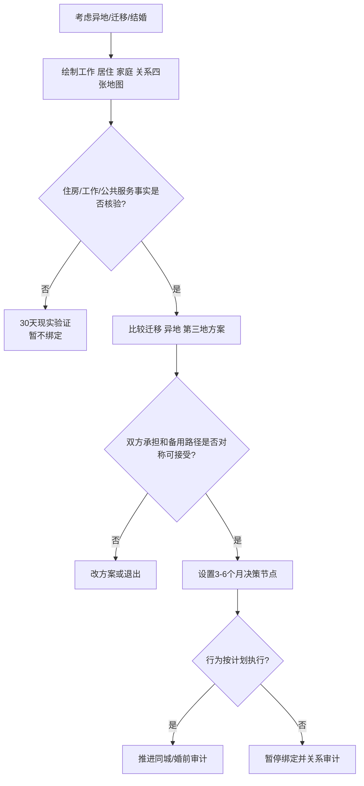

# 城乡迁移、住房与婚姻选择审计

## Evidence base

Xiong（2023）的中国内部迁移研究（DOI 10.1007/s10680-023-09658-3）说明，劳动力市场机会和婚姻市场机会可能相互促进，也可能发生冲突。指南把迁移、住房和婚姻拆开审计，避免用“去大城市/回老家”一句话替代具体决策。

## 四张地图先画清楚

在确定结婚、同居或跨城市迁移前，双方分别写出：

1. **工作地图**：未来 2–3 年的岗位、收入、晋升、失业风险和可迁移技能；
2. **居住地图**：城市、住房来源、租购成本、通勤、户籍/公共服务和子女教育；
3. **家庭地图**：双方父母距离、照护需求、节假日安排、彩礼/婚礼和经济援助上限；
4. **关系地图**：谁迁移、谁牺牲职业、异地多久、探访费用、结婚时间和退出方案。

## 三种常见方案比较

| 方案 | 必须回答 | 主要风险 |
|---|---|---|
| 一方迁移到另一方城市 | 迁移者的工作和社交如何重建 | 一方长期牺牲，形成依赖和权力失衡 |
| 双城异地 6–18 个月 | 见面频率、费用、忠诚边界和结束日期 | 无限期等待、关系承诺与现实不一致 |
| 共同去第三地 | 谁先找工作、住房和家庭支持 | 双方同时失去原有网络，压力集中 |

每个方案都做最坏情景：失业 6 个月、父母突然需要照护、无法落户/获得公共服务、怀孕或孩子入学。写明备用住房、现金储备、返乡路径和谁负责执行。

## 30 天现实验证

1. 第 1 周核验住房、工作、通勤、户籍/教育和父母照护的真实成本，不使用口头估算。
2. 第 2 周按目标城市生活 7 天，模拟通勤、家务、社交和预算；异地伴侣按实际交通费用执行一次。
3. 第 3 周分别与双方父母谈边界，只记录明确承诺和要求，不把“以后再说”当方案。
4. 第 4 周共同决定：推进、延后、改方案或退出；没有负责人、日期和备用路径的计划视为未完成。

可直接使用的话术：

> “迁移不是谁跟谁走这么简单。我们要同时算工作、住房、父母、教育和退出成本；如果只有我牺牲职业，这不是共同方案。”

> “我们可以异地，但只试 6 个月，每月见面两次，费用各自承担多少，6 个月后必须决定是否同城。”

## 反应分支

| 对方反应 | 回应 | 下一步 |
|---|---|---|
| “结婚后自然会解决。” | “结婚会增加绑定，不会自动解决住房、工作和父母责任。” | 结婚前完成四张地图和预算 |
| “你爱我就应该跟我走。” | “爱不能替代对职业、住房和家庭成本的讨论。” | 要求双方都提出牺牲和补偿方案 |
| “先买房再说工作。” | “房产会增加不可逆绑定。先核验收入、贷款、产权和失业方案。” | 暂缓购房或共同贷款 |
| 父母要求回乡/留城 | “父母意见需要听，但居住和婚姻决定由我们承担后果。” | 设定探访、照护和援助上限 |
| 异地长期没有结束日期 | “没有结束日期就是默认长期异地。” | 设定 3–6 个月决策节点 |

## Stop conditions

- 以婚姻或彩礼强迫一方放弃工作、户籍、社交、财产或退出能力；
- 隐瞒住房产权、债务、落户/教育限制或真实迁移成本；
- 任何一方拒绝讨论父母照护、生育、子女教育和返乡方案，却要求先结婚；
- 迁移方案只要求一方牺牲，且没有时间限制、补偿、共同决策或备用路径；
- 出现威胁、暴力、跟踪、经济控制或证件扣押。

触发停止条件时，暂停结婚、迁移、购房和共同贷款；先核验法律与财务事实，保护证件、账户和居住安全。

## Mermaid 分流图

