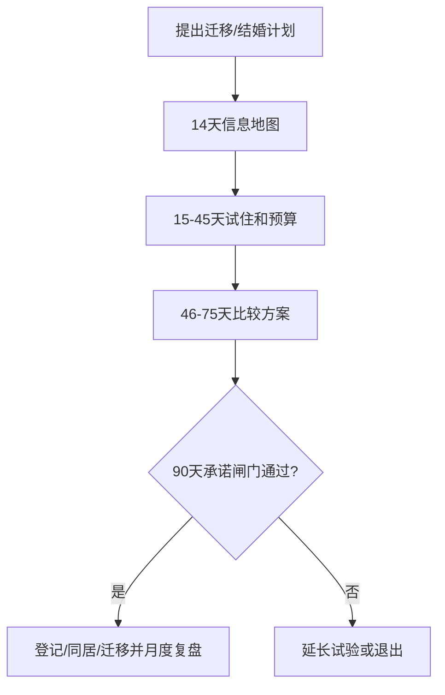

# 迁移、住房与结婚时点路线图

迁移可能改善工作机会，也可能增加异地、住房、照护和关系压力。把“去哪里”拆成可逆的小决定，不用一次承诺解决所有问题。

## Evidence base

Mu 与 Yeung（2019，DOI 10.1080/1369183X.2019.1585009）将内部迁移与结婚时机、家庭背景匹配联系起来；Xiong（2023，DOI 10.1007/s10680-023-09658-3）讨论迁移与婚姻市场前景的关系。研究不能替个人预测迁移后一定结婚或收入上升。

## 90 天路线图

**第 1–14 天：地图。** 各自写工作/收入、住房、父母照护、关系需求、城市偏好和最坏情况；核对合同、社保、通勤与租金。

**第 15–45 天：小规模试验。** 能试住就试住，分别测算单人和共同生活预算；明确异地频率、家务、探亲、生育时间表和退出成本。

**第 46–75 天：决策会议。** 只比较两到三个方案，写清谁迁移、谁承担职业牺牲、住房产权/租约、照护替代和失败后的回程方案。

**第 76–90 天：承诺闸门。** 满足信息透明、现金流可承受、双方自愿和可退出，才决定登记、同居或继续试验；否则延长试验。

## 反应与回应

| 反应 | 回应与动作 |
|---|---|
| “爱我就跟我走。” | “迁移影响工作、住房和照护，需要共同预算和失败方案。”要求 90 天路线图。 |
| “先搬过去，工作以后再找。” | “先验证收入、租约和应急金；没有底线预算不搬。”延后。 |
| 一方承担全部职业牺牲 | “牺牲必须可见、可补偿、可复核。”写轮换或补偿安排。 |
| 父母要求回乡照护 | “照护是共同责任，要列时间、钱和替代照护。”没有方案不承诺。 |

## Stop conditions

- 要求无合同、无应急金、无回程方案地搬迁；
- 隐瞒工作、债务、产权或居住条件；
- 以迁移逼迫登记、生育或切断个人支持网络；
- 失败成本全部由一方承担且拒绝复盘。

