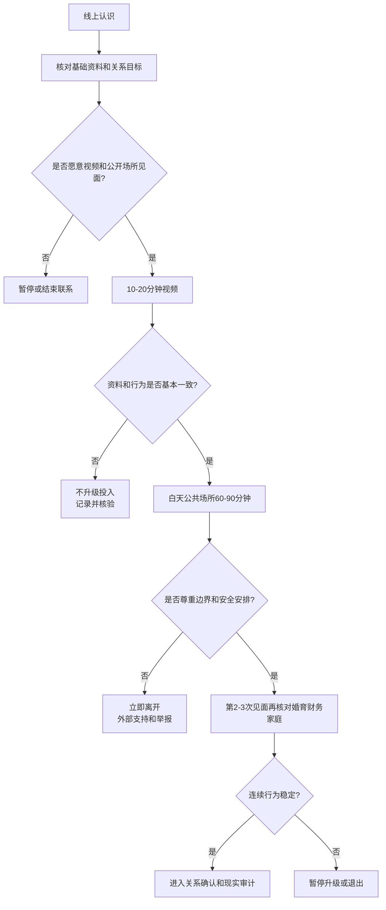

# 线上约会核验与首次见面安全

## Evidence base

Sharabi 与 Caughlin（2019）的研究（DOI 10.1177/1461444818792425）跟踪 94 名线上约会者，发现对伴侣欺骗的感知会降低首次线下约会成功度。指南把线上关系视为待验证信息，不把照片和聊天直接当成现实承诺。

## 三层资料核验

1. **基础一致性**：视频通话、近期自然照片、年龄/城市/职业/婚史/婚育意愿是否前后一致；
2. **行为一致性**：是否愿意在合理时间线下见面、尊重边界、接受公开场所和各自付款；
3. **现实一致性**：对工作、住房、家庭责任、债务、迁移和关系目标的说法能否在后续行动中验证。

不要把“愿意提供全部密码、实时定位或身份证照片”当成真实性证明；这些行为可能制造新的安全风险。

## 线上到线下的低风险节奏

1. **前 3–7 天**：保持平台内沟通，确认基本目标和不可接受事项；不转账、不代购、不提供证件和住址。
2. **第 1 次视频**：10–20 分钟，核对是否为本人、交流是否自然；不要求对方展示隐私空间。
3. **第 1 次见面**：白天、公共场所、60–90 分钟；自行到达和离开，告诉可信任的人时间地点，设置报平安时间。
4. **第 2–3 次见面**：再讨论收入、城市、婚育、家庭和长期关系目标；不因一次浪漫体验跳过事实核验。
5. **投入升级前**：在发生借钱、共同旅行、性关系、同居或见父母前，完成关系目标、财务和安全边界审计。

可直接使用的话术：

> “我愿意继续了解，但第一次见面安排在白天公共场所，各自到达和付款，时间先定 90 分钟。这样对我们都安全。”

> “我不会提供身份证、住址或转账。可以通过视频和公开资料核对基本信息，等建立信任后再谈更深的隐私。”

## 反应分支

| 对方反应 | 回应 | 下一步 |
|---|---|---|
| 拒绝视频或公开场所见面 | “这是我的基本安全条件，不满足就不见面。” | 暂停或结束联系 |
| 很快说爱你、要求转账或投资 | “我不会在未建立现实信任前发生金钱往来。” | 截图留存、举报平台、停止联系 |
| 逼问住址、身份证或实时定位 | “隐私信息不用于证明感情。我们保持公开场所和各自出行。” | 关闭定位，必要时拉黑 |
| 线下与资料差异很大 | “我需要时间核对，不会当场承诺关系或发生亲密行为。” | 离开现场，告诉可信任的人 |
| 对方尊重安排但关系推进很慢 | “慢一点可以，我们按约定频率见面和复盘。” | 观察持续行为，不用焦虑加速 |
| 第一次见面感到不安全 | “我今天先离开，之后是否继续由我决定。” | 直接离开，联系外部支持，不解释过多 |

## Stop conditions

- 冒用身份、重大婚史/婚育/职业信息隐瞒，或多次前后矛盾；
- 转账、借贷、投资、代购、担保、带货或索取验证码；
- 强迫提供身份证、住址、裸照、定位、密码或强制查手机；
- 未经同意跟踪、堵截、威胁、性胁迫或阻止离开；
- 线下见面时出现酒精/药物控制、暴力、抢夺物品或无法安全返程。

触发停止条件时，不继续解释或谈判；优先离开、保存证据、联系可信任的人、平台举报和必要的当地执法/急救支持。

## Mermaid 分流图

