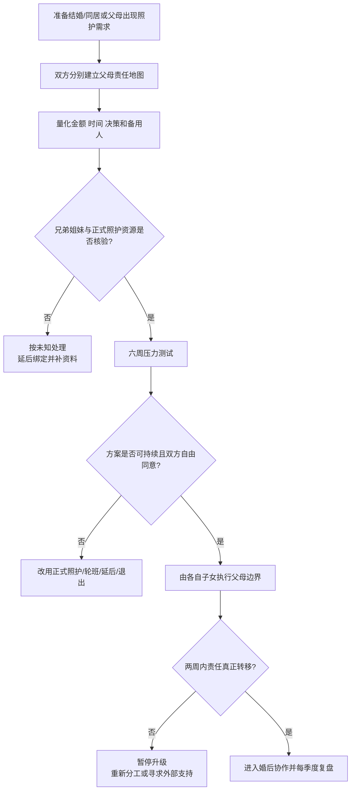

# 双方父母养老与婚后照护责任审计

## 明确结论

婚前必须把双方父母的养老、医疗、居住和紧急照护责任写成可执行方案，不能用“以后再说”“谁的父母谁负责”或“你嫁过来就应该照顾我父母”代替协商。照护责任至少要同时分配金额、时间、决策权、交通和备用人；一方不能因为性别、收入较低或更会照顾人而被默认永久承担。

## Evidence base

Fingerman 等（2012，DOI 10.1093/geront/gnr139）的代际关系综述指出，支持决定受到父母需要、子女价值、家庭结构、迁移和社会环境共同影响。

Willson、Shuey 与 Elder（2003，DOI 10.1111/j.1741-3737.2003.01055.x）对 1,599 名成年子女的研究显示，人与父母、姻亲之间可以同时存在亲近和压力，照护关系受健康、性别化亲属结构和姻亲关系影响。

这两项研究不能直接给出中国家庭的金额或法律答案；本指南把它们转化为婚前审计工具，并结合现有代际边界、经济压力和慢性病照护资料。

## 六周照护审计

### 第 1 周：分别建立父母责任地图

双方各自列出四位父母或实际需要照护的长辈：

| 项目 | 需要写清 |
|---|---|
| 健康 | 慢病、失能、预计医疗和照护强度 |
| 经济 | 养老金、收入、保险、每月缺口和大额医疗 |
| 居住 | 现住地、是否同住、是否需要迁移 |
| 子女网络 | 兄弟姐妹人数、距离、可提供的时间和金额 |
| 个人意愿 | 父母想住哪里、是否接受保姆/机构/社区服务 |
| 伴侣成本 | 请假、通勤、职业机会、育儿和恢复时间 |

### 第 2 周：把“孝顺”转换成责任

每一项写成具体指标，先确定金额上限，再确定时间和任务：

- 每月援助上限和支付日期；
- 每季度探访或陪诊次数；
- 谁负责预约、报销、紧急联系人和信息同步；
- 夜间或住院照护由谁主责，谁是备用人；
- 兄弟姐妹按金额、时间或任务如何分担；
- 一方暂时承担后，何时复盘和如何补位。

### 第 3 周：评估正式照护资源

至少比较三种方案：

1. 家庭轮班；
2. 保姆、护理员、社区或日间照护；
3. 医疗机构、长期照护或异地支持。

每个方案写月成本、等待时间、质量风险、谁管理和失败时的备用方案。

### 第 4 周：和双方父母分别沟通边界

伴侣先分别与自己的父母沟通，避免把对方推到前线：

> “我们会在能力范围内提供帮助，但金额、同住和照护安排由我们夫妻共同决定。临时需求请先联系我，不直接要求我的伴侣承担。”

父母可以表达需要，但不能替成年子女承诺另一方的时间、工资、身体或生育安排。

### 第 5 周：做压力测试

模拟：

- 一位父母住院三个月；
- 一方失业或工作高峰；
- 孩子出生或孩子生病；
- 兄弟姐妹拒绝分担；
- 父母突然要求同住或返乡。

如果方案依赖一方辞职、无限借贷或长期失去独立住房，就不能按“已经谈好了”推进。

### 第 6 周：形成四种决定

1. 继续结婚/同居，责任、上限和备用方案均清楚；
2. 延后，补齐健康、经济或兄弟姐妹信息；
3. 改方案，使用正式照护或分阶段迁移；
4. 暂停婚姻升级，因为双方对核心责任没有可接受的共同方案。

## 可直接使用的话术

> “我愿意照顾你的父母，但照顾不是一句‘以后一起负责’。我们要写清每月多少钱、每月多少时间、谁做医疗决定、谁是备用人。”

> “你的父母由你先沟通边界，我的父母由我先沟通。我们共同承担预算，但不把对方单独推到父母面前。”

> “如果需要我辞职、搬家或长期同住，这不是默认义务，需要单独讨论补偿、期限和退出安排。”

> “父母有需要和我们能承担多少是两件事。我们先看养老金、保险、兄弟姐妹和正式照护资源，再决定援助上限。”

## 对方可能反应与回答

| 对方反应 | 回应 | 下一步 |
|---|---|---|
| “谁的父母谁负责。” | “可以由亲生子女做主要沟通，但时间、金钱和紧急照护会影响夫妻共同生活，需要共同预算。” | 建立双方责任表 |
| “你嫁进来就应该照顾我爸妈。” | “婚姻不自动转移照护劳动。我们可以讨论我愿意承担的项目和期限。” | 不接受无限责任 |
| “谈钱就是不孝。” | “预算是为了让帮助持续，不是把父母当成账目。” | 写上限和复盘日 |
| “我兄弟姐妹以后会帮忙。” | “请把谁、做什么、从何时开始写下来；没有确认就算未知。” | 设计备用方案 |
| 一方工作更灵活 | “灵活不等于永久主责。我们还要计算心理负荷、职业机会和恢复时间。” | 轮换或购买正式照护 |
| 父母要求同住 | “同住是住房、隐私和照护安排的重大改变，需要双方自由同意和试住规则。” | 先短期试住并设退出 |
| 对方短期答应，实际仍把任务交给你 | “我们约定的是完整责任，不是我提醒后你执行。” | 记录两周并重新分工 |
| 父母直接辱骂或干涉 | “我不会在辱骂中谈照护。由你的子女先处理边界。” | 结束谈话，改书面沟通 |

## Stop conditions

- 一方拒绝讨论父母健康、经济、居住或照护需求，却要求先结婚；
- 把性别、彩礼、收入或“谁更孝顺”作为强迫一方照护的理由；
- 强迫辞职、迁移、同住、借贷或放弃就医和个人账户；
- 兄弟姐妹和父母把全部责任默认转给一个人，伴侣拒绝设边界；
- 出现虐待、威胁、经济控制、照护中的暴力或严重安全风险；
- 方案只能靠一方无限透支睡眠、工作、健康或退出能力维持。

触发停止条件时，暂停结婚、迁移、共同借贷和同住；先保护住房、账户、工作和人身安全，必要时联系医疗、社工、法律或照护专业服务。

## Mermaid 分流图

## Evidence boundary

研究说明代际支持受到健康、资源、迁移、亲属结构和文化规范影响，但不能替你决定必须照顾哪位父母。金额、同住、医疗决定和照护方式要结合中国当地法律、医保、长期照护和家庭实际情况；“孝顺”不能替代具体责任、边界和安全方案。

