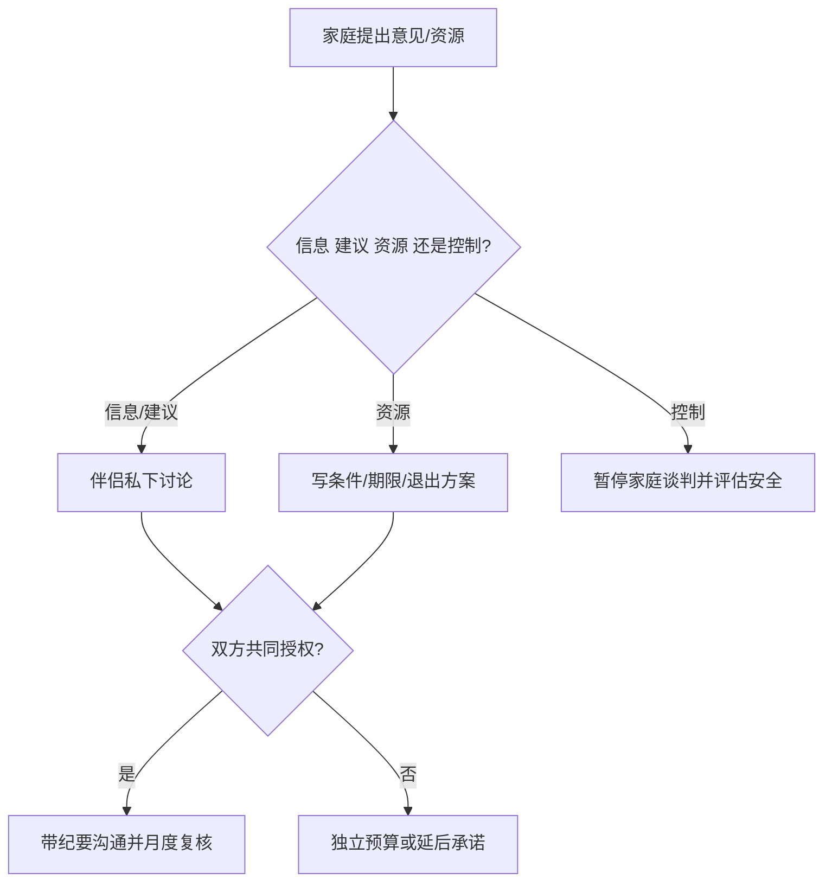

# 父母介入与伴侣共同决策权

目标是区分建议、支持和控制，确保小家庭承担的风险由伴侣共同授权，而不是由父母或某一方单方面决定。

## Evidence base

Ji、Lin 与 Liu（2024，DOI 10.1163/25895745-05020003）描述现代相亲与家庭参与的多层协商；Fingerman 等（2012，DOI 10.1093/geront/gnr139）指出代际支持受需要、迁移、家庭结构和社会环境共同影响；相关证据不规定所有家庭都应采用同一种边界。

## 四级介入审计

把每件事标为：**信息**（提供事实）、**建议**（可接受也可拒绝）、**资源**（钱、房、照护，附带明确条件）、**否决/控制**（以断供、羞辱或威胁迫使服从）。前三级需写明期限和退出方式，第四级视为关系风险。

## 七步流程

1. 伴侣先私下列出住房、彩礼、债务、城市、照护、生育和节日安排。
2. 每人标记自己的底线、可谈项和未知项，不能在父母面前首次讨论。
3. 先决定共同授权：父母可提供什么，谁签字，何时复核，条件不满足时如何退出。
4. 由亲生子女向自己父母传达共同口径，另一方不单独承受攻击。
5. 每次家庭会议限时 45 分钟，会后写纪要；新增要求自动进入下一轮。
6. 对资源支持做替代方案：不接受附带控制的房、钱或照护时，准备租房、延后婚礼或减少支出方案。
7. 每月复查一次共同决策权是否仍在伴侣手中。

## 反应与回应

| 反应 | 回应与动作 |
|---|---|
| “父母出钱就应当听父母的。” | “出资可以有条件，但是否接受由我们共同决定；请把条件写清。”暂停签字。 |
| 伴侣说“你直接和我父母说。” | “由你先传达共同决定，我参加需要时限和纪要的会议。”若拒绝，暂停升级。 |
| 父母用断供威胁 | “我们理解你可以选择不支持，但不能以此替我们决定。”启动独立预算。 |
| 伴侣在家人面前否认约定 | 结束会议，先恢复私下共同口径；重复发生则做关系审计。 |

## Stop conditions

- 任何一方不能在没有家人旁听时自由表达“不”；
- 资源被用来换取婚房产权、居住、育儿或生育的单方面控制；
- 伴侣拒绝保护共同决定，却要求先登记、付款或搬迁；
- 出现羞辱、威胁、跟踪、扣留证件或报复。

