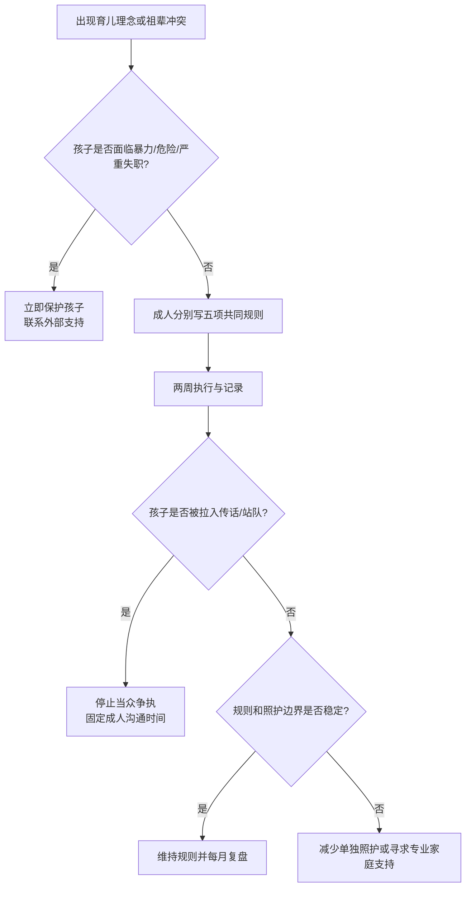

# 育儿理念冲突、祖辈介入与孩子面前的共同决策

## 明确结论

育儿分歧不要求双方每件事都相同，但必须避免三种伤害：在孩子面前互相推翻、让孩子替成人传话或站队，不让孩子传话、让祖辈用照护投入换取最终决定权。先把安全和法律责任固定，再用两周共同规则实验处理作息、屏幕、学习、零食、惩罚和祖辈参与。涉及暴力、虐待或严重安全风险时，优先保护孩子，不进行表面上的“双方平等协商”。

## Evidence base

- van Eldik 等（2020，DOI 10.1037/bul0000233）：169 项研究的父母关系元分析显示，敌意、疏离、无建设性及涉及孩子的冲突与孩子适应问题和冲突反应相关。
- Liang 等（2021，DOI 10.1002/cad.20442）：中国北京 60 名儿童的纵向研究显示，祖母共同育儿行为与母亲敏感性、依恋和儿童行为路径相关。
- Ronaghan 等（2024，DOI 10.1037/fam0001149）：共同育儿质量与婚姻满意度存在群体层面关联，不能代替具体家庭审计。

两周是低绑定试行期，不是儿童发展或治疗阈值。

## 第一步：先定不可谈判的安全规则

- 不体罚、羞辱、威胁、恐吓或把孩子锁起来；
- 不在孩子面前争夺谁更爱孩子、谁出钱更多或谁有最终权；
- 不让孩子传递“告诉你爸/妈”“你选谁”的信息；
- 医疗、走失、接送和过敏等紧急事项由当时在场的成年人先保证安全，再通知另一方；
- 有暴力、虐待、严重成瘾或照护失职迹象时，先联系当地儿童保护、医疗或法律支持。

## 第二步：写共同规则卡

只选五个最常发生的场景，每项写四列：

| 场景 | 默认规则 | 谁执行 | 何时复盘 |
|---|---|---|---|
| 睡眠/作息 |  |  |  |
| 屏幕/游戏 |  |  |  |
| 零食/饮料 |  |  |  |
| 学习/惩罚 |  |  |  |
| 接送/祖辈照护 |  |  |  |

规则应能被孩子理解、被不同照护者执行。暂时无法统一时，选择风险更低、可解释且可复盘的方案，不当着孩子面争论。

## 第三步：祖辈边界四问

每次请祖辈参与前先确认：

1. 是短时帮忙，还是长期承担照护？
2. 谁承担最终法律、医疗和教育责任？
3. 哪些规则祖辈可以灵活处理，哪些必须一致？
4. 如果祖辈不同意，谁负责向孩子解释而不是让孩子传话？

可以感谢照护贡献，但不能把贡献直接兑换成打骂权、隐私权、教育最终决定权或绕过父母的单独承诺。

## 第四步：两周共同规则实验

- 第 1 天：双方和主要祖辈各自写五项规则；
- 第 2 天：删掉无法执行的规则，保留孩子安全和日常最重要的五项；
- 每天记录一次：规则是否执行、谁被临时推翻、孩子是否被卷入；
- 冲突发生时，先用一句话暂停：“这个问题不在孩子面前解决，今晚 20:30 成人再谈。”
- 第 7 天和第 14 天复盘，只修改一至两项；
- 两周后决定维持、调整照护安排，或减少祖辈单独照护时间。

## 可直接使用的话术

> “我们欢迎你帮忙，但孩子的安全、医疗和主要教育决定由父母共同承担。具体规则写下来，避免每个人当场解释一套。”

> “这件事我们意见不同，不在孩子面前争。现在先按低风险规则执行，今晚再由成人讨论。”

> “请不要让孩子传话或选边。需要沟通的内容直接找我/找另一位家长。”

> “感谢你照护孩子，但照护投入不等于可以体罚、羞辱或绕过父母决定。”

## 对方可能反应及回答

| 反应 | 回应 | 下一步 |
|---|---|---|
| “我带大的孩子最多，我说了算。” | “经验值得听，但最终规则要由承担法律和日常责任的照护者共同确认。” | 写共同规则卡 |
| “你们当着孩子面吵，孩子就知道谁对。” | “孩子不负责裁判。我们会离开现场，在成人时间解决。” | 立即停止当众争执 |
| “孩子更听我的，父母规则没用。” | “这正说明需要统一少量规则，而不是让孩子在不同权威间选择。” | 先统一五项规则 |
| 一方私下允许被禁止的行为 | “私下推翻会让孩子承担冲突。以后先记录分歧，不能用孩子保密。” | 两周内暂停单独照护该场景 |
| 祖辈说“不让我管就不帮忙” | “帮忙可以协商，安全规则不能交换。我们会准备备用照护方案。” | 建立备用人和预算 |
| 孩子说“妈妈/爸爸让我这样告诉你” | “你不用传话，这是大人的事。你先去做___，我们自己沟通。” | 不追问孩子谁更对 |
| 一方用钱、房子或照护投入要求最终权 | “资源贡献需要写进预算和责任表，但不改变孩子免受羞辱和暴力的权利。” | 转入权力和安全审计 |
| 规则试行后仍持续在孩子面前攻击 | “这已不是普通理念不同，而是孩子暴露在成人冲突中。” | 减少共同争执场景，寻求专业支持 |

## Stop conditions

- 体罚、羞辱、威胁、性化言语、危险照护或故意不给药/不给食物；
- 强迫孩子选边、传话、监视另一位照护者或隐瞒安全信息；
- 祖辈或父母以房产、金钱、照护和断绝接触威胁换取教育或惩罚决定权；
- 一方持续在孩子面前贬低、恐吓或推翻另一方，拒绝停止；
- 重大医疗、过敏、接送和安全规则被隐瞒或故意违反；
- 任何成年人因争执失控，孩子无法获得稳定、安全的照护。

触发停止条件时，先把孩子转移到安全照护，保留必要记录，联系当地医疗、儿童保护、学校或法律支持；不要让孩子负责调解。

## Mermaid 分流图

## Evidence boundary

研究支持父母关系质量、冲突方式和共同育儿与孩子适应之间的群体关联；不能据此判断某次分歧一定伤害孩子，也不能把祖辈参与自动归类为干涉。安全事件、法律监护和儿童保护问题需要所在地专业机构处理。

