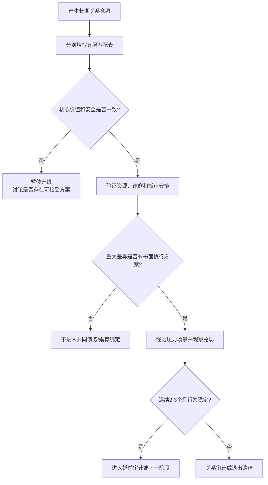

# 择偶匹配与现实适配审计

## Evidence base

Watson 等（2004）的新婚夫妇研究（DOI 10.1111/j.0022-3506.2004.00289.x）发现，不同变量的伴侣相似程度不同：价值/背景相关变量往往更相近，教育和语言能力中等相似，人格并非普遍相似。Jiang、Li、Li 与 Feldman（2016，DOI 10.1007/s11205-015-0981-y）的中国人口学研究则提醒，年龄和性别结构会改变婚姻市场供需，但不能替代个人行为和安全核验。指南因此不追求“全方位相同”，而是检查哪些差异会在婚后变成持续成本。

## 五层匹配表

第一次认真考虑长期关系时，双方分别打分或写事实，不互相代填：

| 层级 | 要核对的现实问题 | 判断方式 |
|---|---|---|
| 吸引与相处 | 外貌吸引、性吸引、相处是否自然、是否愿意公开投入 | 看持续行为，不只看初见感觉 |
| 价值与方向 | 婚姻、生育、忠诚、宗教、城市、生活水平、性别分工 | 必须明确说出底线和时间表 |
| 资源与能力 | 收入、教育、职业、住房、债务、健康、家庭资源 | 核验事实并做最坏情景测试 |
| 家庭与社会 | 父母边界、彩礼/婚礼、城乡迁移、阶层和社交圈 | 看双方能否共同承担外部压力 |
| 互动与安全 | 冲突、道歉、兑现、控制、暴力、性同意和退出能力 | 观察至少 2–3 个压力场景 |

## 三阶段验证

1. **认识期（4–8 周）**：验证吸引、沟通、守时、边界和基本事实，不急于承诺共同财务。
2. **确定关系后（2–3 个月）**：讨论价值与方向，安排一次双方家庭和一次压力场景观察；记录对方如何处理不同意见。
3. **结婚/同居前（至少 4 周）**：完成收入债务、住房、父母、生育、家务、性、城市迁移和冲突协议审计；重大差异没有明确方案就暂停升级。

可直接使用的话术：

> “我不要求我们学历、收入或性格完全一样，但婚后城市、生育、父母责任和钱怎么处理必须有可执行方案。”

> “外貌和吸引是进入关系的条件之一，不能替代对债务、边界、责任和安全的核验。我们把喜欢和可行性分开看。”

## 差异分流

| 差异类型 | 可以协商的例子 | 需要谨慎或暂停的信号 |
|---|---|---|
| 教育/收入差距 | 一方收入高、一方承担更多家务；共同规划职业迁移 | 以资源差距换取决策权、羞辱或隐瞒 |
| 外貌/吸引差异 | 持续尊重、性沟通和对身体的接纳 | 一方长期没有吸引却用婚姻压力掩盖 |
| 城乡/地域差异 | 轮流居住、阶段性迁移、父母探访规则 | 任何一方被默认放弃工作、社交或家人 |
| 家庭阶层差异 | 设定彩礼、婚礼、借贷和援助上限 | 双方父母可无条件干预、要求一方服从 |
| 性格差异 | 外向/内向互补，分工明确 | 一方持续控制、冷暴力或拒绝修复 |

## Stop conditions

- 对方拒绝核验重大事实，却要求确定婚姻、共同借贷或生育；
- 用学历、收入、外貌、户籍、家庭背景或性别羞辱并要求服从；
- 核心目标冲突（如生育、城市、忠诚、债务责任）没有双方都能接受的方案；
- 任何暴力、胁迫、跟踪、经济控制或无法安全退出；
- 关系推进完全依靠一方承担谈判、证明和修复，另一方只要求接受结果。

触发停止条件时，暂停订婚、结婚、共同借贷和生育安排；先完成事实核验、外部咨询和安全计划。

## Mermaid 分流图

