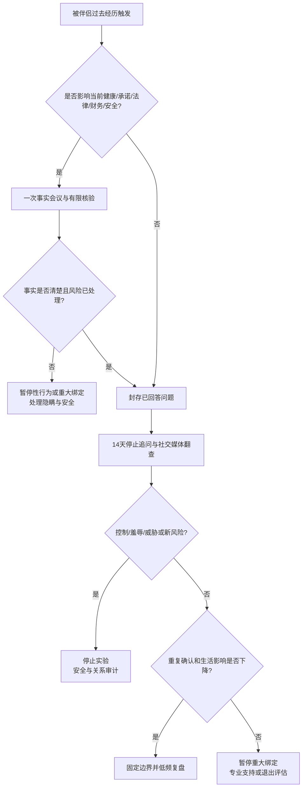

# 伴侣过去经历、披露边界与追溯性嫉妒

## 明确结论

只核对会改变当前健康、法律、财务、安全或关系承诺的事实；无现实影响的具体性行为、人数、排名和比较不属于伴侣自动享有的知情权。完成一次事实沟通后，停止重复追问、翻旧社交媒体和找前任核实，做 14 天停止追问实验。若发现持续联系、重大隐瞒或性健康风险，则退出实验，转入事实核验和安全处理。

这套规则适用于婚内、未婚、同居、非同居、异性或同性关系。它不把任何性别设为天然有义务交代过去的一方。

## Evidence base

- Frampton 与 Fox（2018，DOI 10.1177/2056305118800317）：36 人质性访谈显示，数字痕迹、社会比较、关系不确定和信息搜索参与了追溯性嫉妒；搜索有时会适得其反。
- Ritter 等（2021，DOI 10.1007/s12119-020-09812-7）：美国本科生横断面自报研究发现，披露经历多数并非严重负面，但样本和设计不能证明披露改善关系，也不能推出“全部过去都应披露”。
- Slepian（2024，DOI 10.1177/09637214241226676）：秘密、隐瞒、披露和关系福祉的综述，可用于区分共同风险与个人隐私。

14 天是可执行的行为实验期限，不是研究证实的诊断或治疗阈值。

## 先把信息分成三类

| 类别 | 例子 | 处理方式 |
|---|---|---|
| 当前共同风险 | 未结束的婚姻、已有孩子与抚养责任、仍在联系的前任或性伴侣、当前 STI 风险、私密影像传播风险、会影响现关系的法律/财务/安全事实 | 一次性说明并做有限核验；未清楚前暂停性行为或重大绑定 |
| 可选择分享的关系历史 | 过去关系为何结束、从经历中学到什么、当前触发点、希望怎样建立安全感 | 自愿分享；先约定深度、时长和用途 |
| 私人细节 | 具体性行为、次数、人数的逐项审问、身体或技巧排名、无现实影响的旧聊天和照片、要求复述场景 | 可以拒绝；停止追问、比较和取证 |

“私人细节”不能用来掩盖当前共同风险；“透明”也不能被用作全面检查设备、账户和过去生活的理由。

## 第一步：判断现在到底需要解决什么

分别用一句话回答：

1. 我担心的具体事件是什么？
2. 它现在是否仍影响健康、承诺、法律、财务或安全？
3. 哪一个答案会改变我今天的决定？
4. 这个问题是否已经被清楚回答过？

如果第 2 和第 3 问都是否，只剩“我想知道更多才安心”，进入停止追问路线。若存在当前前任联系、婚史、孩子、检测或重大隐瞒，进入事实核验路线。

## 第二步：开一次 45 分钟事实会议

### 会前规则

- 各写最多五个问题，只问当前共同风险；
- 不问性行为画面、次数、身体比较和排名；
- 不在饮酒后、临睡前、性行为前后或争吵中进行；
- 任一方可暂停 20 分钟，必须约定恢复时间；
- 只记录结论、待核验项和下一步，不保存羞辱性细节。

### 会议顺序

1. **10 分钟说明目的**：明确是为了当前知情同意和关系安排。
2. **20 分钟回答事实**：婚史、孩子、当前联系、性健康、法律/财务/安全影响。
3. **10 分钟确认边界**：哪些已经回答，哪些属于私人细节，今后怎样处理前任联系。
4. **5 分钟定行动**：检测、终止不合适联系、更新边界，或直接进入 14 天实验。

可直接使用：

> “我愿意回答影响当前健康、承诺、法律、财务和安全的问题；我不接受对无现实影响的私密细节反复追问、排名或比较。”

> “你已经回答了这个问题。继续问只会带来短暂安心，所以接下来 14 天我们停止重复确认，并记录触发和应对。”

> “这个新事实会影响我现在的选择。我们先暂停性行为、同居、领证或共同付款，核验清楚后再决定。”

## 第三步：做 14 天停止追问实验

### 双方要做

- 不重复问已经回答的问题；
- 不翻旧社交媒体、旧照片、点赞记录或旧聊天；
- 不创建小号、不查定位、不借朋友账号查看；
- 不联系前任、共同朋友或家人核实私人细节；
- 不用“一次最后确认”重新开启审问；
- 被问方不通过不断保证、补充细节来短暂安抚循环。

### 触发时的四步替代动作

1. 写下触发：看到了什么、想问什么；
2. 标记为“当前风险”或“无当前风险的比较”；
3. 延迟行动 30 分钟，离开社交媒体并做具体活动；
4. 若仍是当前风险，写进下一次约定沟通；否则不提问。

每天只记录一行：

| 日期 | 触发 | 搜索/追问冲动 0–10 | 是否存在新当前风险 | 替代动作 | 30 分钟后强度 |
|---|---|---:|---|---|---:|
|  |  |  | 是/否 |  |  |

第 7 天和第 14 天各复盘 20 分钟，检查重复追问、翻查次数、冲突和睡眠/工作影响。目标不是“从此不嫉妒”，而是停止让焦虑主导取证和控制。

## 对方可能反应及回答

| 对方反应 | 回应 | 下一步 |
|---|---|---|
| “不说就是心虚。” | “拒绝无关细节不等于隐瞒当前风险。请指出哪个事实会改变我们现在的健康、承诺或安全决定。” | 能指出则核验；不能则停止追问 |
| “我只是想知道全部真相。” | “全部过去没有可操作的终点。我们只确认会影响当前选择的事实，并把已回答的问题封存 14 天。” | 写下最多五个风险问题 |
| “告诉我人数/细节，我就不会再问。” | “这类细节通常会增加画面和比较。我不回答排名与场景，但可以讨论当前检测、承诺和边界。” | 回到性健康和现状 |
| 对方不断把自己与前任比较 | “我可以说明我对当前关系的选择和行动，不做人物排名，也不贬低别人来提供安全感。” | 约定一个当前关系行动 |
| 对方翻旧照片、聊天或社交媒体 | “这已经越过我们的停止追问规则。请现在退出页面，记录触发；今天不继续讨论旧细节。” | 恢复实验并限制触发入口 |
| “你直接把密码给我就行。” | “密码和全面监控不能解决反复确认。当前风险可以共同核验，私人账户仍有边界。” | 拒绝常态设备检查 |
| 被问方说“过去与你无关”，但仍与前任隐瞒联系 | “持续联系是当前事实，不属于过去隐私。请说明联系目的、频率、隐瞒和边界。” | 转入前任联系审计 |
| 发现婚史、孩子、性健康或重大法律/财务事实被隐瞒 | “这是会改变我选择的当前共同风险。先暂停不可逆决定，再核验事实和补救。” | 停止实验，进入重大事实核验 |
| 对方用过去经历进行贞洁或性羞辱 | “我不接受用过去羞辱、威胁或降低我的人格价值。继续发生，我会结束谈话并重新评估关系。” | 执行边界并保留支持 |
| 14 天后仍反复审问并影响生活 | “这个循环已经影响睡眠、工作或关系，仅靠更多保证没有解决。下一步是专业支持和关系去留审计。” | 预约合格专业人员或退出 |

## 第四步：14 天后作出决定

- **明显改善**：固定“一次事实沟通、不重复核验、不排名”的边界，每月复盘一次即可。
- **有改善但仍频繁触发**：再做 14 天，同时由困扰者主动寻找合格心理专业支持；伴侣不承担全天候安抚职责。
- **无改善且双方愿意修复**：暂停重大绑定，带记录寻求能处理嫉妒、焦虑或伴侣沟通的专业支持。
- **持续控制、羞辱或威胁**：停止增加绑定，进行安全与退出评估。
- **出现新的真实风险**：按事实核验，不把真实隐瞒解释成“你只是嫉妒”。

## Stop conditions

- 强迫交出手机、密码、云相册、旧账户或定位；
- 冒充伴侣、盗号、跟踪、安装监控软件或联系前任骚扰核实；
- 以过去经历进行性羞辱、贞洁羞辱、种族/性别双重标准或公开羞辱；
- 威胁传播私密影像、聊天、性经历或身份信息；
- 以自伤、伤人、暴力、限制出行、经济控制逼迫披露或保证；
- 已有清楚答案仍长期审问，严重影响睡眠、工作或安全，并拒绝停止或寻求支持；
- 隐瞒仍在进行的婚姻、性关系、重大性健康风险、孩子或其他会改变伴侣选择的事实。

触发前五项时，先保护设备、证件、账户、住处和支持网络，不安排单独对质；按所在地法律和专业服务处理。最后一项转入重大事实披露与核验，不继续用“过去隐私”回避。

## Mermaid 分流图

## Evidence boundary

这些研究描述群体中的经验和关联，不能判断某个伴侣是否撒谎、是否会背叛，也不能把嫉妒直接诊断为 OCD。一次性事实核验和 14 天实验是保守、可逆的决策工具，不是临床治疗。遇到真实隐瞒、暴力、跟踪、私密影像威胁或性健康风险时，应以事实、安全、医疗与当地法律支持为先。

