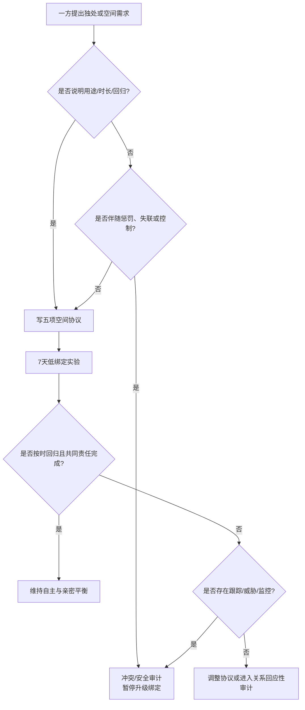

# 伴侣个人空间、独处需求与关系边界

## 明确结论

健康的个人空间是**可说明、可回归、不会惩罚对方**的自主安排；它不等于冷暴力。冷暴力、失联、故意制造不安和强制监控不是个人空间。双方不必共享全部时间，也不必用定位和秒回证明忠诚。先做 7 天空间协议，把独处时段、最低联系、回归时间、紧急例外和隐私边界写清，再观察它是否同时保护自治、亲密和共同责任。

## Evidence base

- La Guardia 等（2000，DOI 10.1037/0022-3514.79.3.367）：关系中的自治、胜任和联结需要满足与依恋安全和福祉相关，支持亲密与自主并存。
- Weinstein 等（2023，DOI 10.1038/s41598-023-44507-7）：178 名参与者的 21 天日记显示，没有统一最佳独处时长；自主选择的独处与较低压力和较高自治满足相关。
- Dimensions of Relationship Quality（DOI 10.1111/1475-6811.00017）：关系质量同时包含亲密、协议、独立和性等维度，不能只用陪伴时长衡量。

7 天是低风险试行期，不是关系治疗或人格判断标准。

## 第一步：区分四种情况

| 情况 | 关键特征 | 先做什么 |
|---|---|---|
| 自主独处 | 提前说明、时长大致明确、结束后回归 | 允许并约定最低联系 |
| 临时忙碌 | 工作、照护、健康或交通原因 | 说明不可用时段和替代联系 |
| 冲突暂停 | 情绪过高，需要冷静 | 约定回来时间和继续地点 |
| 惩罚性撤退 | 故意失联、让对方猜、用回归不确定惩罚 | 转入冲突和安全审计 |

## 第二步：写五项空间协议

双方分别写，再合并：

1. **独处用途**：休息、朋友、运动、游戏、工作或不想说话；不要求交出全部细节；
2. **开始方式**：提前多久说明，临时情况怎样发一句状态；
3. **最低联系**：例如睡前一句“安全，明天___点联系”，而非全天候定位；
4. **回归时间**：独处结束后何时恢复对话；冲突暂停必须有最晚回归时间；
5. **共同责任**：孩子、宠物、账单、老人和约定事项不能因独处被单方面丢下。

可直接使用：

> “我今晚需要 19:00–21:00 独处。不是惩罚你，21:10 我会发消息，明天 10:00 我们再谈这件事。”

> “我可以给你空间，但需要一个回归时间。没有回归时间的失联会让我无法安排生活，我们先把最低联系写清。”

> “我不要求你的全部聊天和定位；我需要知道共同责任是否有人承担，以及什么时候恢复联系。”

## 第三步：7 天空间实验

- 每人安排 3 次 30–120 分钟自主空间；
- 每次开始前说明预计时长和是否需要紧急联系；
- 独处期间不连续追问、不翻设备、不用社交媒体暗示对方；
- 结束后按约回归，先说“现在可以谈/还需要 30 分钟”，不要让对方猜；
- 冲突暂停最长不超过 24 小时，除非双方书面约定并有安全理由；
- 每天记录：是否自愿、是否按时回归、共同责任是否完成、焦虑 0–10；
- 第 4 天和第 7 天各复盘 15 分钟，只调整一项规则。

## 对方可能反应及回答

| 反应 | 回应 | 下一步 |
|---|---|---|
| “你要独处就是不爱我。” | “独处是恢复精力，不是结束关系。我们按回归时间保持联系。” | 做一次短时试行 |
| “你爱我就该随时告诉我在哪。” | “亲密不等于全天候定位。紧急安全需要可以另行约定，普通生活保留隐私。” | 写隐私与紧急例外 |
| 对方独处后按时回归 | “谢谢你按约回来，这让空间和安全可以同时存在。” | 维持协议 |
| 对方借独处逃避所有责任 | “空间不取消孩子、账单和已承诺的任务。” | 重新分工并设截止日 |
| 冲突中说“以后再也不谈” | “暂停可以，但必须有最晚回归时间；无限期不谈不是暂停。” | 写回归时间 |
| 对方连续失联、让你猜测 | “这已经影响共同安排，不是普通独处。请按协议回复；否则我会暂停增加绑定。” | 进入关系回应性审计 |
| 你忍不住连续发消息 | “我会按约定时间等，先记录焦虑，不用追问换短暂安心。” | 暂离聊天，联系自己的支持者 |
| 对方要求交出密码以换取空间 | “密码不能解决回归和尊重问题，也不是空间协议的一部分。” | 保持设备隐私 |

## 决策结果

- **协议有效**：双方能独处、按时回归，共同责任没有转嫁；固定每周一次低频复盘。
- **需要调整**：工作、照护或健康造成不可预测时段，改为状态消息和备用联系人。
- **回应性不足**：一方用失联惩罚或一方用监控控制，暂停同居、婚姻和财务升级，做关系审计。
- **安全风险**：出现跟踪、威胁、暴力或设备控制，直接进入安全和退出路径。

## Stop conditions

- 用失联、回归不确定、拒绝沟通或性/经济惩罚控制另一方；
- 强迫交出手机、密码、定位、朋友名单或全部社交记录；
- 以个人空间为名把孩子、宠物、账单、医疗或老人照护全部丢给另一方；
- 因对方需要独处而威胁、跟踪、限制出行或报复；
- 冲突暂停超过约定期限，且拒绝提供安全状态和回归安排；
- 一方持续恐惧、失眠或无法安排生活，却被要求接受无限期不确定。

## Mermaid 分流图

## Evidence boundary

研究支持自治、联结和独处体验之间的关系机制，不能给个人规定统一独处时长，也不能证明一次失联就构成冷暴力。判断重点是自愿性、可预测回归、共同责任和安全，而不是伴侣是否时时在一起。

