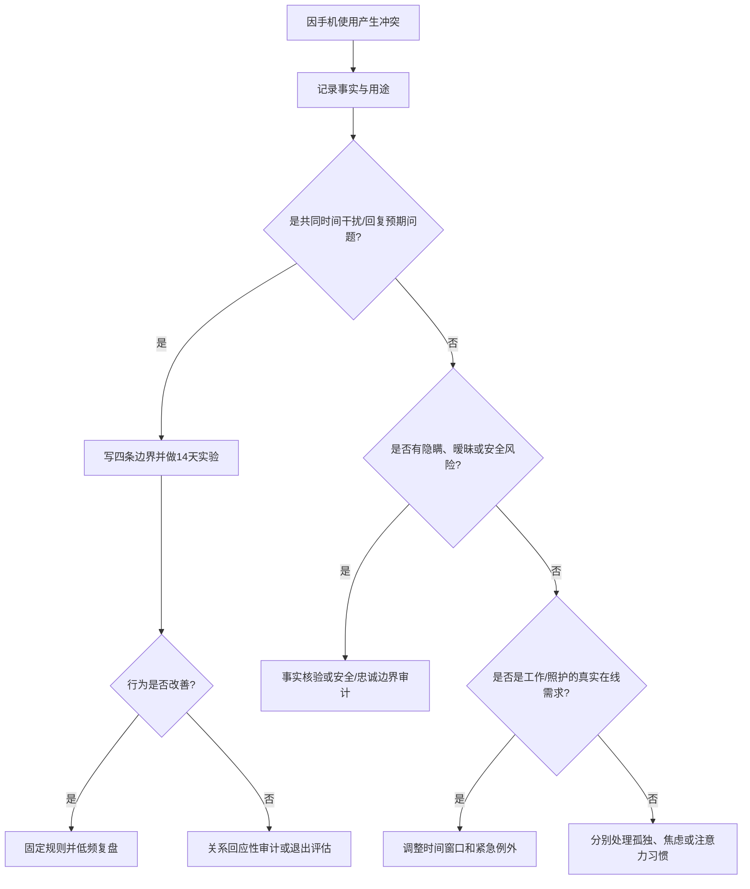

# 手机使用、回复边界与伴侣共同时间

## 明确结论

先区分四件事：回复频率、共同时间被手机打断、手机使用是否隐瞒，以及是否出现监控控制。共同时间协议不等于监控。伴侣看手机不自动等于背叛，回复慢也不自动等于不在乎；但在约定的共同时间持续忽视、用手机逃避沟通或要求交出设备，会形成不同性质的问题。实用做法是做 14 天注意力实验，先改共同时间和回复预期，再决定是否需要关系审计。

## Evidence base

- Roberts 与 David（2016，DOI 10.1016/j.chb.2015.07.058）：伴侣手机干扰与关系满意度存在关联。
- Beukeboom 与 Pollmann（2021，DOI 10.1016/j.chb.2021.106932）：两项横断面调查（N=507、386）显示，排斥感、感知回应性下降和亲密感下降是重要关联路径；共享手机活动并不必然造成同样影响。
- Zhan 等（2022，DOI 10.3389/fpsyg.2022.967339）：504 名中国成年人资料显示，手机干扰、孤独和关系满意度之间存在关联。

14 天是行为实验期限，不是手机成瘾诊断标准。

## 第一步：记录而不猜测

连续 3 天记录五列：

| 时间 | 发生了什么 | 手机用途 | 是否事先说明 | 你的影响 |
|---|---|---|---|---|
|  |  | 工作/家人/娱乐/暧昧/未知 | 是/否 | 被忽视、担心、延误、无影响 |

把“事实”和“解释”分开。例如事实是“晚餐 30 分钟看屏幕 12 次”，解释才是“他不重视我”。

## 第二步：写出四条边界

双方分别提出，再合并成一份：

1. **回复边界**：工作时段、睡眠时段和无法及时回复时的简单说明；
2. **共同时间**：吃饭、约会、冲突讨论、性生活和孩子照护时是否免打扰；
3. **紧急例外**：工作值班、老人孩子、医疗或现实安全事项如何处理；
4. **隐私边界**：不以信任为名强制交出密码、定位、全部聊天或设备。

可直接使用：

> “我需要的是可预测的回复和共同时间，不是全天候秒回。你忙时发一句‘今晚 9 点回’，我会按这个时间安排。”

> “吃饭和讨论重要事情时，我们把手机放到看不见的位置；有紧急事项可以先说明再处理。”

> “我愿意讨论影响关系的隐瞒和边界，但不接受把手机密码、定位和全部聊天当作忠诚证明。”

## 第三步：14 天注意力实验

- 每天至少安排一段 30 分钟无手机共同时间；
- 需要持续看手机的一方提前说明用途和预计时长；
- 回复延迟超过双方约定时间，只发一个简短状态，不编造借口；
- 冲突中不边看手机边谈，任一方可暂停 20 分钟并约定回来时间；
- 每晚记录：中断次数、是否按约说明、共同时间质量 0–10、是否出现监控冲动；
- 第 7 天和第 14 天各复盘 20 分钟，只调整一条规则。

## 对方可能反应及回答

| 反应 | 回应 | 下一步 |
|---|---|---|
| “你要求太多，我不可能秒回。” | “我没有要求全天候秒回，只要求说明不可用时段和共同时间规则。” | 写可执行时段 |
| “你管我用手机就是控制。” | “控制是限制你所有设备和社交；我讨论的是我们共同时间的注意力协议。” | 先做 14 天实验 |
| “你不信任我，给你密码就行。” | “密码不能替代回应和尊重，也不是我要求的解决方案。” | 保持隐私边界 |
| 对方工作需要随时在线 | “紧急在线可以保留，但请说明值班时段，并给共同时间安排替代窗口。” | 调整时间而非争夺设备 |
| 对方把手机用于暧昧或隐瞒联系 | “问题已经从注意力进入忠诚和透明边界。” | 停止普通实验，做事实核验 |
| 你因回复慢反复检查、发很多消息 | “我会按约定时间等，不用连续确认换短暂安心。” | 记录触发，暂离聊天 |
| 14 天后仍持续忽视共同时间 | “规则已经清楚但行为没有改变，我们需要评估关系回应性，而不是再加提醒。” | 进入关系审计 |

## 决策结果

- **改善**：共同时间中断减少，延迟有说明，固定低频复盘。
- **可调整**：工作或照护确有特殊需求，双方改为不同时间方案。
- **未改善**：持续忽视、隐瞒或用手机逃避所有对话，暂停同居、婚姻和财务升级并做关系审计。
- **安全问题**：若出现监控、跟踪、威胁或私密内容传播，直接进入安全路径。

## Stop conditions

- 强迫交出手机、密码、定位、云相册或全部聊天记录；
- 安装监控、冒充账号、跟踪在线状态或联系第三方骚扰核实；
- 用回复慢惩罚、限制社交、经济控制或暴力逼迫服从；
- 隐瞒持续暧昧、其他性关系、传播私密内容或重大健康风险；
- 以“手机边界”为名切断对方工作、医疗、家庭或紧急联系；
- 14 天内出现威胁、报复、羞辱或安全风险。

## Mermaid 分流图

## Evidence boundary

研究多为横断面、自报或情境实验，不能证明手机干扰必然导致关系恶化，也不能为个人计算手机成瘾概率。指南不提倡全面监控；它把可协商的共同时间、回复预期、工作例外和安全风险分开处理。

