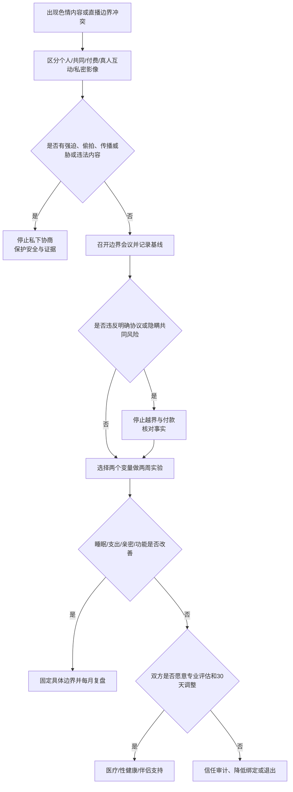

# 色情内容、直播互动与伴侣性边界

观看成人视频本身不等于成瘾、背叛或关系失败。需要处理的是双方是否自愿、是否违反明确协议、是否隐瞒付费或真人互动、是否影响睡眠工作和现实亲密，以及是否存在强迫、偷拍或传播私密内容。

## Evidence base

Wright等（2017，DOI 10.1111/hcre.12108）的荟萃分析汇总50项研究、超过5万人，报告色情内容消费与多类满意度总体存在负向关联，但研究结果和情境存在差异。Kohut等（2021，DOI 10.3389/fpsyg.2021.661347）使用四组伴侣资料，显示共同观看、双方单独使用差异、态度和性欲差异与关系质量的关联并不相同。两项研究都不能诊断个人成瘾，也不能把共同观看作为伴侣义务。

## 先区分五种情境

| 情境 | 核心问题 | 初步处理 |
|---|---|---|
| 个人观看 | 频率、时间、隐私、是否影响功能 | 协商个人边界 |
| 共同观看 | 双方是否真实愿意、内容是否可接受 | 每次均可拒绝和退出 |
| 付费内容 | 金额、共同资金、订阅和赠礼 | 设消费上限并公开共同风险 |
| 真人互动 | 私聊、直播打赏、定制、视频互动 | 明确是否属于性/排他边界 |
| 私密影像 | 拍摄、保存、设备、分享和删除 | 必须逐项取得同意 |

不要把搜索记录、想象或自慰自动等同于现实出轨；也不要把互动付费包装成“只是看视频”来回避双方协议。

## 一次边界会议

双方分别写出并交换：

1. 可以接受哪些内容、频率和使用场景？
2. 哪些需要提前说明：付费、真人互动、直播打赏、定制内容、与认识的人交换内容？
3. 共同观看是否可接受？任何一方如何在不中途受罚的情况下拒绝？
4. 是否允许拍摄私密内容；保存在哪里、谁能访问、何时删除？
5. 什么属于个人隐私，什么会影响共同财务、健康或排他边界？
6. 违反一次与重复隐瞒分别如何处理？

协议写成可观察行为，例如：“不使用共同账户直播打赏；不与真人进行性私聊；不经逐次同意拍摄或转发。”不要写成无法验证的“永远不看别人”。

## 两周影响审计

### 第1—3天：记录基线

各自记录使用时长、时间段、消费、是否隐瞒、睡眠、工作、自慰、伴侣性接触、拒绝后的反应和情绪触发。只记录事实，不强制展示具体内容或完整设备。

### 第4—10天：只改变两个变量

根据问题选择：取消付费与直播打赏；停止真人互动；不在睡前使用；恢复两次无屏幕共同活动；安排一次非性亲密；或暂停色情内容七天。性欲、疼痛、勃起/润滑、药物或心理问题明显时预约合格医疗或性健康专业人员。

### 第11—14天：比较现实影响

检查睡眠、支出、现实亲密、性满意度、工作、隐瞒和冲突是否变化。结果只选一个：维持现有边界；调整具体频率或消费；进行30天暂停；寻求专业评估；或因持续欺骗、强迫和伤害进入信任修复或退出路径。

## 可直接使用的话术

> “我不先给你贴成瘾或出轨标签。我需要核对的是频率、隐瞒、消费、真人互动，以及它对我们现实生活的影响。”

> “共同观看必须双方自愿，每次都可以拒绝。拒绝后不能冷战、羞辱或降低生活支持。”

> “直播打赏和付费定制会影响共同财务与排他边界，请把金额、互动方式和旧协议说清。”

> “私密内容的拍摄、保存和分享是三次不同的同意。没有明确同意就不做。”

## 对方可能的反应及回应

| 反应 | 回应 | 下一步 |
|---|---|---|
| “所有人都看，没什么好谈。” | “普遍与否不能替代我们的协议和现实影响。” | 完成五种情境分类 |
| “看一次就是精神出轨。” | “我们先判断具体协议、互动和隐瞒，不用单一标签代替事实。” | 写一页边界协议 |
| “你陪我看就能解决。” | “共同观看不是义务，我可以自由拒绝。” | 选择其他亲密方式 |
| “查我手机才证明你在乎。” | “核验共同风险不等于全面监控。” | 只核对消费和已约定事项 |
| 付费或直播消费被隐瞒 | “问题包括共同资金和真人互动，不只是内容本身。” | 停止付款并核对流水 |
| 使用减少但现实性问题仍在 | “继续把身体和健康因素交给专业评估。” | 医疗或性健康转介 |
| 对方承诺停止却反复删除记录 | “现在是重复欺骗和协议失效，需要限期修复。” | 30天验证或退出审计 |
| 以私密内容威胁或报复 | “我不继续私下协商，现在先保护安全和证据。” | 停止接触并寻求法律/安全支持 |

## Stop conditions

- 强迫共同观看、模仿、拍摄或参与任何性行为；
- 偷拍、冒名制作、未经同意保存、转发或威胁传播私密内容；
- 与真人进行违反协议的性私聊、直播互动或付费定制，并持续隐瞒；
- 偷用共同资金、借贷或大额直播打赏，拒绝公开共同风险；
- 用羞辱、冷战、出轨威胁、经济断供或暴力逼迫接受；
- 强制密码、监控设备、远程控制或公开性隐私；
- 使用已明显损害睡眠、工作、照护或现实性功能，却拒绝任何两周实验和专业评估；
- 内容涉及未成年人、偷拍、胁迫、暴力剥削或其他疑似违法伤害。

触发停止条件时，停止共同性活动和新的付费绑定；保护账户、设备、证件和住处。涉及私密内容威胁、强迫或现实危险时，不单独对质，保存证据并联系当地法律、安全或紧急支持。

## Mermaid分流图

文字版：先区分使用情境；有强迫、偷拍或传播威胁先保护安全；其余情况形成具体协议并进行两周影响实验；能改善则固定边界，不能改善则进入专业评估、信任审计或退出。

## Evidence boundary

研究中的平均关联不能判定个人使用有害，也不能证明共同观看会改善关系。个人隐私不等于可以隐瞒共同财务、真人互动或违反协议；伴侣边界也不等于全面监控权。具体成瘾、性功能、违法内容和私密影像侵害需要由合格医疗、心理、性健康或法律专业人士评估。
