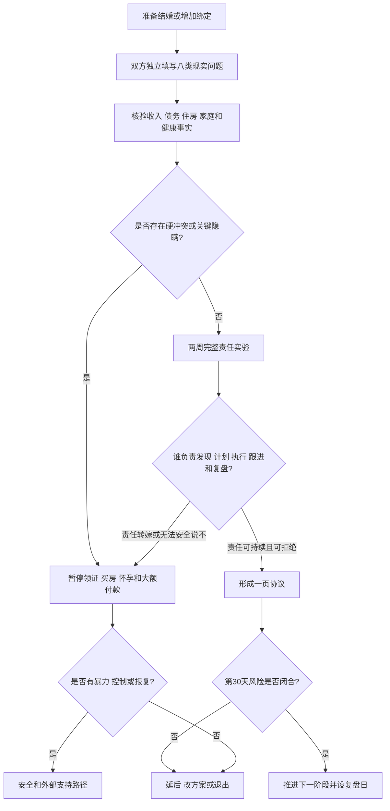

# 婚前 30 天现实因素综合审计

## 明确结论

结婚前不要只问“感情好不好”。用 30 天把外貌与性吸引、收入与债务、住房和城市、双方家庭、家务与心理负荷、性边界、生育意愿和安全退出逐项核验。没有事实、负责人、日期和备用方案的承诺，按未完成处理；审计通过后再推进领证、买房、怀孕或大额不可退支出。

这是一套决策工具，不是给关系打分，也不要求所有伴侣选择相同生活方式。

## Evidence base

本指南整合本地已核验研究：现实匹配与婚姻进入（Yu & Xie，2015，DOI 10.1111/jomf.12186）、关系权力（Young & Seedall，2024，DOI 10.1111/famp.13008）、性别角色观念与关系满意度（Park 等，2025，DOI 10.1093/pnasnexus/pgae589）、心理负荷（Reich-Stiebert 等，2023，DOI 10.1007/s11199-023-01362-0）以及生育决定（Ranjbar 等，2024，DOI 10.1016/j.socscimed.2024.116583）。这些研究提供关联或理论框架，不证明 30 天流程能预测婚姻结果。

## 第 1–3 天：各自写答案

双方分开回答，不先看对方答案：

| 领域 | 必须写清的问题 |
|---|---|
| 外貌与吸引 | 是否有稳定的身体吸引和亲密意愿？哪些差异可以接受？是否存在羞辱、比较或逼迫改变身体？ |
| 收入与债务 | 收入、债务、储蓄、赡养和大额支出各是多少？失业 6 个月由谁承担？ |
| 住房与城市 | 婚后住哪里？买、租还是与父母同住？谁迁移、谁承担通勤和职业损失？ |
| 家庭 | 双方父母的金钱、照护、探访和边界上限是什么？谁负责沟通和执行？ |
| 家务与心理负荷 | 谁发现、计划、执行、提醒、跟进和承担失败后果？ |
| 性与健康 | 排他范围、检测、安全措施、欲望差异和拒绝边界如何处理？ |
| 生育 | 是否生育、时间、数量、照护和不孕/流产方案是否一致？ |
| 决策与安全 | 谁能对结婚、借贷、买房、生育说“不”？双方是否都有证件、账户、住处和退出支持？ |

## 第 4–7 天：事实核验

1. 交换答案，只标记“相同、可协商、硬冲突、待核验”。
2. 用账单、合同、征信或可核对记录确认收入、债务、房产和固定支出；不要求交出全部隐私密码。
3. 把双方家庭要求写成金额、频率、期限和拒绝方式，不用“以后再说”代替。
4. 安排一次清醒、无第三方施压的 60 分钟谈话；每个硬冲突只写一个可验证问题。
5. 暂停订婚、买房、怀孕和不可退婚礼付款，直到关键事实闭合。

## 第 8–21 天：两周现实实验

双方各自承担至少一项完整责任，责任链必须包含**谁负责发现、计划、执行、跟进和复盘**：

- 一周家务和采购；
- 一次双方父母沟通；
- 一次预算和账单管理；
- 一次冲突暂停后按时回归；
- 一次性健康或生育信息确认；
- 一次工作、疾病或照护压力模拟。

每天记录事实，不记录“谁更像好人”：任务是否完成、是否需要原承担者提醒、出现分歧时能否安全拒绝、失败后谁善后。

## 第 22–30 天：做决定

第 22 天各自独立写三项：继续推进的依据、最大的未决风险、若风险发生的备用方案。第 25 天共同形成一页协议，包含责任人、日期、金额上限、复盘日和退出路径。第 30 天只能作四种决定：

- **推进**：硬冲突已解决，责任能持续执行，双方都能安全说“不”；
- **延后**：只有一个明确缺口，写负责人和最终日期，不无限等待；
- **改方案**：例如先租房、分账户、暂缓生育或降低双方父母介入；
- **退出**：存在欺骗、强迫、持续失约或安全风险。

## 可直接使用的话术

> “我们不是评判谁更好，而是核对结婚后谁承担什么。请把外貌、收入、家庭、城市、性、生育和家务都写成事实、负责人和日期。”

> “我愿意讨论让步，但不能在信息不完整时先领证、借贷、买房或怀孕。缺口补齐后我们再决定。”

> “你可以不同意我的方案，但我也必须能安全说不。不能安全拒绝，就先暂停升级绑定。”

## 对方可能反应及对应回答

| 反应 | 回应 | 下一步 |
|---|---|---|
| “有感情就够了，别把婚姻算得这么细。” | “感情是基础，具体责任决定日常能否持续。我们只核对会产生长期后果的事项。” | 完成一页事实表 |
| “你问收入和债务就是不信任。” | “透明是共同承担风险的前提，不要求密码，只核对会影响婚姻的事实。” | 设资料清单和截止日 |
| “我父母已经定了，你只能接受。” | “父母可以提出要求，但我们的婚姻需要双方同意。” | 暂停彩礼、婚礼和住房绑定 |
| “家务谁有空谁做，到时候再说。” | “请先做两周完整责任实验，包含发现、计划和跟进。” | 记录是否仍由一方提醒 |
| “性和生育以后自然会解决。” | “这些决定会改变身体、时间和退出成本，必须在升级前确认是否兼容。” | 约定一次具体谈话和复盘日 |
| 对方愿意公开信息并调整方案 | “我们把让步、负责人、日期和备用路径写下来。” | 进入 30 天协议执行 |
| 对方反复拖延、羞辱或威胁 | “在没有安全和清晰同意前，我不会推进不可逆决定。” | 保护账户、证件、住处并寻求外部支持 |

## Stop conditions

- 隐瞒婚姻状态、债务、重大健康或性健康风险；
- 以彩礼、住房、户籍、怀孕、分手、自伤或经济报复逼迫结婚、生育、借贷或性行为；
- 一方拒绝提供影响共同决策的基本事实，却要求先完成绑定；
- 把收入、性别、学历或父母资源当作单方面决定权；
- 两周实验中责任始终回到同一人，只有口头承诺没有行动；
- 出现暴力、跟踪、扣证件、冻结账户、性胁迫或无法安全退出。

触发停止条件时，不进行单独对质或继续婚前实验；先联系可信支持者、医疗、法律或当地安全服务。

## Mermaid 分流图

## Evidence boundary

本指南整合本地已有关于关系不确定性、现实匹配、经济压力、住房迁移、家庭边界、性沟通、生育自主、心理负荷和关系权力的研究笔记。它把群体层面的关联转成个人可执行的核验流程，不预测某段婚姻一定成功，也不把外貌、收入、城乡或家庭背景单项当作价值判断。

